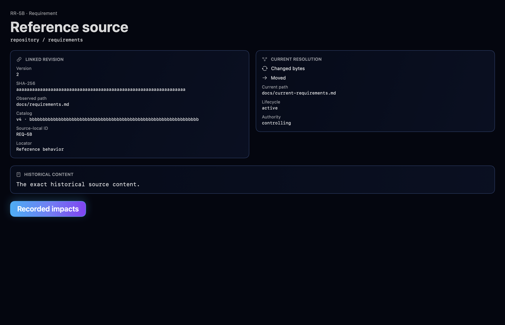
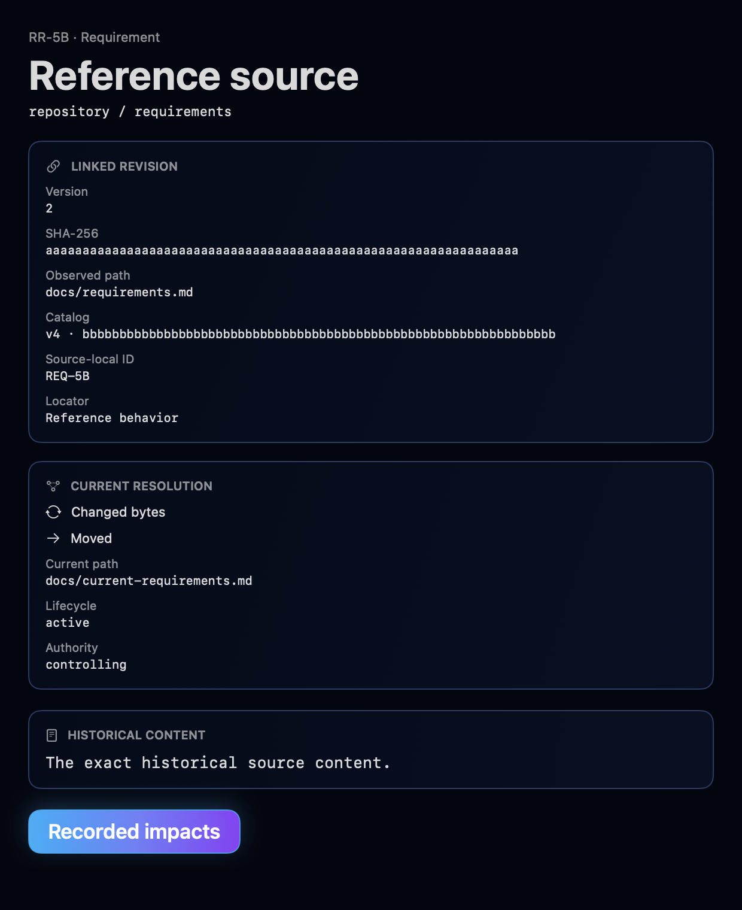
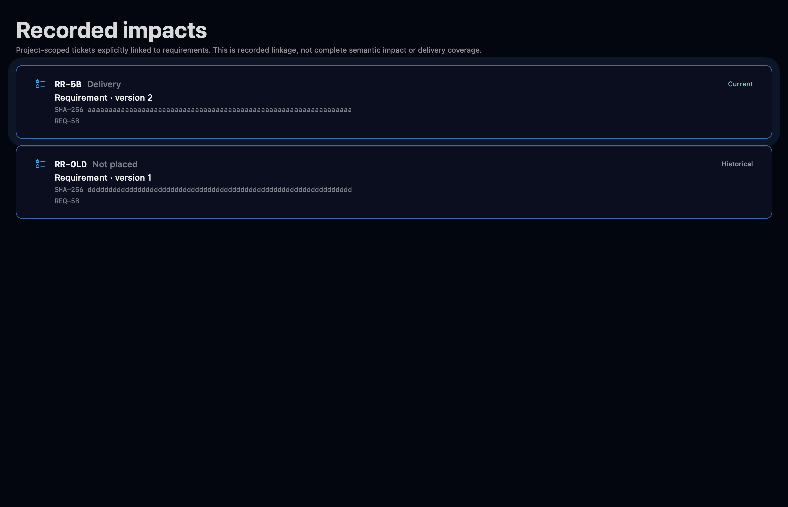
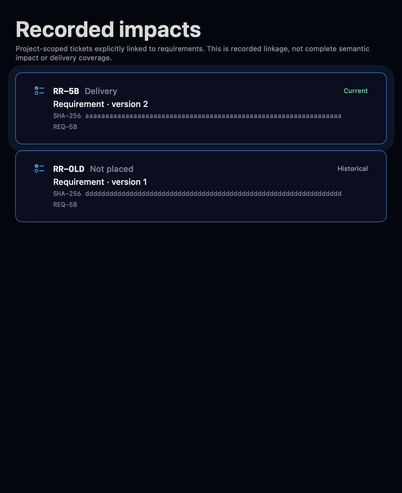
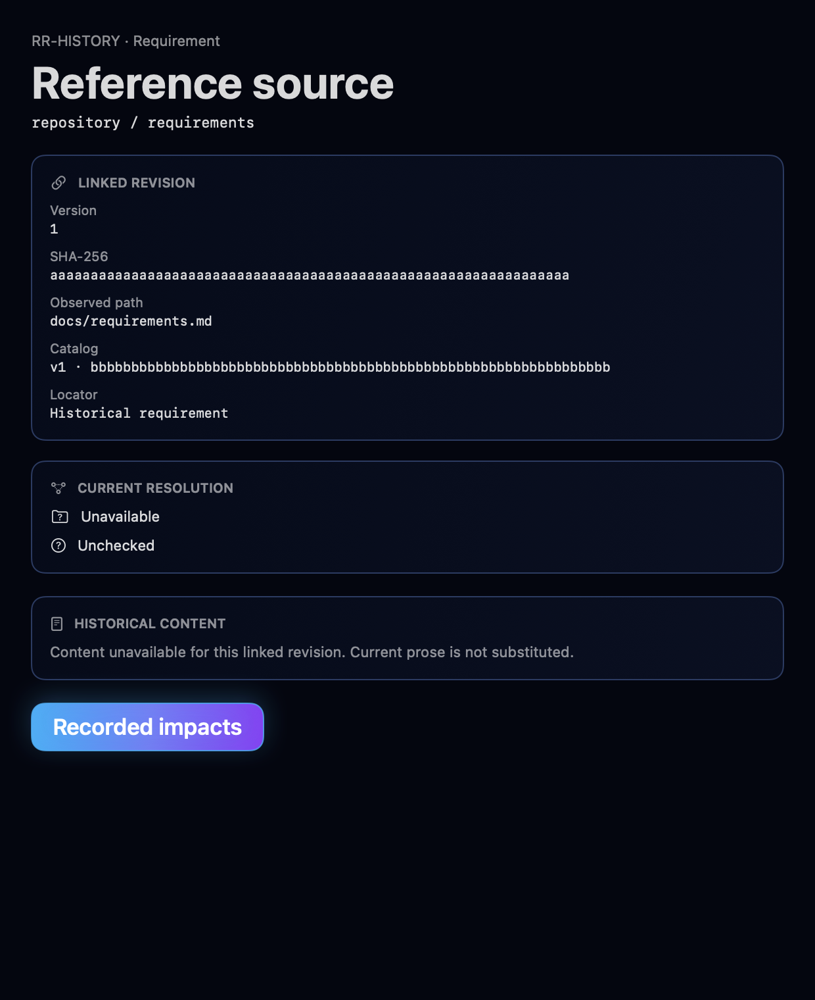
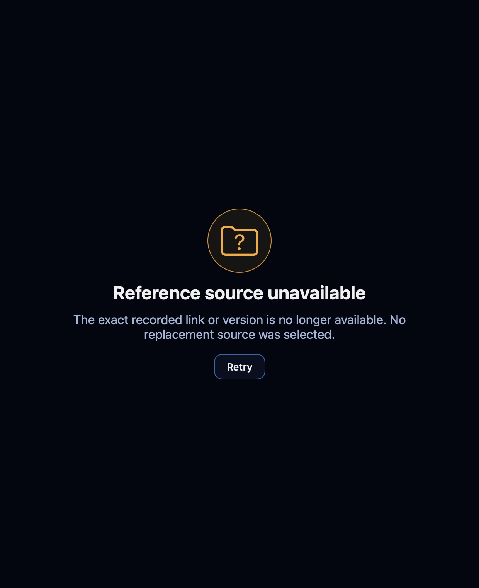
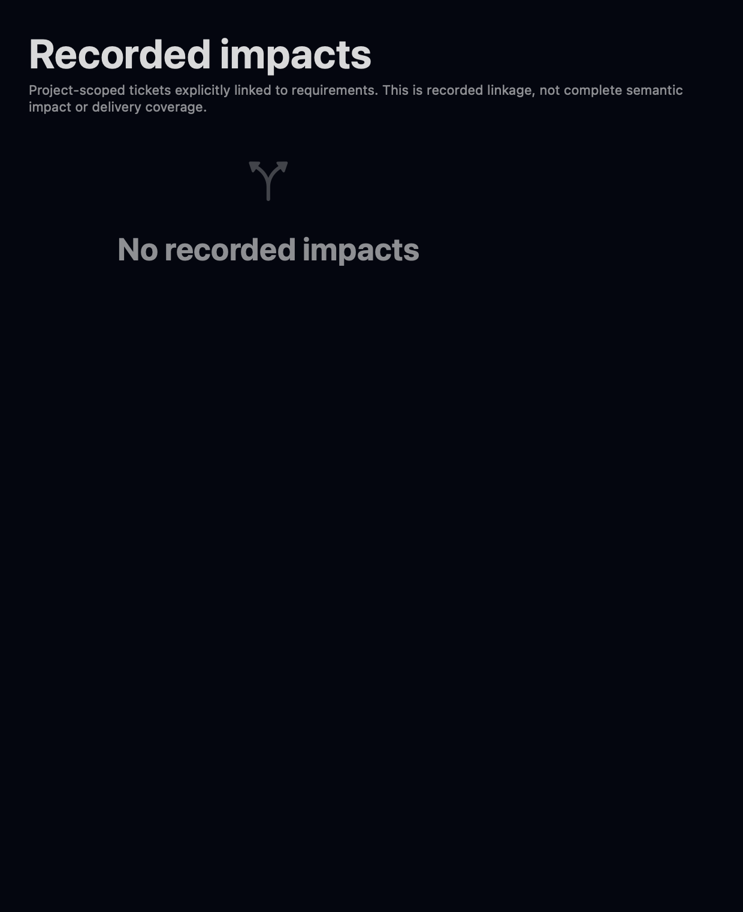
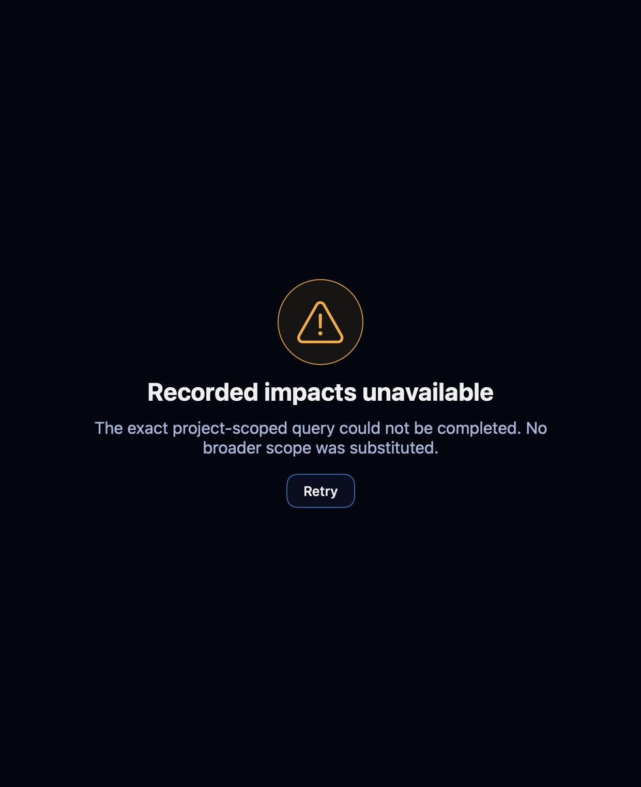
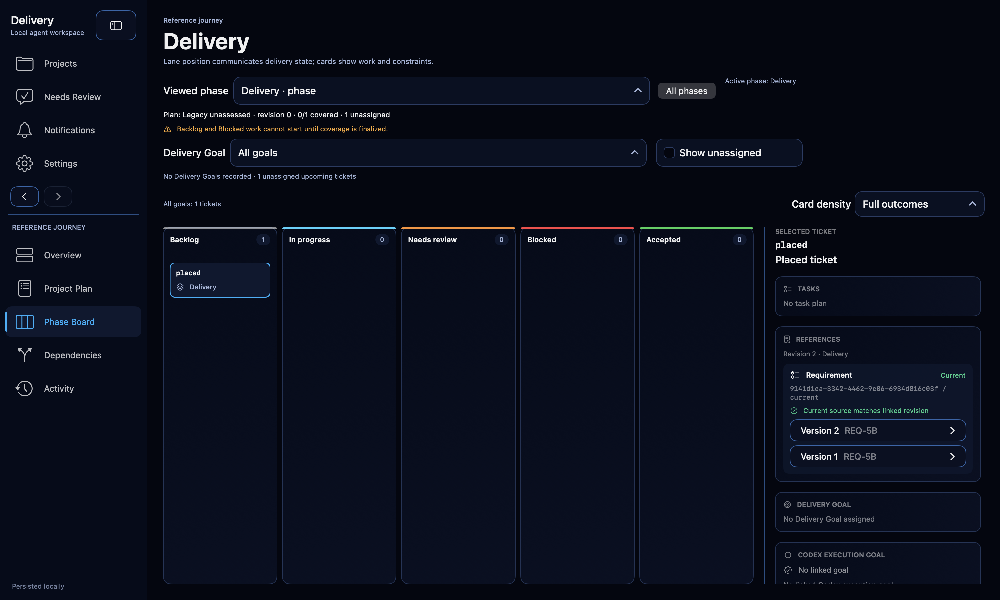

# Phase 5B reference and recorded-impact evidence

## Candidate

- Baseline: `6c03d5bba17f2e52c3fcfc9c3c3c72f88844d7e2`
- Branch: `codex/phase5b-reference-impacts`
- Scope: revision-specific requirement and decision references, project-scoped recorded impacts, retained history, typed read/write surfaces, and native navigation.

## Delivered behavior

- Store schema version 20 persists ticket link sets, immutable reference versions, current or retired relationships, and removal-retained reference history.
- Typed upsert and retire commands enforce exact link-set revisions, immutable link identity, accepted-ticket immutability, an active controlling source, a caller-supplied expected source digest, complete-byte SHA-256 capture, request replay, and atomic receipt/audit publication. A source-byte mismatch is rejected before reference, audit, or receipt writes.
- Read-only ticket-reference and recorded-impact queries retain exact project, registration incarnation, root, repository, artifact, link, and version identity. Authority is revalidated after asynchronous work and before publication, so registration or bookmark replacement withdraws the stale result.
- Each historical reference version is resolved against its own stored digest and observed path. Current resolution reports changed, moved, retired, superseded, archived, no-longer-controlling, unavailable, and unchecked facts without substituting current prose for unavailable historical bytes.
- Project archive, restore, removal, backup, and application restore preserve the reference records and renew authority through the existing lifecycle boundaries.
- Four additive packaged helper tools expose strict JSON schemas for upsert, retire, ticket-reference history, and project-scoped recorded impacts. The packaged helper now publishes 30 schemas.
- Project Plan and Phase Board ticket details show References. Source and Recorded impacts are native routes with recoverable failure states, accessible controls, responsive layouts, identity-keyed query state, and identity-preserving Back/Forward history. Recorded-impact rows display their exact digest and restore focus by ticket, link, and version row identity.

## Direct verification

- `CorrectionsFinal.xcresult`: 22/22 passed across `TicketReferenceAcceptanceTests`, `TicketReferenceNativeRenderingTests`, and `DocumentationCallbackTests`. This covers stale reviewed bytes with no side effects, bookmark replacement during a paused query, per-version changed/moved resolution, distinct stored digests, in-place ticket switching with a deliberately late old result, exact historical-row restoration, helper schemas, and callback replay.
- The v5 isolated external accessibility journey used a synthetic store/root with external services suppressed. It exposed current placed v2, current unassigned v1, and non-first historical placed v1 as distinct AX rows. Activating `recorded-impact-placed:placed-reference:1` opened `ticket-placed`; Back restored the actual focused UI element to that exact historical AX identifier; Forward restored focus to `ticket-placed`.
- Two earlier in-process attempts (`ExactFocusAX.xcresult` and `ExactFocusAX2.xcresult`) reported no focused AX element from either the process or hosted accessibility root even though the exact SwiftUI focus callback succeeded. No equivalent retry or VoiceOver change was made. The externally controlled isolated journey above supplied the actual focus observation.
- `FocusedFinal.xcresult`: 13/13 focused reference, transport, lifecycle, backup/restore, navigation, and native rendering tests passed.
- `CorrectionsGreen.xcresult`: 5/5 migration-compatibility and recovery-render corrections passed.
- `FinalTargeted.xcresult`: 3/3 passed. The two relocation tests that failed with `catalogMismatch` during the parallel full run both passed in isolation, and the corrected 620-by-760 failure-state render passed its bounds assertions.
- `RouteOrderingRed.xcresult`: the deterministic regression proved that a project route was published while its exact documentation observation remained `.checking`.
- `CommonOrderingLiveGreen.xcresult`: 3/3 passed after moving the existing project-documentation refresh before project-route publication. The run covered source and Phase Board publication ordering, suppression of an older pending navigation after a newer destination wins, and the isolated native journey.
- The final live accessibility observations were:
  - Tab moved keyboard focus from Project Plan to `ticket-unassigned`.
  - The Version 1 reference control opened the exact source route.
  - Source opened directly with no recovery state and focused `open-recorded-impacts`.
  - Recorded impacts opened directly and the correction journey exposed `recorded-impact-placed:placed-reference:2`, `recorded-impact-unassigned:unassigned-reference:1`, and historical `recorded-impact-placed:placed-reference:1` as distinct rows with SHA-256 values.
  - Activating the non-first historical placed v1 row opened Phase Board directly with its exact References loaded and focused `ticket-placed`.
  - `navigation-back` restored focus to exact historical row `recorded-impact-placed:placed-reference:1`; `navigation-forward` restored `ticket-placed` focus.

An earlier live run observed `reference-query-unavailable` when Source, Recorded impacts, and then Phase Board mounted while navigation had deliberately placed the shared documentation observation in `.checking`. Retry recovered exact identity, but normal entry was incorrect. The red regression and final 3/3 green run preserve the diagnosis and correction; the final journey required no Retry.

The final full run, `FullFinal2.xcresult`, executed 716 tests: 700 passed, 13 failed, and 3 skipped. Eleven distinct failures reproduce the baseline categories. The remaining two were the relocation `catalogMismatch` results above, which passed 2/2 in the isolated `FinalTargeted` run. The baseline full run executed 703 tests: 688 passed, 12 failed, and 3 skipped; its obsolete packaged-helper schema-count failure is corrected by this candidate.

No installed owner application or owner application data was used. All UI checks used isolated XCTest windows and fresh synthetic stores and repository roots.

## Visual comparison

The source and impact routes were compared with `docs/design/mockups/phase_board.png` and `docs/design/mockups/dependencies.png`. They preserve the approved dark RDS background, fine blue borders, restrained cyan/purple primary action, monospaced identities, compact metadata hierarchy, and honest scope language. Wide layouts retain paired source panels; compact layouts stack them without clipping. No design deviation was required.

### Exact source

| Wide | Compact |
| --- | --- |
|  |  |

### Recorded impacts

| Wide | Compact |
| --- | --- |
|  |  |

### Recovery and empty states

| State | Evidence |
| --- | --- |
| Historical content unavailable |  |
| Exact source link unavailable |  |
| No recorded impacts |  |
| Recorded-impact query unavailable |  |

### Live journey endpoint

## Preserved raw results

- `/private/tmp/release-radar-phase5b-baseline.tyFf80/Baseline.xcresult`
- `/private/tmp/release-radar-phase5b-red.GEAmTU/FocusedFinal.xcresult`
- `/private/tmp/release-radar-phase5b-red.GEAmTU/CorrectionsGreen.xcresult`
- `/private/tmp/release-radar-phase5b-red.GEAmTU/FullFinal2.xcresult`
- `/private/tmp/release-radar-phase5b-red.GEAmTU/FinalTargeted.xcresult`
- `/private/tmp/release-radar-phase5b-red.GEAmTU/FinalLive4.xcresult`
- `/private/tmp/release-radar-phase5b-red.GEAmTU/RouteOrderingRed.xcresult`
- `/private/tmp/release-radar-phase5b-red.GEAmTU/CommonOrderingLiveGreen.xcresult`
- `/private/tmp/release-radar-phase5b-native-attachments.safrF9`
- `/private/tmp/release-radar-phase5b-final-attachments.u1owK6`
- `/private/tmp/release-radar-phase5b-live-attachments.h5MHNB`
- `/private/tmp/release-radar-phase5b-final-live-attachments.rC0mWa`
- `/private/tmp/release-radar-phase5b-corrections.uhFRfc/FocusedGreen.xcresult`
- `/private/tmp/release-radar-phase5b-corrections.uhFRfc/ExactFocusAX.xcresult`
- `/private/tmp/release-radar-phase5b-corrections.uhFRfc/ExactFocusAX2.xcresult`
- `/private/tmp/release-radar-phase5b-corrections.uhFRfc/CorrectionsFinal.xcresult`
- `/private/tmp/release-radar-phase5b-corrections.uhFRfc/final-attachments`

Earlier red, correction, skipped, and failed live-run bundles and their controller markers remain preserved under `/private/tmp`; no temporary evidence was deleted.
