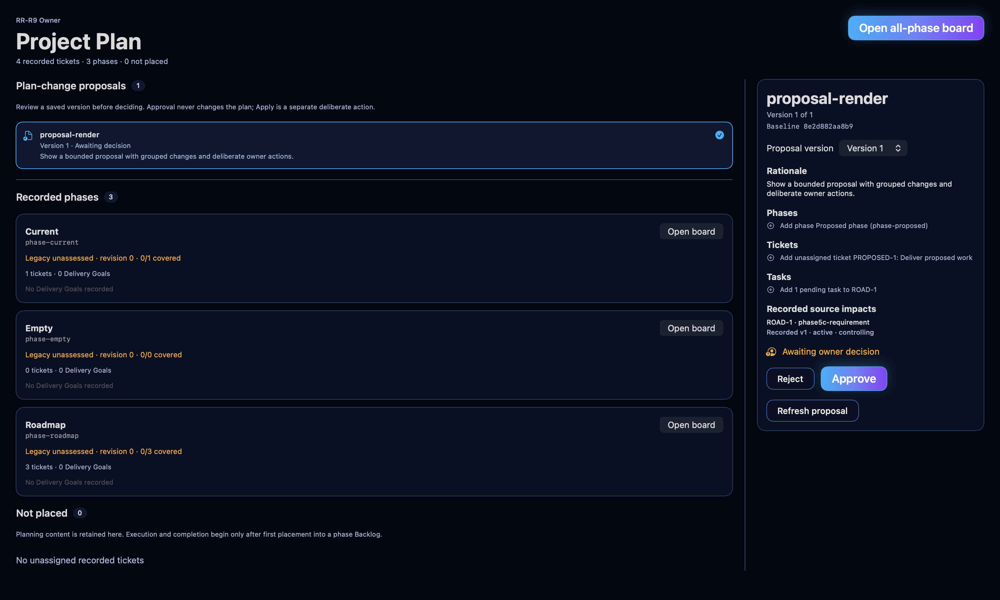
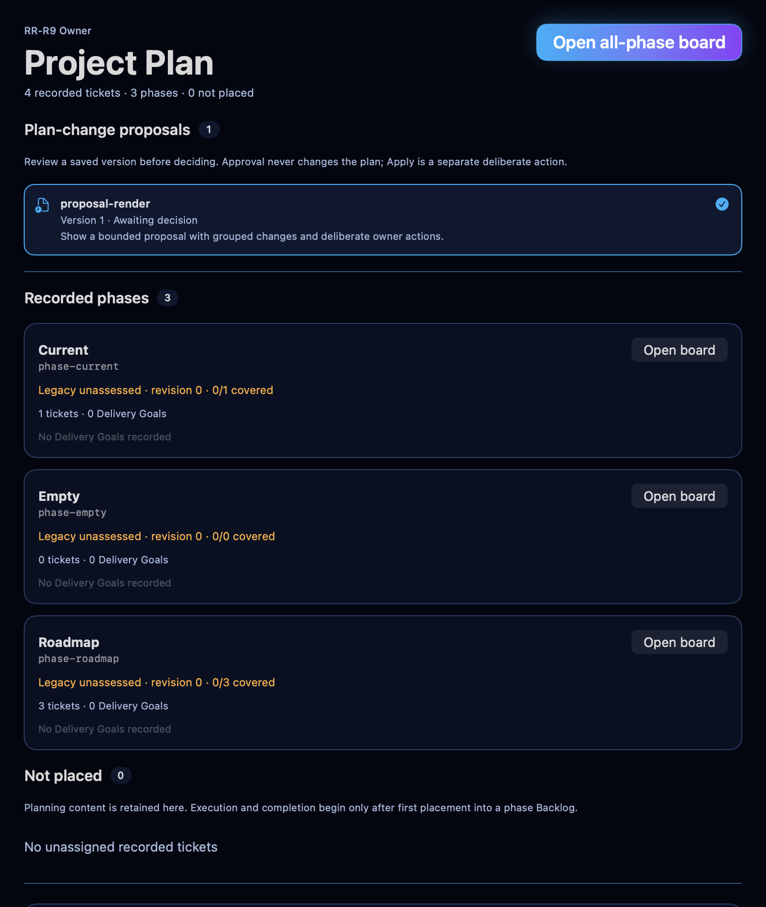

# Phase 5C saved plan-change proposals

## Delivered boundary

Phase 5C persists immutable proposal versions with an app-captured planning
baseline, derived grouped diff, rationale, exact recorded source impacts, separate
owner decisions and a unique atomic application record. External agents can use
the packaged `release_radar_save_plan_change_proposal` tool and read the resulting
history through `release_radar_plan_change_proposals`. The package intentionally
does not publish decision or apply tools: those remain trusted owner-app actions,
and external-origin attempts are rejected before replay lookup.

The native Project Plan workflow presents proposal history and exact versions,
keeps Approve separate from Apply, offers rejection and refresh, reports stale or
unavailable state without changing the graph, and restores exact proposal/source
focus through Back and Forward.

## Direct verification

- `16-contract-native.xcresult`: all 12 proposal acceptance tests passed, covering
  save/relaunch/immutability, exact decisions and replay, the complete additive
  work package, late-failure rollback, every declared baseline category, stale
  refresh/reapproval, source impacts, removal and older-backup reconciliation.
- `23-targeted.xcresult`: 78 passed, 1 failed and 0 skipped across the full proposal,
  dashboard, project-removal, recovery and navigation suites plus the two native
  proposal tests. Its sole failure was a synthetic v16 downgrade fixture retaining
  schema-21 triggers. The bounded fixture correction then passed 1/1 in
  `25-migration-fix.xcresult`.
- `22-live-focus.xcresult`: 1/1 passed. External accessibility inspection observed
  exact wide and compact focus identifier
  `proposal-source-impact-ROAD-1:proposal-requirement:1`; compact navigation brought
  that row into view, deliberate proposal selection moved focus to the proposal
  row, and Back restored the exact source focus before Forward reopened the source
  route.
- `26-packaged-entrypoints.xcresult`: the authorized proposal query and packaged
  schema tests passed (2/2); the inert parser test reached its intended final local
  guard but its assertion expected different wording. The assertion-only correction
  passed 1/1 in `27-packaged-parser.xcresult`. The parser test never connected to or
  registered the owner bridge.
- Repository diff whitespace validation passed. The final wide and compact captures
  below were exported unchanged from the passing native-render test in
  `23-targeted.xcresult` and compared with the approved
  [Phase Board](../../design/mockups/phase_board.png) and current Plan composition.

## Native captures

## Limitations and retained raw evidence

The isolated source fixture deliberately points to a missing document. The live
journey therefore verifies honest `rootUnavailable` recovery, exact history and
focus restoration; it does not claim successful current-source resolution. The
compact static capture records the top of the stacked Plan flow, while the live
journey supplied the direct scrolling/focus observation.

`24-migration-fix.xcresult` contains no executed test because the first sanitized
rerun omitted the no-signing overrides; it is retained but is not completion
evidence. All raw bundles, attachment exports and one-shot marker files remain under
`/private/tmp/release-radar-phase5c-writer/`. No installed owner application,
credentials, external service, repository content outside this worktree, push or
pull request was changed.
