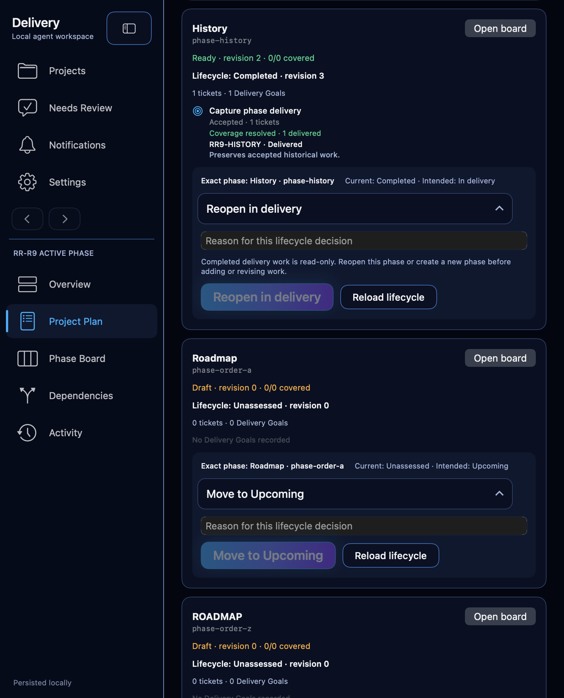

# Phase 5E explicit phase lifecycle evidence

- Date: 2026-09-10
- Branch: `codex/phase5e-lifecycle`
- Baseline: `2bee505a255b1d4dc32d9e3d377bcce015acbcdf`
- Controlling brief:
  [`phase5e-lifecycle-brief.md`](../task-briefs/2026-09-10-phase5e-lifecycle/phase5e-lifecycle-brief.md)
- Scope: local source, synthetic stores, isolated native XCTest hosts, canonical
  evidence and local commits. No push, pull request, merge, installation,
  owner-application data, catalog acceptance, owner bridge, notification,
  credential or external-service mutation was authorized or performed.

## Delivered behavior

Schema 23 stores a current phase lifecycle row and immutable transition history,
with matching retained-removal records. Existing and new phases start Unassessed
at revision 0 without fabricated history. Upcoming, In delivery and Completed
are explicit owner decisions, multiple phases may be In delivery, and the active
or viewed phase remains independent.

The owner transition command requires exact project registration, lifecycle
revision, a nonblank reason and, for completion, the exact relevant planning and
obligation baseline. External-origin lifecycle decisions reject before receipt
lookup. Successful replay returns the original receipt without another history
event. Completion rechecks required goal acceptance, current obligation coverage,
superseded debt, unfinished nonretired phase tickets and a genuinely delivered
outcome in the same audited transaction. Legacy Accepted work and exact carried
descendant delivery are supported; empty and all-dropped scope remain ineligible.
Fully resolved, explicitly dropped goal scope does not itself require goal
acceptance when other Accepted work proves actual delivery.

Completed phases are read-only across direct planning, tickets, tasks, goals,
reviews/completions, blockers, dependencies, references, managed evidence,
imports, associations and proposal save/apply paths. Both old and new owners are
checked for rehoming. Browsing, observations, identity-preserving recovery and
open work that only depends on Completed work remain allowed. Proposal baselines
include lifecycle state so decisions cannot silently cross a lifecycle change.

Removal and full backup/recovery retain current lifecycle and immutable events.
Older-backup reconciliation preserves newer lifecycle history without replaying
it over the restored live snapshot, and registration rotation preserves facts
without transferring old decision authority. Removed Project activity reads the
retained rows by exact removal identity and exposes current state plus exact
phase/revision/from-to/action/reason/audit/registration/baseline transition facts;
the historical path has no mutation or reauthorization capability.

The packaged external tools expose one read-only lifecycle query containing
current state, history and completion assessments. No external lifecycle mutation
tool is published. The Project Plan uses existing RDS cards and controls to show
exact phase, current and intended state, reason, blockers, pending/failure/
committed revision, reload and explicit reopen choices. Structural readiness no
longer claims that zero upcoming work means delivery is complete.

## Direct verification

Every build/test run used `ReleaseRadar.xcodeproj`, scheme `ReleaseRadar`, serial
macOS execution, signing disabled and a sanitized environment rooted at
`/private/tmp/release-radar-phase5e-writer`.

- `phase5e-focused-5.xcresult` executed 20 tests: 19 passed. All ten lifecycle
  acceptance tests, the exact-root authorization test, completed-phase reference,
  managed-evidence and import guards, three recovery/authority-rotation tests,
  schema-22 carry-forward and the non-native Plan fixture passed. Its only
  failure was a schema-20 downgrade fixture that had not removed newly added
  schema-23 tables and its phase-insert trigger.
- `phase5e-migration-2.xcresult` passed the corrected affected schema-20 migration
  test 1/1. The correction changed only how that historical fixture removes
  newer schema objects before setting `user_version = 20`.
- `phase5e-contracts-2.xcresult` passed the completed-phase reference pre-read
  guard 1/1. Its preceding failure exposed URL directory-representation equality
  in the in-memory authorization registry. Production authorization now compares
  exact canonical paths; the focused direct test proves an equivalent directory
  representation is admitted while a genuinely different root is rejected.
- `phase5e-navigation-red-1.xcresult` reproduced the native-discovered false
  navigation recovery: a placed ticket still present in the same project was
  treated as unavailable only because Project Plan's inspector is limited to
  unassigned/retired tickets. The bounded AppModel fix recognizes the exact same-
  project board ticket without broadening root or ticket identity. The identical
  regression passed 1/1 in `phase5e-navigation-green-1.xcresult`; real missing-
  ticket recovery is unchanged.
- `phase5e-final-focused-1.xcresult` passed 12/12: all eleven final lifecycle
  acceptance tests, including two concurrent decisions at the same revision
  committing exactly one current row/event/receipt, plus the packaged read-only
  lifecycle query and absence of any external lifecycle mutation tool.
- `phase5e-native-1.xcresult` passed its host assertions 1/1 while external CUA
  exercised the actual controls, but acceptance remained open because the first
  wide save displayed that false navigation-recovery banner and stole focus.
- `phase5e-native-2.xcresult` passed 1/1 in 107.299 seconds after the correction.
  External CUA selected only verified isolated host PID 60485 and the unique v2
  window. It exercised Empty to Upcoming then In delivery, History reopen then
  recompletion, reload after each state, completed read-only/reopen guidance and
  reason accessibility focus at wide and compact widths. The visible completion-
  blocker result had already been observed in v1 and remained unchanged, so it
  was not separately repeated in v2.
  No false recovery banner or clipping appeared. Host readback confirmed History
  Completed revision 3, Empty In delivery revision 2, three concurrent In-delivery
  phases and the unchanged active phase. Reload was exercised; a full process
  restart was not claimed or required for this journey.
- The packaged-tool schema check passed 1/1 in `phase5e-contracts-1.xcresult`;
  its paired reference test was superseded by the corrected green contract run.
  `git diff --check` also passed before candidate preparation.
- Independent review found two Required gaps in the prepared candidate. The
  focused mixed delivered/fully-dropped regression failed both eligibility
  assertions in `phase5e-review-r1-red-1.xcresult`. The retained-history
  regression first encountered a test-only async-autoclosure compile error in
  `phase5e-review-r2-red-1.xcresult`; after that harness correction,
  `phase5e-review-r2-red-2.xcresult` directly failed because the expected
  retained current-lifecycle activity item was absent.
- `phase5e-review-green-2.xcresult` passed 3/3 after the bounded corrections:
  mixed delivered plus fully dropped scope is eligible, all-dropped scope still
  fails phase-level nonvacuity, and the removed-project activity path returns
  exact retained lifecycle facts while rejecting an old-registration owner
  transition without changing history. The first green attempt,
  `phase5e-review-green-1.xcresult`, was compile-blocked by a local `compactMap`
  inference ambiguity; adding the explicit optional result type was the only
  correction before the passing rerun.

The installed owner application remained PID 60590 throughout native testing and
was never selected, controlled, terminated or connected to. All stores were
synthetic and external services were suppressed.

## Native visual evidence

The selected attachment is copied unchanged from the passing native-2 result
bundle. It shows the compact Completed history card with exact phase identity,
persisted revision, current/intended lifecycle, reason control, explicit reopen,
reload and completed read-only guidance. The live wide journey additionally
verified visible completion blockers and committed revision feedback.

The result was compared with the approved Phase Board and Goals mockups and the
current Project Plan composition. It preserves the dark Rekon surface, five-lane
navigation, card hierarchy, typography, status color and compact stacking. The
expanded lifecycle decision panel is the approved Phase 5E extension; no design
deviation was accepted. The v1 focus/recovery discrepancy was fixed and the v2
journey verified the intended focus behavior.

## Portable representation boundary

ADR-001 records the future portable-package requirement: complete export/import
must preserve current lifecycle plus immutable event identity, revision, from/to,
typed action, reason, timestamp, source registration/generation and completion
baseline, or fail explicitly. Phase 5E does not modify portable archive v1 or the
current exporter/importer.

## Temporary-output status

No orchestrator cleanup was performed. The pre-correction v1 native fixture did
remove its live-store XCTest temporary root during teardown, producing the vnode
unlink warning that prompted removal of that teardown cleanup. All subsequent
temporary outputs and roots were retained: result bundles, logs, attachment
exports, isolated home/tmp/DerivedData, v1 and v2 marker files, and the remaining
synthetic stores under `/private/tmp/release-radar-phase5e-writer`,
`/Users/Shared/release-radar-reference-fixture-*`,
`/Users/Shared/RekonImportTests-*` and XCTest temporary roots. The PNG above is
the verified canonical repository copy; the exported original and manifest remain
under `/private/tmp/release-radar-phase5e-writer/phase5e-native-2-attachments`.
