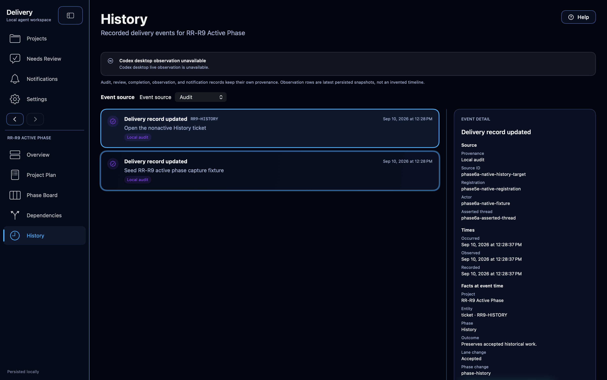
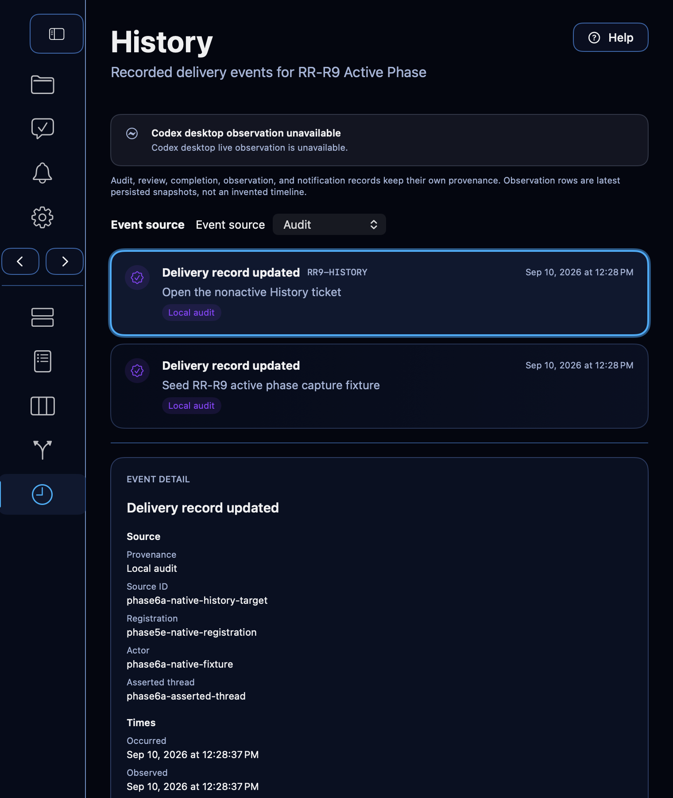

# Phase 6A truthful event-time History evidence

- Date: 2026-09-10
- Branch: `codex/phase6a-history`
- Baseline: `6bcd31ed4a6fcc9b9c88c1e074e5f24a93787e7f`
- Controlling brief:
  [`phase6a-history-brief.md`](../task-briefs/2026-09-10-phase6a-history/phase6a-history-brief.md)
- Scope: local source, synthetic stores, isolated native XCTest hosts, canonical
  evidence and local commits. No push, pull request, merge, installation,
  owner-application data, catalog acceptance, owner bridge, notification,
  credential or external-service mutation was authorized. No owner-application
  interaction was knowingly performed; the nonterminal R4 verification deviation
  and remaining service/Keychain uncertainty are recorded below.

## Delivered behavior

Store schema 24 records event-time audit facts atomically with each authoritative
delivery transaction: exact project and registration, available ticket and phase
identity/name, lane or transition values, outcome, request generation, provenance,
occurrence time and recording time. Transaction rollback removes both the state
change and event. Pre-schema-24 audit rows remain explicitly unknown rather than
being reconstructed from current delivery state.

The project History projection uses stable project/registration/source identities
for audit, retained history, latest persisted observations, notification delivery,
reviews and completions. Occurrence, observation and recording times remain
separate where meaningful. Deterministic newest-first ordering and All, Audit,
Observations, Notifications, Reviews and Completions filters preserve unrelated
events. Empty History, no matches, failed reads and incomplete observation sources
remain distinguishable. Reading or filtering History does not mutate delivery
state, acceptance or attention.

Removal, re-add and full backup recovery retain the original event identity and
facts without transferring authority to the replacement registration. Exact
ticket and nonactive-phase navigation uses shared typed navigation history. The
verified R4 correction records and restores the actual vertical History scroll
offset, including positions below the final timeline row, together with the
selected event, filter and keyboard or accessibility focus. Removed-project History
keeps its own mutable browsing state while exposing no action that can reopen or
mutate the removed registration.
Missing targets, including legacy audit rows without recorded identity, present an
accessible recovery state instead of substituting a current ticket or registration.

The visible Activity route is now History while the existing internal route and
file names remain for compatibility. The wide surface presents a timeline beside
event detail; compact mode stacks a full-width timeline and detail. Contextual Help
explains provenance, the three time meanings, unknown legacy facts, current context,
attention versus acceptance and copied-not-dispatched actions without claiming a
future observer or service.

## Direct verification

The completed pre-R4 build/test runs used `ReleaseRadar.xcodeproj`, scheme
`ReleaseRadar`, serial macOS execution, signing disabled and a sanitized environment
rooted at `/private/tmp/release-radar-phase6a.eJzQ2M`.

- `history-final-focused-3.xcresult` passed 20/20 final focused persistence,
  projection, navigation, removal/re-add, recovery, notification, route-rendering
  and historical migration tests.
- `history-native-5.xcresult` passed its isolated native host test 1/1 in 87.158
  seconds. External CUA attached only to the app under the matching DerivedData
  product at verified host PID 90021 and the unique window titled
  `Phase 6A History — isolated native interaction 01a08be3-v3`.
- The native journey reached the first and last timeline events, every relevant
  filter and selected detail with keyboard/accessibility navigation at wide and
  compact widths. It opened the exact nonactive `RR9-HISTORY` phase, returned to
  the exact Audit filter and `phase6a-native-history-target` event, exercised Help,
  and repeated exact ticket navigation and Back restoration. The installed owner
  application remained PID 60590 and was never selected, controlled, terminated
  or connected to.
- Historical schema migration fixtures for versions 15, 16 and 20 passed after
  their test-only downgrade support learned to remove schema-22 through schema-24
  objects before declaring the older version. No accepted historical definition
  was rewritten.
- The preceding broader `history-final-focused-2.xcresult` exposed one additional
  version-18 fixture mismatch: its current-writer seed contained schema-24 facts
  that could not have existed in the simulated version-18 database. The fixture
  now clears those facts before its pre-migration snapshot; the direct correction
  passed 1/1 in `history-v18-green.xcresult` and is included in the final 20/20.
  That broader run also selected an unrelated Task 11A notification test whose
  four assertions fail at an unchanged Phase Plan readiness prerequisite before
  reaching its notification/replay checks. No planning repair was made. The five
  notification invariants selected by the Phase 6A scope pass in the final run.
- `git diff --check` passed before candidate preparation.

Independent review identified seven required corrections. The correction preserves
schema-24 audit facts during older-backup recovery, keeps removed History controls
interactive, qualifies retained runtime identities by thread and goal, restores
the exact History viewport and detail focus, renders the complete recorded detail,
merges retained lifecycle metadata into the original audit event, and leaves
unrecorded observation times unknown.

- `history-review-corrections-final.xcresult` passed 10/10 affected projection,
  migration, lifecycle-removal, project-removal, recovery and navigation tests.
- `history-native-correction-10.xcresult` passed its corrected isolated native host
  journey 1/1 in 190.886 seconds. External CUA attached only to the matching
  DerivedData app at host PID 95442 and the window titled
  `Phase 6A History — isolated native interaction correction-root-v10`.
- At wide and compact widths, the corrected native journey scrolled to the exact
  event, selected it, displayed all four recorded-detail lines, opened its
  nonactive ticket and returned through Back with the exact Audit filter, selected
  identity, row-relative viewport and `history-open-entity` accessibility focus. It
  then removed the synthetic project, changed the removed History filter, selected
  different rows at both widths, restored the full detail and verified that no Open
  action existed. The installed owner application remained PID 60590 and was never
  selected or controlled.

### Verified R4 actual-viewport correction

The same independent reviewer found that the row-relative viewport assertion above
did not cover the inspector below the final timeline row. In its compact scenario,
Back returned to approximately 0.63 rather than the absolute bottom and left Open
offscreen. The final source candidate replaces the row identity with the enclosing
`NSScrollView`'s real vertical offset through a narrow `NSViewRepresentable` bridge;
SwiftUI and `AppModel` remain the source of truth, while the coordinator only
observes and restores the native scroll view.

One nonterminal native R4 run (`history-native-r4-root-v1.xcresult`) exercised the
new behavior before candidate preparation. At wide width, the real accessibility
scroll value returned from 0.345270 to 0.345037 with Open visible and focused. At
compact width, it returned from absolute bottom 1.0 to 1.0 with the full inspector,
Open visible and `history-open-entity` focused. The run nevertheless failed 1/1
because its first assertion compared the raw offset before activating Open (2404.5)
with the navigation-captured/restored offset after AppKit's 6-point focus visibility
adjustment (2410.5). The candidate now compares the restored model value with the
offset captured at navigation time while retaining direct before/after accessibility
viewport and focus assertions.

The independent reviewer's fresh sanitized run of candidate `d4b5df3` executed
3 tests: 2 passed and the native test failed only its assumption that the captured
compact offset could not decrease. Focus/layout reduced that offset by 12 points
while the actual scrollbar remained at 1.0; wide viewport restoration, compact
bottom, full inspector/Open visibility and focus checks passed. Final source
candidate `fbbf138b00b0ff9e0b0de3ec33b269984288d30b` removes the directional
comparison and retains the captured/restored offset equality, actual before/after
viewport and Open focus assertions.

The same reviewer's affected native rerun on that final source candidate passed
1/1 with zero failures or skips. The orchestrator confirmed the result by direct
readback of
`/private/tmp/release-radar-phase6a-r4-review-01a08c37.MJLXYm/r4-review-v2.xcresult`.
The reviewer observed actual wide viewport and compact absolute-bottom restoration,
the full inspector and visible Open action with restored focus. The isolated host
exited. This closes the outstanding R4 runtime verification.

### PR 44 reset-boundary correction

Review of PR 44 found that application preference reset and recovered-store
adoption cleared board and navigation state but retained the in-memory History
filter, selected event and viewport dictionaries. A reused project ID could
therefore reopen with History context from the prior preference session or retired
store registration. Two focused `NavigationHistoryTests` cover the real
`AppModel.resetApplicationPreferences` and `AppModel.adoptRecovery` boundaries,
including reopening History for the same project ID after a fresh recovered
registration.

The independent expected-red run of test-only candidate `12ddb97` executed both
selectors. Their preconditions passed, then each test failed only the six intended
post-reset assertions: Audit remained instead of All events, the stale event identity
remained selected and offset 412.75 remained, both immediately and after reopening.
The recovery case also demonstrated that an event identity from the retired
registration survived adoption of the fresh registration. The 12 assertion failures
are recorded in
`/private/tmp/release-radar-phase6a-reset-review-01a08c37-12ddb97/red.log`.

The bounded correction adds the three missing dictionary resets to
`clearEphemeralViewState`. Normal Back and Forward navigation outside reset and
recovery continues to preserve History context. Final focused verification and
independent review remain pending on this correction candidate.

Before the fresh reviewer runs, writer verification departed from the authorized
sanitized inert XCTest-host path. An unsanitized build-for-testing succeeded and re-signed the
scratch products; two subsequent unsanitized Xcode launches were interrupted before
XCTest materialized (0 tests executed in each) while their scratch hosts were blocked
in macOS sandbox initialization. A direct `xctest` invocation ran two model tests
with 2 passes, but that result is excluded from approval evidence; later direct
native attempts produced one skip and one pre-window crash, not a passing native
result. Those attempts also left two symlinks inside the scratch test-bundle
Frameworks directory. The scratch products are therefore treated as contaminated
and retained unchanged. The observed test-host paths were scratch products, and no
owner/default application interaction was knowingly performed, but no claim of zero
service or Keychain effects is made. The independent reviewer performed the final
verification from freshly built products using the approved isolated path.

## Native visual evidence

Both repository images are unchanged copies of attachments from the passing
native-5 result bundle and were inspected at their original resolutions. Comparison
with `history.png` and `history_compact.png` confirmed the dark Rekon palette,
source chips, timeline rhythm, wide list/detail relationship and compact stacking.

The implementation intentionally uses the established detailed inspector rather
than the mockup's flatter grouped cards, so exact provenance, times, recorded facts,
recovery and navigation remain together. Sidebar compaction is an explicit app
control and was exercised directly. Observation availability reports the actual
implemented source as unavailable/incomplete where appropriate; it does not repeat
aspirational mockup freshness copy.

## Boundaries and limitations

The observation source still represents the latest persisted snapshot, not an
invented immutable observation-change timeline. Actor and thread attribution is
labelled by provenance and is not promoted to verified independent review. The
native journey exercised reload and retained-store recovery tests exercised store
reopen; a full owner-app process restart was neither performed nor claimed.

The writer performed only diff-level validation after its verification reservation
was revoked; the fresh independent results above supply final R4 runtime evidence.

The current portable archive v1 is unchanged. Future complete portable formats
must represent supported History facts and provenance or reject unsupported export.

## Temporary-output status

No cleanup was authorized or performed. Result bundles, logs, isolated home/tmp,
DerivedData, marker outputs, attachment exports and synthetic stores remain under
`/private/tmp/release-radar-phase6a.eJzQ2M`,
`/private/tmp/release-radar-phase6a-attachments.iOBzDG` and
`/private/tmp/release-radar-phase6a-r4-review-01a08c37.MJLXYm`. The PR 44
expected-red output remains under
`/private/tmp/release-radar-phase6a-reset-review-01a08c37-12ddb97`. The two PNGs
above are the verified canonical repository copies.
