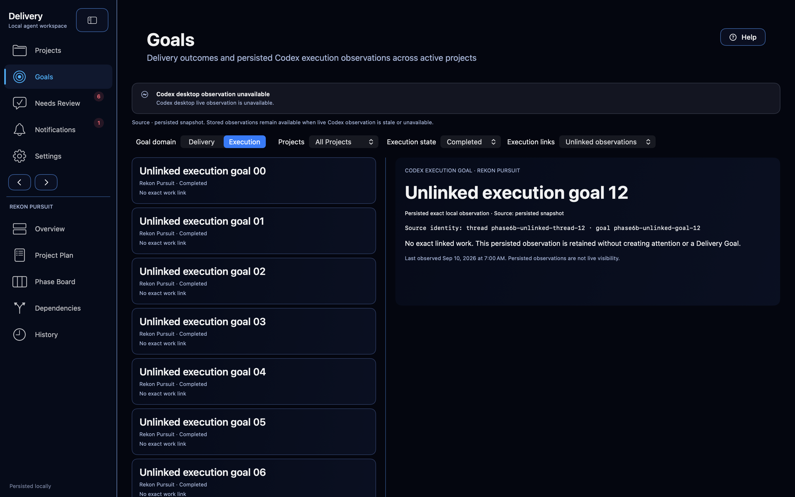
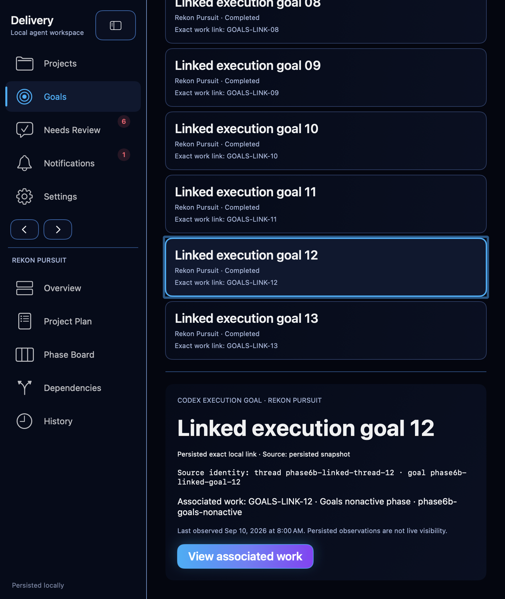
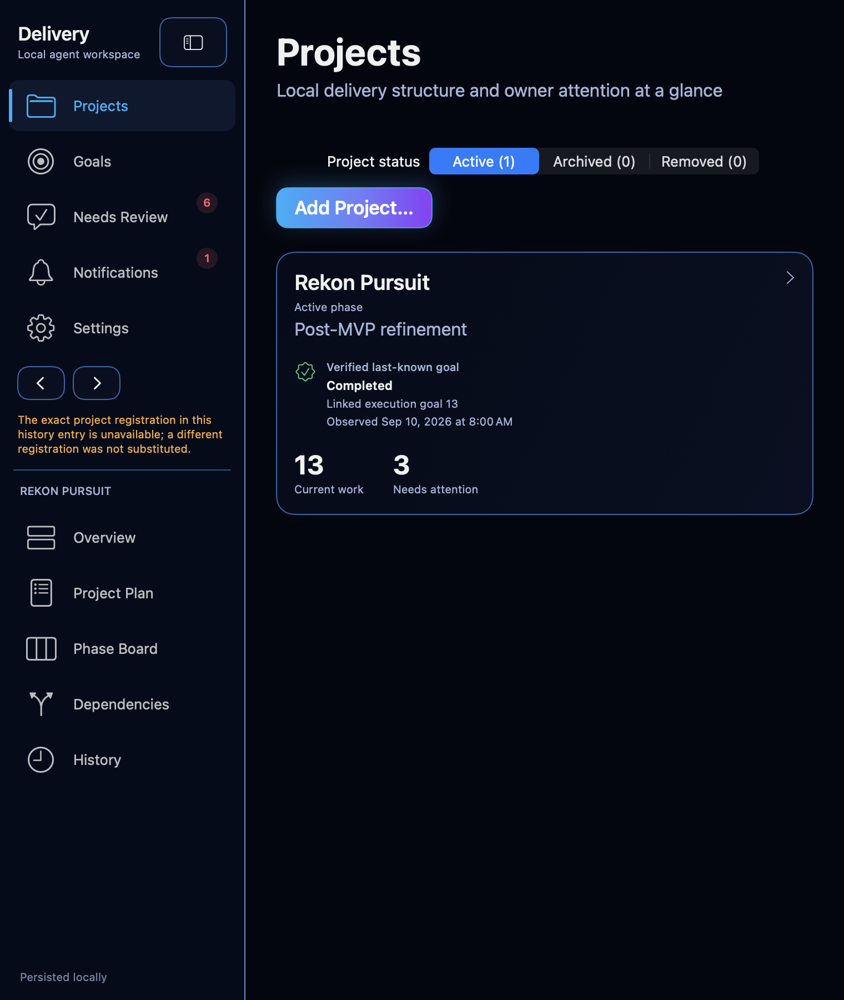

# Phase 6B workspace Goals evidence

- Date: 2026-09-10
- Branch: `codex/phase6b-goals`
- Baseline: `c374a155589f2b9077787718c209008929bb1744`
- Controlling brief:
  [`phase6b-goals-brief.md`](../task-briefs/2026-09-10-phase6b-goals/phase6b-goals-brief.md)
- Scope: local source, synthetic stores, isolated native XCTest host, canonical
  evidence and local commits. No push, pull request, merge, installation,
  owner-application state, catalog acceptance, credentials, notifications or
  external-service mutation was authorized or performed.

## Delivered behavior

Goals is a workspace route with explicitly separate Delivery and Execution
domains. Delivery discovers phase-owned formal outcomes across active projects,
including terminal goals and unassigned work, while preserving project, phase
and registration identity. Its detail reports criteria, membership, carried
obligation coverage, structural readiness and owner acceptance as separate
facts. Superseded or dropped scope does not become delivered credit.

Execution discovers every persisted goal observation for active projects,
including completed and unlinked observations. Exact thread/goal identity, exact
ticket link, source provenance, observation time, freshness and source
availability remain distinct. Persisted data remains visible when live Codex
observation is unavailable, without claiming live visibility or creating a
formal Delivery Goal or attention state.

Both domains provide project and applicable state filters, exact selected detail,
distinct empty/filter-zero/unavailable states and contextual Help. Associated
work opens the existing all-phase board using an explicit typed Delivery Goal or
Execution Goal filter; **All goals** clears it while retaining the selected
ticket. Associated work includes stored nonactive phases and keeps their phase
identity. Browsing performs no delivery, lifecycle, lane, acceptance or attention
mutation.

Navigation history stores the Goals domain, project and state filters, exact
selection, actual viewport and keyboard/accessibility focus. Back and Forward
restore that context after board navigation. If the exact project registration
has been replaced or removed, recovery returns to Projects, focuses the recovery
message and explicitly refuses substitution.

## Direct verification

Every build/test run used `ReleaseRadar.xcodeproj`, scheme `ReleaseRadar`, serial
macOS execution, signing disabled and a sanitized environment under the retained
Phase 6B scratch root. Dependencies were resolved from the pinned offline
SourcePackages checkout at RekonDesignSystem revision
`6d1fb9d341850ee1d13ba9391fada072534eb684`.

- `phase6b-native-build-20260910-06.xcresult` completed the isolated native build.
- `phase6b-native-run-20260910-06.xcresult` passed the exact native Goals journey
  1/1 in 176.445 seconds. The controller used only the verified test host and
  unique Phase 6B window. It exercised the filter-zero state; Delivery and
  Execution domains; exact project, state and link filters; contextual Help;
  linked and unlinked completed observations; nonactive-phase associated work;
  explicit Delivery Goal and Execution Goal board filters; **All goals**; wide
  and compact layouts; actual compact scrolling with retained goal focus;
  exact Back/Forward model, viewport and accessibility-focus restoration; and
  replaced-registration recovery. Active phase and ticket lane remained
  unchanged.
- The final run used the copied
  `phase6b-native-phase6b-goals-writer-20260910-05.xctestrun` with unique session
  token `phase6b-goals-writer-20260910-05`. That runfile points to the fresh
  `native-DerivedData/Build/Products/Debug/ReleaseRadar.app`, its embedded
  `ReleaseRadarTests.xctest`, and the same fresh product directory's agent tools,
  bridge, core framework, documentation tool, lifecycle helper and wrong-agent
  fixture. Its command used `env -i` with explicit `PATH` and `TMPDIR`, plus
  disabled signing. It did not include the identity, explicit developer-directory
  or architecture flags used in some preparation commands, so no broader native
  command configuration is claimed. Every final completion marker carried the
  same unique `-05` token and the passing test first asserted those markers were
  absent; the one-time enable marker was consumed on startup. No marker from an
  earlier session was reused.
- Earlier native run 03 failed eight assertions, directly exposing premature
  board-state mutation, lost outgoing Goals history and incorrect recovery
  focus. Run 05 was stopped once the remaining synthetic pre-scroll expectation
  was shown not to represent the actual departure viewport. The bounded fixes
  moved board state changes after navigation, guarded Goals bindings to their
  route, focused accessible recovery and made the journey capture the real
  scroll needed to expose its action. The final passing run supersedes both.
- `phase6b-writer-v22-source.xcresult` passed the seven final focused source
  tests 7/7 in 1.328 seconds. They cover exact linked/unlinked persisted-goal
  discovery, byte-distinct same-ID Delivery Goals across projects, workspace
  routing, typed Execution Goal board filtering, navigation-entry state,
  Back restoration and the associated-work navigation-order regression.

The passing native result emitted a benign teardown warning after the temporary
fixture directory was unlinked while SQLite still held a vnode. The test and all
assertions completed successfully; no product store, owner data or external
state was involved.

## Native visual and accessibility evidence

The wide capture shows the cross-project Execution list and selected exact
detail side by side, with unavailable-live-observer guidance, persisted-source
copy and filters remaining visible.

The compact capture shows the goal row retaining native focus after Back, the
detail stacked in the same vertical scroll surface and the associated-work action
remaining reachable without horizontal clipping.

The recovery capture shows the exact registration failure on Projects and the
separate recovery focus target. Accessibility readback contained the same refusal
to substitute a different registration.

The Goals mockup remains the Execution-domain reference for workspace discovery,
source chips and wide list/detail composition. The delivered UI preserves the
dark Rekon palette, selected-row accent, native controls and information hierarchy.
It deliberately adds a Delivery/Execution domain selector and keeps formal
Delivery facts separate. It also opens associated work in the existing all-phase
Phase Board rather than reproducing five lanes inside Goals. Compact composition
uses one scrolling list/detail stack instead of a separate drill-in. These are
necessary product-boundary and responsive adaptations, not new delivery states.

## Candidate closeout

The packaged documentation check was run against the exact repository root from
the pinned isolated build. Before orchestrator-owned catalog/index integration it
correctly reports the new compact capture as an uncatalogued file. The writer does
not own those metadata files; the four intended evidence entries were supplied to
the orchestrator for the required integration and final check. The final local
candidate commit and independent review disposition are reported in the delivery
closeout after that owned integration.

## Temporary-output status

No cleanup was authorized or performed. Result bundles, logs, marker files,
isolated DerivedData, dependency checkout, attachment exports and synthetic
stores remain under `/private/tmp/release-radar-phase6b.PTQwNy`. The three PNGs
above are the verified canonical repository copies.
