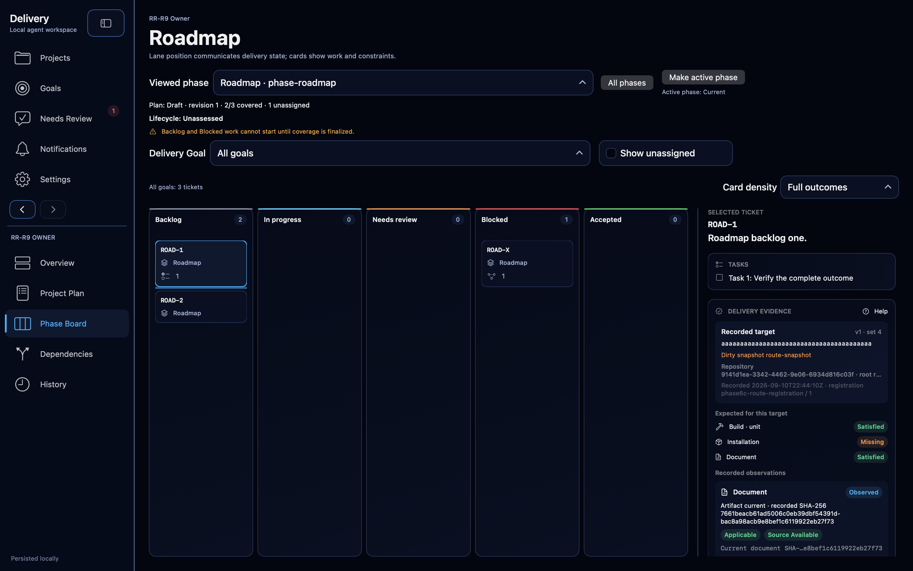
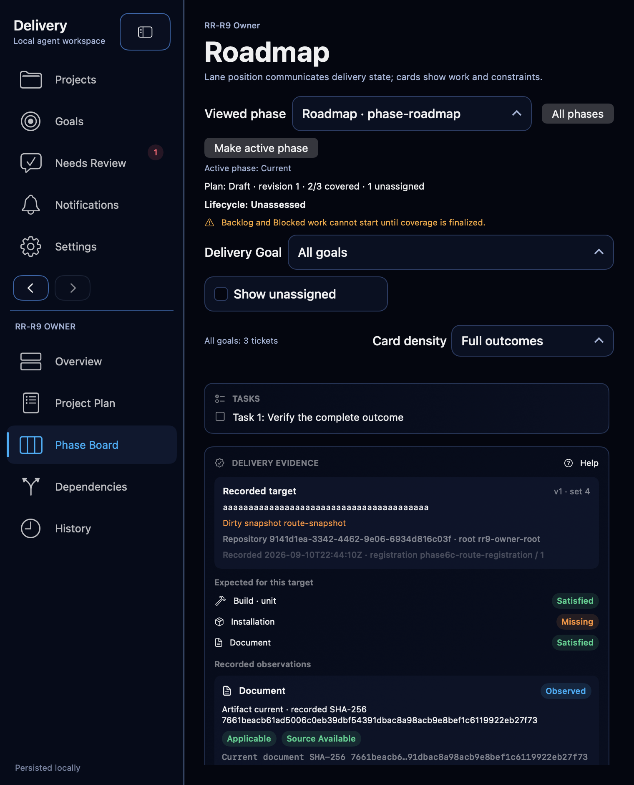

# Phase 6C revision-bound delivery evidence

## Delivered contract

Phase 6C adds a versioned evidence target per ticket and append-only typed
observations for repository, commit, pull request, check, document, build and
installation facts. Commands use the existing authorized project registration,
root and replay envelope. Target, observation, audit and request-receipt writes
are atomic; invalid facts, stale evidence revisions, stale registrations and
post-lifecycle writes fail without partial effects.

The ticket inspector presents the recorded target, expected categories,
observation history, applicability and source availability without treating any
of them as owner acceptance. Applicability compares recorded identities with the
current recorded target. Managed-document refresh may re-read only the exact
accepted catalog artifact under the authorized root; it does not execute work,
contact providers or mutate delivery state.

Project removal preserves immutable historical evidence while removing live
authority. Re-adding creates a distinct registration. Application recovery from
an older backup rotates authority and reconciles retained newer evidence as
history instead of discarding or re-authorizing it. Portable archive v1 is
unchanged.

## Direct verification

Focused XCTest evidence passed on macOS 26.5 with Xcode's unsigned arm64 Debug
test host and pinned RekonDesignSystem revision `6d1fb9d`:

- `results-integration-green-04.xcresult`: 8/8 acceptance and applicability
  tests passed, covering schema migration without invented legacy identity,
  typed command replay, target changes, managed-document byte readback,
  lifecycle rejection, exact/stale/unknown applicability and distinct failed or
  skipped check results.
- `results-recovery-green-02.xcresult`: 1/1 older-backup recovery test passed,
  including authority rotation and preservation of post-backup evidence history.
- Thirteen focused final selectors passed across
  `results-focused-green-02.xcresult`: all seven acceptance cases, all four
  applicability cases, empty/unavailable rendering and late-result withdrawal.
- The component wide/compact rendering selector passed in
  `results-recovery-ui-green-01.xcresult`. The exact transport-schema selector
  passed in `results-route-green-01.xcresult`, including malformed-fact rejection
  before transport.
- `results-native-build-01.xcresult` completed `build-for-testing`. The guarded
  `results-native-live-01.xcresult` run then passed the integrated Phase Board
  journey 1/1 in 60.531 seconds. It used copied format-2 runfile
  `phase6c-native-phase6c-evidence-writer-20260910-01.xctestrun`, unique session
  `phase6c-evidence-writer-20260910-01`, resolved all product paths to the fresh
  build root and consumed a fresh enable marker. The external controller verified
  the exact isolated host PID and tokenized window before interaction, stopped UI
  control before writing the matching completion marker, and made no later UI
  call.

These result bundles and runfiles remain retained temporary diagnostics under the
Phase 6C scratch directory. They are not controlling artifacts. No installation,
owner application/store mutation, provider request, notification, network call,
portable import/export or repository-document write occurred.

## Review corrections

The four Required findings from independent review received bounded corrections:
superseded observations no longer satisfy expectations through either evaluator
entry point; app recording time and evidence-set append revision replace caller
time/ID ordering; unknown checkout identity stays Unknown, including target-bound
checks and unchanged managed documents; and PR facts must identify their explicit
head or a recorded merge revision when merged. A head observation still cannot
satisfy a target at the merge revision.

`results-review-fixes-01.xcresult` passed all 17 affected tests: 10 acceptance and
7 applicability tests, zero failures, in 1.263 seconds of test execution. The
sanitized unsigned arm64 run used the pinned package cache and exercised scope-
and revision-changing corrections, app timestamps/order, exact and changed-body
replay, PR rejection without side effects, unknown checkout/document readback,
migration, atomicity, lifecycle guards, removal and older-backup recovery. Removal
and recovery preserve the assigned append revision. Regression source was written
before the implementation corrections; no pre-fix test execution occurred while
the shared build reservation was occupied.

The append-order column refines the same unshipped schema-25 migration and its
retained tables. Earlier synthetic schema-25 candidate stores are not upgrade
inputs; no installed or owner store was changed. The UI and native test are
unchanged, so the existing native evidence remains applicable. The correction
delta is subject to the same independent review before final acceptance.

## Native visual and accessibility evidence

Both repository images are unchanged copies of inspected attachments from the
passing guarded native result. The wide view shows Delivery evidence in the
selected ticket's side inspector. At 760 points the compact Phase Board scroll
shows the stacked inspector with its task row, Delivery Evidence heading and Help
control, exact recorded target and dirty-snapshot context, Build satisfied,
Installation missing and Document satisfied expectations, plus the document
observation and applicability/source badges without horizontal clipping.

The same mounted route test gave the Help control native accessibility focus,
activated it through `AXPress`, confirmed the “Recorded is not live” explanation,
closed the sheet through its accessible Done control, retained the project/ticket
selection and asserted the evidence content after responsive resize. Separate
rendering tests cover loading-equivalent empty/unavailable recovery and withdrawal
of a late result after ticket identity changes.

The captures preserve the established dark inspector-card vocabulary. No approved
design mockup was replaced. The custom AX-frame screenshot experiments that failed
to place the panel in the actual compact window were rejected and removed; they
are not reported as product evidence.
