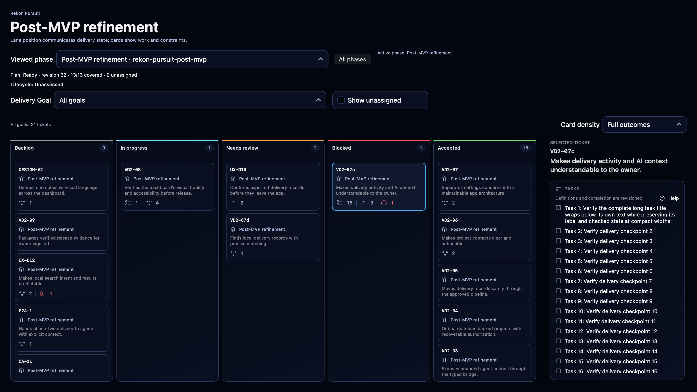
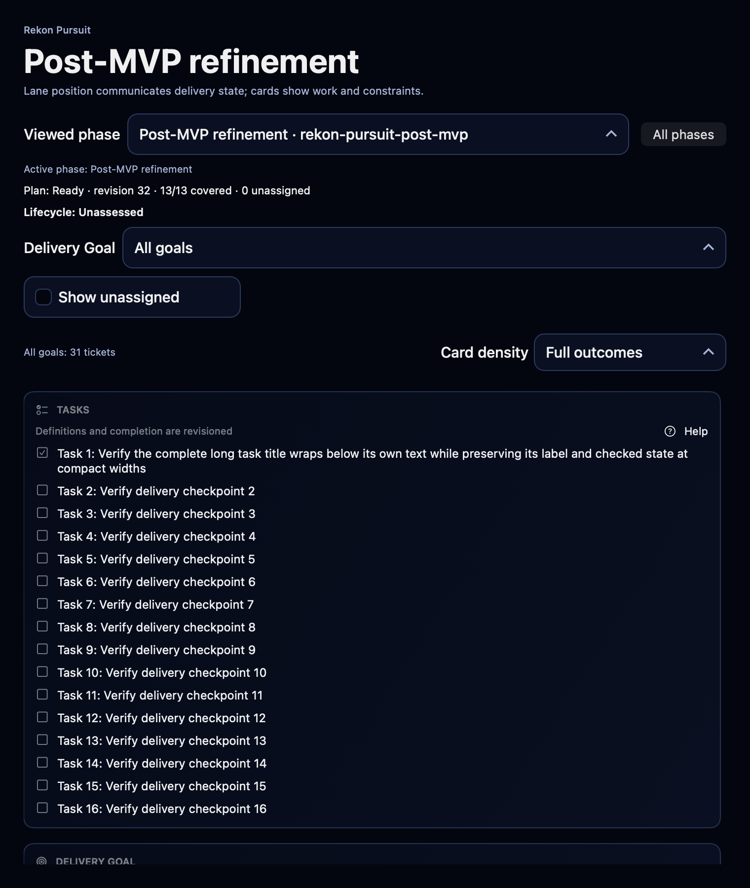
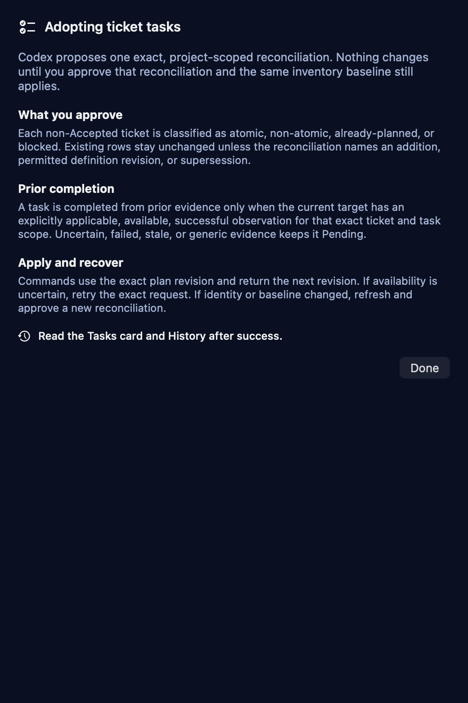
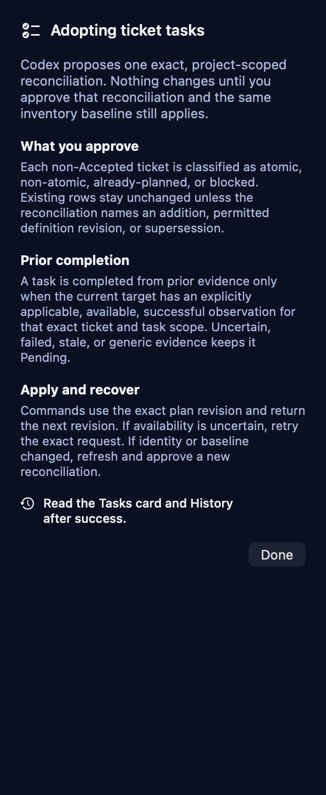

# Phase 6D agent task adoption

## Delivered contract

Phase 6D gives an authorized agent one complete, project-scoped delivery
inventory before task adoption. The typed read-only query returns the exact
project, root and registration, every phase and lifecycle, every ticket
including Accepted, retired, completed-phase and unassigned work, every current
plan revision, and current plus superseded task history. It has explicit row and
response bounds, rejects stale authorization, and performs no writes.

Managed repository guidance v3 and release-radar plugin package 0.1.9 define the
generic adoption workflow: inventory first, classify every non-Accepted ticket,
present one exact reconciliation, wait for owner approval, then use only the
existing revision-bound task commands. Prior completion requires current,
available, successful evidence explicitly applicable to the exact ticket and
task scope. Uncertain, failed, stale or generic evidence leaves a task Pending.
Exact guidance v2 remains readable and upgradeable; modified, duplicated or
future managed blocks fail closed. Existing package versions remain recognized.

The Phase Board Tasks inspector adds native Help explaining approval,
classification, evidence, exact revisions, replay and recovery. Its accessible
Done action closes the help surface. The dashboard continues to read task state
from Release Radar's existing typed store and shows the resulting active task
count and rows; no second source of truth was introduced.

## Direct verification

All commands used the sanitized unsigned arm64 macOS Debug host, serial test
execution, offline package resolution and pinned RekonDesignSystem revision
`6d1fb9d`.

- `results-green-06.xcresult` passed the four Phase 6D adoption acceptance tests:
  complete mixed-state zero-write inventory, response-bound rejection, and the
  end-to-end inventory-to-current-evidence-to-owner-scoped-task-command journey
  with exact replay and nonduplicated receipts.
- Nineteen contract and compatibility checks passed and remained terminal in
  `results-green-08.xcresult`, covering packaged helper schema, plugin lifecycle,
  recognized package versions, shared-execution boundaries, onboarding prompt,
  guidance inspection and application refresh. The fixture-dependent guidance
  cases then passed after their synthetic roots moved to the established
  non-symlink `/Users/Shared` test location; production no-follow protection was
  not weakened.
- `results-green-11.xcresult` passed 5/6 affected cases: the changed wide/compact
  Help component with real Help and Done actions, the saved managed-guidance
  observation, and all three remaining preview/import paths. Its sole failure
  was the integrated compact interaction before a visible user scroll.
- `green-14-build.log` records a successful build-for-testing. The guarded live
  `results-green-14.xcresult` then passed the integrated Phase Board journey 1/1
  in 56.282 seconds with zero failures or skips. The copied format-2 xctestrun
  resolved all host, bundle and product paths to the fresh build and carried the
  unique target-scoped session environment. The external controller verified
  exact isolated host PID 47435, product and window, scrolled only the compact
  recovery view until Tasks and Help were visible, stopped UI control, and wrote
  the matching completion marker. The test itself activated Help through AX,
  verified the guidance, closed it through Done and captured the mounted view.
- `git diff --check` passed before candidate preparation.

All stores were synthetic and external services were suppressed. No owner
application data, owner store, installation, provider, notification, network,
catalog-acceptance, push, pull request or merge action was used.

## Independent-review corrections

The initial independent review found three required presentation and guidance
omissions. The bounded correction now keeps the accepted catalog version
separate from the current guidance version, names guidance v3 throughout the
staged and recovery presentation, requires atomic/non-atomic classification and
an explicitly owner-approved titled task catalog before non-atomic
implementation, and records approved command envelopes plus their disposition,
returned plan revisions and audit IDs in existing repository delivery
documentation for exact recovery after interruption.

The focused RED run executed three regression tests with the expected failures.
After correction, `results-review-green-01.xcresult` passed all nine selected
presentation, adoption-guidance, packaged-skill, lifecycle-digest and recognized
capability tests with zero failures. The normalized unshipped 0.1.9 package
digest is
`b01335654a5dedcf2055c9bfa3e074e478f75dd2b9e4171dd16c1f2a4427ef83`;
the frozen 0.1.7 and 0.1.8 identities remain unchanged. The accepted native UI
evidence above was not rerun because these corrections do not change that Tasks
or Help UI.

## Native visual and accessibility evidence

The repository images are unchanged copies of inspected attachments from the
passing component and guarded integrated results. Wide layout shows the selected
blocked card's 16-task count beside the full Tasks inspector. At 760 points the
live-scrolled compact view shows the Tasks heading, Help affordance, wrapped
completed first task and all 16 task indicators without horizontal clipping.
Both Help widths preserve the dark Rekon surface, hierarchy and readable wrapping
while keeping the full adoption and recovery explanation plus Done visible.

The captures were compared with the approved Phase Board wide and compact
mockups. They preserve the established lane, card, inspector, typography, color
and spacing vocabulary. The Tasks Help surface is the bounded Phase 6D extension;
no approved mockup was replaced.

## Temporary-output status

Build products, result bundles, logs, exported attachments, the copied xctestrun
and native marker files remain under
`/private/tmp/release-radar-phase6d-writer-01a08d97`. They are retained temporary
diagnostics and are not controlling artifacts. The four PNG files linked above
and this record are the verified canonical repository copies. No temporary
output was deleted.

The same independent Astra High reviewer, task
`01a08dd9-47dd-7ea0-b208-810fe7514e32`, approved correction
`4f3a78ac8fba2d63401f1801f970282d1091f3f0`, integrated at
`1f4f5ed45cdf0e04b2e4bec7251c0081a5c9fbcd`. All three Required findings are
resolved, the nine affected tests passed without failures or skips, and frozen
0.1.7/0.1.8 identities remain unchanged. No additional runtime verification was
needed. This completes local Phase 6D source review, not installed acceptance.
