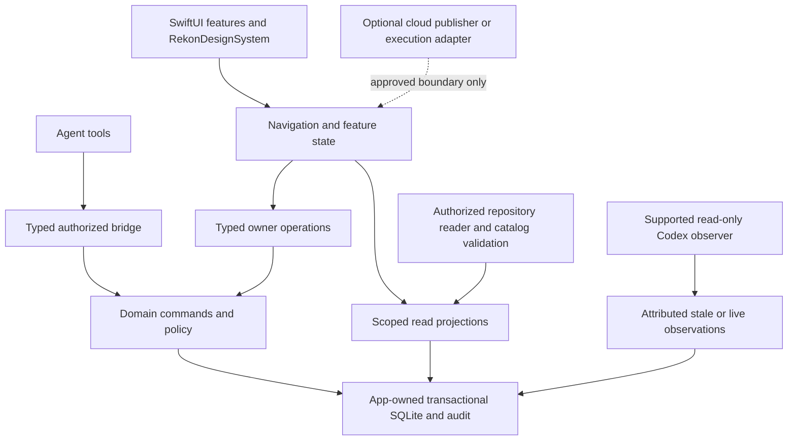

# Release Radar: full-product architecture assessment and delivery plan

Date: 2026-09-06. Status: **Supporting; architecture and sequence proposed. Six
additional outcomes approved for roadmap inclusion on 2026-09-06.**

Programme authorization now covers scoped implementation, local commits, branch
pushes and PRs, with owner approval before every merge; see
[current authorization](../progress.md#current-authorization).
Earlier assessment-only restrictions below describe that completed assessment,
not the new programme. Inclusion and execution authorization do not accept every
proposed contract. The shared-contract reconciliation below is a review candidate,
not an ADR amendment or implementation claim.

The scoped owner decisions recorded below and in ADR-001 are accepted inputs to
this plan. They do not approve all proposed contracts or implementation.

The owner also approved including the C8 OS-metadata validator repair described
below. It is a bounded repair within documentation reliability, not a new feature
or authorization to implement during this planning update.

RekonDesignSystem adoption is agreed. The owner's 2026-09-06 clarification requires
using its existing components, tokens and appearance as provided; adding or changing
light/dark support is out of scope. This settles presentation scope without approving
the plan's other proposed contracts or opening implementation.

This document assesses the complete product direction in the repository, including
unfinished proposals, all GitHub issues, project lifecycle repairs, RekonDesignSystem,
and agent execution reliability. It proposes a coherent implementation sequence.
It does not approve architecture changes, open implementation, change application
delivery state, or supersede accepted designs. [Progress](../progress.md) remains
the delivery ledger. Feature references below identify assessment rows, not new
application tickets or a second delivery ledger.

## Owner-authorized sequence — 2026-09-08

Phase 3 source delivery is merged through PR #35 (`6f528c5`). The owner authorized
Phase 4 RM2/P7/P8 and issue #9 through scoped source/tests/docs, commits, pushes and
PRs, with separate approval before every merge. Resolve only its necessary D6/IA
and coupled product decisions before dependent implementation; the rest of the
proposed planning contracts do not become approved merely through continuation.

After Phase 4, prepare and reconcile the unresolved Phase 5 decisions for
P1–P4/P15/P16/P18 and D4/D5/D6/D12. Phase 5 implementation is not authorized.
Independent preparation may proceed during an actual owner-approval wait. Preserve
phase-owned Delivery Goals and separate execution-goal semantics unless explicitly
changed by the owner; do not reopen settled identity, retention, package-content,
authority or RDS choices.

The Mac remains available for builds and isolated synthetic native UI checks.
Owner hands-on testing on other Macs and the private versioned DMG wait until at
least Friday, September 11. Neither is a prerequisite for independent source
delivery. Packaging is unstarted, target architectures/macOS versions are unknown,
and this continuation authorizes no packaging, installation, notarization,
publication, owner-data or application-catalog operation.

Phase 4 source delivery completed through owner-approved
[PR #36](https://github.com/joeroberts/release-radar/pull/36), merged 2026-09-08 at
`356e134`. The [verification record](../evidence/2026-09-08-phase4-navigation.md)
preserves focused tests, native evidence and independent review. The assessment
below records the accepted contract; future surface contracts remain proposed.

### Phase 4 prerequisite assessment — 2026-09-08

Fresh chief-architect task `01a08262-ffdf-7120-896b-0252ce2f8a30` (requested Astra
High, runtime settings not independently exposed) inspected current source,
accepted ADRs/designs, both board/dependency mockups and prior approval history.
The owner approved both recommendations, relayed from the visible parent task:

- **Dependency scope:** project-wide relationships focused on the selected ticket,
  with phase labels. Cross-phase prerequisites are directly visible; dense paths
  need readable scrolling space.
- **Relaunch:** Projects with empty Back/Forward history, preserving startup
  behavior. Restoring the last location is not selected for Phase 4. Phase 6 saved
  views remain a separate outcome.

The bounded implementation contract is: one typed navigation
owner captures destination, project identity, explicit viewed scope, selected
entity, filter domain and focus/restoration context. Sidebar, in-app links,
phase/ticket selection and Back/Forward share that history. Back/Forward restores
without pushing entries; branching clears Forward; filter adjustments update the
current entry. Missing selection retains a valid parent and an explanation rather
than substituting a ticket/phase or broadening a filter. Archive/removal uses the
existing read-only surfaces and exact historical identity; re-add cannot inherit
old navigation by matching a path or name. Restore focus to the originating valid
control/entity, otherwise an informative heading/recovery message.

Browsing never changes the persisted active phase. The selected project-wide graph
is recorded in ADR-003 and the dashboard design,
without changing stored dependencies, five lanes or task/acceptance semantics.
No Phase 5 planning-domain decision blocks this journey; no new future screens,
external URL registration, general routing framework or portable navigation state
is required. One writer owns navigation, board bindings, dependency projection and
the inspector repair. One independent review covers architecture, UX/QA and the
actual lifecycle/preview-isolation risks. Direct tests include nonactive-phase
navigation, branching/filter/focus, stale targets/publication, archive/removal/re-add,
dense dependency paths and first/last task access at compact and wide sizes.

The two product choices above are accepted; the remaining Phase 5 proposals are
unchanged. This record is not implementation proof. The architect performed no
runtime checks or file writes, reported no remaining processes, and is archived.

### Phase 5 decision preparation and handoff — 2026-09-08

This preparation was authorized during the Phase 4 owner-decision wait. It is
proposed, not Phase 5 implementation authorization. Fresh chief architect
`01a08269-0c66-7d61-bd3d-f9963383471e` (requested Astra High) checked the accepted
contracts, implemented planning policy, approval record and relevant mockups.
No runtime checks, owner-data operations or file writes were performed by that
peer; it reported no remaining processes. Runtime settings were not independently
exposed. The following preserves its useful findings; current execution stays in
[progress](../progress.md).

**Already settled:** P15/P16/P18 inclusion; phase-owned Delivery Goals and separate
observed execution goals under current cardinality; five lanes; active context
separate from readiness; immutable Accepted history; identity/retention/package
contents/Mac-repository authority and supplied RDS appearance. Earlier owner
direction retained Overview as default project landing with a sibling Project Plan;
the complete historical v5 planning/redesign package was never accepted wholesale.
The current Phase 4 dependency/relaunch decisions above are accepted, not reopened.

Present the remaining choices in small batches during an actual owner-approval wait
or after Phase 4 source delivery, using recommendations and concrete consequences:

1. **Planning surfaces and scope:** retain Overview as directed; recommend a sibling
   Project Plan for all recorded phases, phase-owned goals/readiness, unplaced work
   and explicit relationships, plus one shared board with phase/all-phase scopes.
   Phase links retain their explicit scope. The all-phase option is still a choice;
   it adds broader comparison while every card must name its phase and appear once.
   Unresolved intake is a separate incompleteness signpost, never recorded-work count.
2. **Unplaced work:** recommend the same permanent ticket identity with outcome,
   dependencies, evidence and task definitions, but no lane or execution/completion/
   review actions until placement. Placement enters Backlog atomically. Preserve
   Backlog-only move rules and reconcile affected plan revisions/assignments for
   move/unplace. This requires domain/storage changes but avoids a fake phase or
   sixth lane. It cannot erase task history or bypass readiness.
3. **Phase lifecycle/order:** recommend Upcoming / In delivery / Completed /
   Unassessed, zero or one In-delivery phase, and explicit optional order. Active
   phase remains independent. This requires deliberate lifecycle maintenance;
   migration infers neither lifecycle nor order. Completed requires an explicit
   transition with resolved delivery obligations, not an empty-board inference.
   The one-In-delivery limit and labels are proposed product choices, not defaults
   silently imposed by this assessment. Unordered legacy records display neutrally.
4. **Requirement/decision references:** recommend managed artifact identity plus a
   stable source-local identifier where supplied and exact source revision. A
   heading-only reference remains a locator, not invented requirement identity.
   Typed explicit links support impacts; sources may be changed, missing,
   inaccessible or superseded without silent relinking. Deliberate linking costs
   effort and cannot prove semantic completeness. Keep authoritative prose in its
   repository documents; no copied requirements authority or automatic adoption.
5. **Plan proposals/apply:** recommend a persisted bounded proposal with exact
   baseline, diff, rationale and disposition. Approval binds that proposal and
   baseline; a separately authorized typed operation atomically applies the app
   graph. Relevant phase/task revisions and ticket/dependency/lifecycle facts must
   be covered because phase revision alone does not track all changes. Stale apply
   changes nothing and needs refreshed review. Document changes retain separately
   reported repository/catalog outcomes; no distributed atomicity or inferred
   execution/delivery-acceptance authorization.
6. **Withdrawal/successors and goal coverage:** recommend separate ticket lifecycle,
   retained original/reason/last lane/tasks/evidence, and explicit replacement/split
   links. Successors receive new IDs and start uncompleted; inherited evidence is
   provenance, not completion proof. Explicitly reconcile dependencies and remaining
   goal obligations; cancellation without replacement leaves uncovered outcomes
   visible and blocks false goal acceptance. Started-work withdrawal cannot imply
   its external run stopped. Accepted history is immutable. This needs a narrow
   successor/coverage amendment: current policy forbids removing/transferring started
   assignments and requires assigned tickets Accepted for goal acceptance. Merely
   excluding withdrawn tickets from counts is incorrect; preserve historical
   assignments separately from current obligations. Do not infer Active-goal
   supersession or rewrite dependency targets.

**Actionable handoff after selections:** amend only affected accepted contracts,
persist the next bounded brief, and start each writer from the merged Phase 4
navigation contract. Coherent checkpoints are (a) recorded planning and its complete
readback/Overview/Plan/shared-board journey, (b) references, impacts and proposal
comparison/atomic apply, and (c) withdrawal/replacement/splitting with coverage and
acceptance protection. These checkpoints bound delivery; they do not omit any
selected Phase 5 behavior. Use existing typed mutations, navigation and documents,
not a second execution, requirements or change-control system.

Migration preserves existing identities, lanes, active context, goals, task
completions and history; new unknown fields stay unknown. Verify complete new
records through archive/restore, retained-history and full-backup recovery. Record
complete future portable representation, without implementing Phase 7 exporter/
importer early or changing v1 silently. Relevant acceptance covers exact stale/
replayed/racing apply and rollback, cross-project rejection, count agreement,
placement identity, moved/withdrawn coverage, immutable Accepted history, recovery,
and native compact/keyboard/accessibility journeys. The existing proposed Plan
mockups do not constitute an approved complete visual specification.

SQL layout, bounded payload limits, component composition and deterministic ordering
mechanics are implementation decisions within accepted semantics. They do not need
additional owner questionnaires. Risk-triggered independent review covers changed
architecture, security/privacy and UX/QA without duplicate approval layers.

### Phase 5 owner selections and implementation authorization — 2026-09-09

The owner explicitly authorized bounded Phase 5 implementation after selecting:

- Overview remains the landing page. Project Plan shows all phases, phase-owned
  Delivery Goals and unassigned tickets. One shared board switches between one
  phase and all phases; every ticket identifies its phase.
- Unassigned tickets retain their permanent identity, details, task definitions,
  dependencies and evidence. They cannot execute until placement into a phase,
  which enters Backlog without replacing their identity.
- Multiple phases may be In delivery concurrently. This overrides the proposed
  zero-or-one limit above. Lifecycle remains separate from active/view context.
- Ticket requirement/decision links point to authoritative repository documents
  and exact revisions, exposing changes, moves and removal. Copied prose does not
  become competing authority.
- Goal obligations carry forward when plans change; they never clear silently.

These selections do not approve the historical v5 package or all Phase 5
preparation. The owner subsequently approved saved version-specific plan-change proposals,
baseline-bound explicit approval and atomic application of the approved change set;
stale state requires refreshed preview/approval. The owner also approved retaining
original tickets/history on withdrawal/replacement/splitting, explicit successor
links, reconciliation of carried-forward obligations, incomplete successors and no
automatic goal completion/acceptance. Preserve current acceptance and started-
assignment protections until the bounded coverage amendment is implemented.
These choices do not authorize silently dropping obligations or stopping external runs.

The first bounded slice is recorded planning, unassigned placement and the complete
Overview/Project Plan/shared-board journey, including first placement,
existing history/inspector integration and preservation through recovery. Exact
revision-specific document links remain authorized follow-on scope. Proposal/apply
and successors are now approved follow-on slices, not dependencies of the first slice.
The owner subsequently confirmed the lifecycle policy: Unassessed / Upcoming /
In delivery / Completed; existing phases begin Unassessed; multiple In delivery;
explicit completion only after obligations resolve; explicit reopening or a new
phase for further work. This is approved follow-on scope. No product-choice
approval from this Phase 5 batch remains outstanding.
First placement avoids transferring existing phase-owned obligations. Current
Backlog moves remove assignments and are not an implementation of carry-forward.
The read-only chief architect confirmed these boundaries against current source.
Shared execution integration remains non-gating for Phase 5; its separately
authorized local source candidate is recorded in the 2026-09-09 amendment below. No Phase 6+, runtime/hooks, installation or
owner/application-state mutation is included. Source, tests, affected documents,
scoped commits, pushes, PRs and necessary fresh peer tasks are authorized; each
merge still requires separate owner approval. Current ownership and evidence stay
in [progress](../progress.md).

### Remaining Phase 5 delivery sequence — 2026-09-09

Read-only chief architecture assessment of candidate `2543cd6` confirmed the
following bounded sequence under the already-approved owner choices:

1. **5B: Revision-specific requirement/decision links and recorded impacts.**
   Explicit links bind ticket identity (placed or unassigned), repository/artifact
   identity, a supplied source-local identifier where available, and exact source
   revision. Current resolution exposes changes, moves, removal, supersession and
   unavailable access. Catalog digest alone is not mutable document content
   revision. Preserve repository prose authority; reverse links describe recorded
   impacts, not inferred semantic completeness.
2. **5C: Saved proposals, baseline-bound approval and atomic apply.** Start with
   bounded safe operations that preserve existing started/Accepted and obligation
   protections. Include all relevant phase/task revisions and ticket/dependency/
   lifecycle/reference facts, not phase revision alone. Persist approval separately
   from application; stale apply changes nothing and requires refreshed approval.
3. **5D: Complete successor and carry-forward coverage through the same proposal
   path.** Add withdrawal/replacement/split plus reconciliation of every applicable
   move/unassignment loss path. Retain original identities/history/last lanes;
   successors get new IDs and incomplete work. Keep phase-owned goals, one current
   goal per ticket and explicit obligation lineage. Historical assignment events
   alone are not outstanding obligations or proof of their resolution.
4. **5E: Complete phase lifecycle.** Unassessed / Upcoming / In delivery /
   Completed, legacy Unassessed, multiple In delivery, explicit guarded completion
   and explicit reopening or new phase for further work. Recheck resolved
   obligations and accepted required goals/work atomically; never auto-accept.
   Completed phases reject new/revised delivery work through every writer until
   explicit reopening. Preserve Accepted history and active/readiness independence.

The coverage-before-completion dependency is concrete: existing Backlog moves and
unstarted plan edits can remove assignments, while current acceptance checks
consider current membership. A phase must not appear complete because an
obligation disappeared. Implementing full lifecycle earlier would require that
same coverage enforcement, rather than a temporary current-count guard. Nonterminal
lifecycle alone would be a partial journey and is not the preferred next slice.
These checkpoints preserve the complete approved Phase 5 outcome; Phase 5 is not
complete until all selected behavior ships. Phase 5A passed direct checks and
independent review, then merged with explicit owner approval in PR #38 at
`a8877aa`. Later slices retain separate merge approval.

Phase 5B's [controlling brief](../task-briefs/2026-09-09-phase5b-reference-impacts/phase5b-reference-impacts-brief.md)
incorporates the fresh read-only chief-architecture assessment on merged `a8877aa`:
separate retained ticket-link versions, complete safe-byte content digests distinct
from catalog acceptance, current versus historical resolution, typed link mutations
and read-only native recorded-impact navigation. No unresolved owner choice was
identified; proposals, successor obligations and lifecycle remain later slices.

Each actual new record participates in additive migration, archive/restore,
retained removal history, full backup and stale-request invalidation. No inferred
links/proposals/successors or historical acceptance; unresolved historical coverage
requires reconciliation. Define complete future portable representation without
implementing export/import or changing v1 silently. One appropriate independent
review per material candidate covers its actual risks; no additional review layers.

### Shared execution local source candidate — 2026-09-09

The owner subsequently authorized the reviewed shared design and local source
implementation, including disjoint parallel work and later integration of reviewed
Phase 5B source. Candidate `dd486f04459f9ceae7e4e2163d0274402fba78ee` implements
the packaged V1 skill/exact capability registry, additive read-only diagnose,
root-bound compatibility observation and Project Overview presentation. The
[design](../../design/shared-execution-integration-v1-design.md) and
[evidence](../evidence/2026-09-09-shared-execution-integration-v1.md) distinguish
source delivery from installed behavior. Direct affected checks report 101 passed,
2 environment-gated skips and no failures; metadata integration and one fresh
independent combined review remain the next steps.

This authorization does not establish consumer adoption, application catalog
acceptance, plugin installation or a runtime pilot. The original assessment below
remains historical proposal context; its unselected runtime and execution-engine
ideas remain proposals. Shared source ownership must be coordinated before a
Phase 5C writer touches overlapping observation/UI files.

### Shared execution integration assessment — proposed, non-gating — 2026-09-08

The owner authorized recording the completed chief-architect assessment from task
`01a0829a-0f61-7bf3-9435-d64faf9afccd`; this is not design approval, a priority
change, a new assignment or implementation authorization. The recommendation is
compatible shared-standard, bounded context, existing-check, version and explicit
adoption work alongside Phase 5, with shared-source integration after Phase 4
source closeout. It is not a default prerequisite or release gate for either phase.
Phase 5 retains ownership of placement, lifecycle, proposal baselines, successors
and goal coverage; integration must consume those decisions when accepted.

Reuse the existing documentation checker and report actual checker/version, scope,
source revision and dirty or unknown applicability, distinguishing passed, failed,
skipped and unavailable results. Source inspection at `6f528c5` found current
command transaction receipts already bound to registration and request generation.
The older run-discovery missing-registration statement remains historical evidence,
not a current implementation requirement. Those receipts are not test, reviewer or
run attestations. A catalog digest identifies metadata, not approval of mutable
content or the identity of tested code. New authoritative completion/check gates,
verified reviewer identity and run attestations remain separately proposed
P10/P17/D13 or runtime scope; ADR-006 guidance v3 remains reserved for Issue #1/P10.

Run Guard remains conditional and I9 remains no-go. Exact consumer instruction
supersession and adoption need later explicit authorization, preserving product
completeness, security/privacy, recovery, independent review, owner acceptance and
ledger authority. Perspective's canonical root also needs clarification. The
assessment inspected source and test definitions, without runtime verification or
application readback. Recording it authorizes no hooks, installation, consumer
changes or app-state mutation, and does not accept or synchronize a catalog.

## Owner-approved roadmap additions — 2026-09-06

The owner approved including all six recommendations below. Their inclusion is
settled; detailed design, architecture amendments and implementation remain to be
approved in the applicable slice. This approval does not promote the whole plan
or other existing proposals to approved status. The existing six-goal/eleven-ticket
catalog remains intact; these references identify additional documented outcomes,
not newly created application tickets.

| Outcome approved for inclusion | Assessment reference | Planned delivery |
| --- | --- | --- |
| Requirements and decision traceability | P15 | Set identity/authority rules in slice 0; deliver explicit links and impact browsing with recorded planning in slice 5. |
| Plan revisions and change previews | P16 | Set baseline/approval rules in slice 0; deliver reviewable proposals and history in slice 5. |
| Delivery evidence tied to the actual code revision | P17 | Set evidence identity/freshness rules in slice 0; deliver the ticket panel in slice 6, with installed-version coverage verified in slice 8. |
| Ticket cancellation, replacement and splitting | P18 | Set lifecycle/history rules in slice 0; deliver complete revision and successor behavior in slice 5. |
| Workspace search and saved views | P19 | Use slice 4 navigation/query scope; deliver search, filters and saved-view restoration in slice 6. |
| Project health and guided recovery | C12 | Deliver the consolidated health view and initial recovery actions in slice 1; complete management, recovery and documentation observations in slices 2/3. Reuse existing diagnostic services. |

## Owner-approved continuity choices — 2026-09-06

The owner selected all three recommendations after reviewing their product
consequences. [ADR-001](../../architecture/ADR-001-release-radar-boundaries.md)
records their controlling scope; details not settled there remain design work.

| Choice | Approved direction | Effect on later work |
| --- | --- | --- |
| Removal and history | Archive is reversible. Remove from tracking removes the operational project and local capabilities while retaining read-only audit/activity history and a removal record. Repository files remain untouched; confirmation states the retained history. | C5–C7 and History must preserve historical identity independently of the live registration and prevent stale actions after removal/re-add. Full erasure is not selected. |
| Portable project contents | A self-contained package contains complete supported project records, managed documents and evidence files, with historical provenance. It excludes source-code checkouts, credentials and device access permissions. | C10/C11 must preserve identities and destination root mapping, include later authoritative features, and report unavailable required content. Package encoding and import/file recovery still need design. This replaces v1 as the future product target, not as an implemented format. |
| Companion authority | Mac app authority for delivery, repository authority for documents, and cloud publication for the read-only phone. | I6 uses published copies and truthful offline/freshness states; no document relocation or cloud takeover of authority. RM8 still owns unresolved feasibility, publication, privacy, account and recovery design. |

These selections do not add project-editing fields, open the next implementation
slice, authorize external actions or change the RekonDesignSystem appearance scope.

## Recommendation and confidence

**Retain the application and its core boundaries. Repair the continuity model and
replace the affected orchestration and navigation incrementally. A full rewrite
is not justified by the evidence.** The major modules are sensible: SwiftUI
presentation, framework-independent domain/store code, a typed mutation bridge,
bounded transport, and separately signed tools/helpers. The transactional store,
revision checks, replay receipts, managed artifact identities, five-lane policy,
Delivery Goals and Ticket Tasks are valuable working foundations.

The project is only partly coherent and maintainable today. Folder structure is
clearer than responsibility ownership. `AppModel` coordinates navigation,
projections, documentation, authorization, notifications and plugin state;
`OnboardingView` mixes a large workflow with UI; projection code combines SQL,
availability and display policy. More importantly, the product lacks a complete
project lifecycle contract. Individually defended boundaries have produced an
end-to-end deadlock. Documentation has authority metadata but contradictory
contracts and obsolete implementation-status statements. Tests cover many domain
rules while allowing an unusable owner journey to pass.

| Approach | Assessment |
| --- | --- |
| Continue isolated patches | Fast locally, but repeats contradictions among setup, recovery, planning, identity and export. Reject as the primary approach. |
| Retain core; revise shared contracts; deliver complete vertical slices | Recommended. Preserves working invariants and allows direct comparison with current behavior. Replace narrow subsystems when their existing structure obstructs the agreed outcome. |
| Restart the whole app | Recreates signing, sandbox, store, history, bridge and recovery risk while still requiring the same product decisions. Consider only if a separately approved product direction replaces local authority or a bounded slice proves the existing core cannot safely migrate. Neither is established. |

Assessment baseline: GitHub default tree `fcb432bf2c6f5e5bab63418adb9b6ec647e1baef`,
content-identical to local repair revision `ec511d8`. The canonical checkout has
older HEAD and extensive pre-existing documentation changes; it is not a clean
representation of that baseline. Seven GitHub issues were read, including bodies
and comments: six open, one closed. Source, controlling documentation, proposals,
design assets and selected installed UI were inspected. Ninety-five focused tests
passed during this assessment (onboarding, guidance, documentation preview and
store); that is not a full-suite or complete runtime acceptance claim. The exact
folder-picker timeout remains undiagnosed. Proposed screens were assessed against
their mockups, not claimed to exist in the running product.

## Findings that change the plan

1. **Blocking: registration depends on work the handoff cannot perform.** Setup
   persists the project, hides it while pending, and requires a phase to finish.
   The copied prompt handles repository guidance and expressly excludes delivery
   mutations. Checking status only observes phase existence. Source also requires
   existing managed-documentation prerequisites, so a genuinely blank repository
   needs an explicit bootstrap route. Repair the whole journey rather than make
   a status button invent a phase. See source references S1 and S2.
2. **High: reset cannot reconstruct authority from repository files.** Files do
   not restore the lost project graph, repository binding, accepted snapshot,
   audits or receipts. A recovery prompt cannot manufacture that evidence.
   Reconnect, relocate, seed, portable import and full backup recovery need
   distinct operations and truthful outcomes. Schema recovery currently leaves a
   store instance with immutable availability; refreshing projections does not
   reopen it. Plugin installation receipts also cannot substitute for inspection
   of installation state after reset. See S1, S3 and S8.
3. **High: lifecycle and portability contracts are incomplete.** Project editing
  is absent from the inspected general Settings/Overview paths. Archive/delete
   are open work. Path-derived project IDs, root-only older commands, restrictive
   foreign keys, audit retention and globally scoped opaque receipts complicate
   deletion/re-add and restoration. Archive v1 predates current goals, readiness,
   tasks and managed documentation. The RR-R10 design also describes importing
   v1 tickets into Backlog, conflicting with ADR-001's lane preservation and the
   lossless outcome. Resolve these contracts before export/import. See S1, S3,
   S7 and ADR-001.
4. **High: future planning needs exceed the scheduled implementation.** RR-RM1
   covers a joint design decision; RR-RM2/RM10 cover navigation and Help. This
   does not itself schedule delivery of Project Plan, unscheduled work, explicit
   phase lifecycle/order, workspace Goals or richer History. These directions
   need explicit delivery outcomes after their joint decisions, not omission or
   automatic promotion from proposal to approval.
5. **High: similarly named concepts have incompatible meanings.** Active phase
   is an owner-selected working context; proposed phase “Current” is lifecycle.
   Delivery Goals are phase-owned outcomes; proposed Goals screens also describe
   observed Codex goals. Ticket lanes, phase readiness, task completion and agent
   run status each have different authority. Conflating any pair creates later
   migration and UX problems. See ADR-003/004/005 and the planning/UX proposals.
6. **Medium: navigation scope already disagrees across features.** The latest
   dashboard loads all phases, but dependencies still use the active board and
   project-keyed graphs. Routes contain no phase/filter/detail history. Viewing
   another phase can therefore lose context on related navigation. Fix through
   one shared scope contract, not separate stacks for each new screen. See S4.
7. **Medium: freshness and history can mislead.** Documentation validation is
   not continuously reconciled with external changes (#18); relevant errors lack
   direct same-folder recovery (#19). Activity already aggregates multiple event
   types, but current ticket lane is attached to old events and cannot prove an
   event-time transition. Use shared observations and preserved event facts. S5.
8. **Medium: tests and delivery practice miss completion at the user boundary.**
   Onboarding tests can manually create the phase missing from the real handoff.
   Dedicated UI-test scaffolding is minimal, though hosted rendering tests do
   exist. Passing policy tests cannot prove a copied prompt, installation,
   folder authorization or compact inspector works. #9 is a discoverability
   problem with stacked scrolling, not proven missing task data. S2 and S6.

## Scope and source maturity

“Approved” below means an existing documented outcome, not authorization to
implement in this assessment. “Proposed” means a documented direction with
unresolved detail. “Repair” comes from owner reports or a verified gap. “Decision”
and “discovery” must terminate in an explicit conclusion and need not produce code.

The approved roadmap remains all six goals and all eleven tickets:

| Goal | Existing tickets | What is actually committed |
| --- | --- | --- |
| RR-DG1 | RM1, RM2, RM10 | Joint product/IA decision, coherent Back/Forward, Help and acceptance of that outcome. Additional proposed surfaces need explicit delivery scope. |
| RR-DG2 | RM5, RM6 | Authoritative lossless exporter/fixture, then complete transactional Portable Import. |
| RR-DG3 | RM7 | Prove a supported authenticated observer, or approve no-go with truthful unavailable behavior. |
| RR-DG4 | RM3, RM4, RM9 | Production wordmark, scoped warnings, distribution decision and required package verification. |
| RR-DG5 | RM8 | Companion pursue/no-pursue decision; pursue requires a separately approved boundary and delivery outcome. |
| RR-DG6 | RM11 | Role-agent execution decision; no implied orchestration engine or mandatory role matrix. |

GitHub coverage: [#1](https://github.com/joeroberts/release-radar/issues/1) is generic
Ticket Tasks adoption; [#3](https://github.com/joeroberts/release-radar/issues/3) is
bounded Run Guard extension-host discovery; [#9](https://github.com/joeroberts/release-radar/issues/9)
is inspector discoverability; [#18](https://github.com/joeroberts/release-radar/issues/18)
is documentation freshness; [#19](https://github.com/joeroberts/release-radar/issues/19)
is documentation access recovery; [#20](https://github.com/joeroberts/release-radar/issues/20)
is archive/restore/delete. Closed [#2](https://github.com/joeroberts/release-radar/issues/2)
records the owner-attribution disposition; it is not reopened as a product defect.
These issues are not a complete feature inventory; the documentation supplies
the wider direction confirmed by the owner.

## Feature-by-feature fit

### Project continuity and repository access

| Ref / feature / maturity | Current support and architectural fit | Complete outcome and decisive acceptance |
| --- | --- | --- |
| C1 Register, initialize and resume — repair | Persisted roots/bookmarks and setup exist; phase-gated visibility and incomplete handoff are incompatible with empty/unplaced planning. Retain authorization/store policy, replace setup orchestration. | A saved project is visible with an honest setup status even with zero phases. A blank folder has a supported documentation-bootstrap path; existing managed docs have explicit binding/acceptance steps. Creating the first real plan remains an authorized typed delivery action. Close/relaunch at every step preserves name, exclusions and progress; checking status creates nothing. |
| C2 Edit project — repair | Name is collected at setup; no general editor. Metadata edits fit the existing owner-operation pattern. | Rename and edit applicable existing onboarding settings by stable project ID, preserving saved task exclusions even when observation is unavailable. Task exclusions are not documentation filters. Root/worktree authorization and one-time seed application remain explicit operations, not incidental metadata saves. Editing never creates a new project, resets setup, changes delivery state or implicitly relocates a root. Cancel, invalid input and unavailable folder preserve data. |
| C3 Same-folder reconnect and first-root attachment — existing + #19 | Core owner actions exist; documentation errors lack a direct route to them. | Restore folder access from the actual error, renew only the exact saved folder, retain IDs/history/binding. Invalid or changed docs must not prevent renewing permission; show the remaining catalog problem afterward. Legacy rootless attachment remains a distinct confirmed action. Diagnose picker behavior in the installed app. |
| C4 Repository relocation and worktree roots — existing, continuity gap | Typed relocation checks accepted catalog identity; multiple roots are supported but primary-root intent needs clarity. | Preserve project/artifact identities, authorize destination and keep the accepted-catalog boundary for relocation. Explicit primary root and separately authorized worktrees; no arbitrary evidence repointing. Wrong repository, lost permission and partial failure leave original associations intact. |
| C5 Archive and restore — #20 | No project lifecycle field/workflow. Add to existing store, not a second project registry. | Archive retains the graph/history and repository association, hides from default active views and suspends applicable operational activity. Restore changes lifecycle only and exposes access problems. Neither action needs a valid current catalog merely to manage local records. |
| C6 Remove from tracking, retaining history — #20, owner-selected policy | Goals/tasks/history foreign keys, audit protection and receipts make naive cascades unsafe. | Confirm the exact project and explicitly state retained read-only audit/activity history. Atomically remove the operational graph and local capabilities, stop monitoring and prevent pending app-owned actions from applying, while preserving the history/removal record, other projects and every repository file. Late callbacks/old requests cannot mutate a re-added registration. Full erasure is not selected. |
| C7 Backup, reset and recovery — repair | Migration preservation exists; no coordinated recovery across app/bridge connections and dependent services. | Separate preference reset, tracking-data reset and full backup restore. Quiesce all app-owned connections and pending work, replace state through app-owned operations, reopen services, inspect external plugin state, and recover missing permissions. Older backups cannot cause replay of already-sent notifications. A repository-only reconstruction is explicitly incomplete. |
| C8 Documentation validation, catalog acceptance and maintenance — existing + #18 + completed validator repair | Strong catalog/identity validator, generated indexes and typed operations. The exact regular-`.DS_Store` repair is delivered; refresh and status ownership remain fragmented. | Preserve the narrow OS-metadata discovery rule below. One root/registration-scoped observation drives Overview and evidence: checking, current, invalid, pending acceptance or inaccessible, with validation time. Authorized filesystem events plus activation/reopen invalidate stale success; coalesce reads and reject late results. Observation never accepts a catalog or repairs files. |
| C9 Evidence preview, identity and lifecycle — existing | Managed artifact locators and bounded reads are reusable; legacy paths remain distinct. | Preserve repositoryID/artifactID through relocation, archive and import. Render only bounded authorized content; rejected/stale/missing evidence stays explicit. Maintenance, preview and export use the same identity and custody rules. Never replace identity with a cached path to make a check pass. |
| C10 Portable export — approved RM5 and owner-selected contents | No complete exporter; seed import is not export. Existing v1 contract is too old. | Design the revised self-contained package of all supported project records, managed documents and evidence files with historical provenance, then produce the acceptance fixture. Preserve root/identity mappings; include all supported roots rather than silently omit content. Unavailable required content prevents a complete export. Exclude source-code checkouts, credentials and device permissions; distinguish the package from full app backup. |
| C11 Portable import — approved RM6 | Validation/transaction foundations fit; implementation depends on C10. | Preview and revalidate exact package records and files, freshly authorize destination roots, reject identity/root and destination-file conflicts, restore the complete supported graph with exported domain IDs and new local capabilities. Design file placement/recovery and the store transaction together so failure leaves no partial project or overwritten owner content. Imported observations/history remain historical; do not replay source notifications or commands. Round-trip records, documents and evidence files. |
| C12 Project health and guided recovery — owner-approved inclusion | Existing store, access, catalog, plugin and observer diagnostics provide the data; the consolidated owner workflow is missing. Extend C1–C9 rather than create a second diagnostic system. | One view identifies each problem, its affected project/root, last-check time and supported next action across folder access, catalog, store, plugin and observation. A successful check in one area cannot mask another failure. Actions invoke the existing exact-target owner operations and refresh the shared observation. Stale results, denied recovery and unavailable checks remain explicit. The health view must remain usable when the store itself is unavailable; viewing health never repairs or accepts anything automatically. |

### C8 bounded repair: tolerate ordinary OS metadata

**Closed:** the exact regular-`.DS_Store` repair and installed verification are
complete in the merged baseline; [progress](../progress.md) records the result.
The requirements below are retained for compatibility, not reopened work. Broader
C8 freshness remains in slice 3; missing binding and connector availability are
separate recovery limitations.

At the assessment baseline,
`RepositoryDocumentReader.isProhibited` and the directory walk rejected dot-prefixed
paths, following the [managed-documentation contract](../../design/managed-repository-documentation-contract.md).
This is a validator design defect: Finder metadata must not invalidate otherwise
valid documentation. Repeated deletion and changes to `.gitignore` are not the fix.

Start with an exact `.DS_Store` basename exclusion for ordinary regular files
during documentation discovery. Check file type without following symlinks before
excluding it; a symlink or directory using that name must not bypass existing
safety checks. Do not ignore all hidden files or everything matched by Git ignore
rules. Excluded metadata is not a catalog artifact and cannot be registered as
managed evidence. Keep actual documentation registration, root containment,
symlink protection and other prohibited-content checks intact.

Update the reader/validator behavior, the documented versioned exclusion rule and
the shipped catalog reference together, with an explicit compatibility decision
for installed validators. No database repair, repository rebinding, catalog
acceptance, metadata deletion or agent-rule change is part of this fix.

Acceptance uses the existing reader/validator tests and bundled checker:

- Valid documentation containing regular `.DS_Store` files at the docs root and
  nested collection paths validates. Creating, changing or removing only that
  metadata leaves the document inventory and catalog digest unchanged.
- Same-named symlinks/directories, other prohibited paths, unregistered actual
  documents and attempts to catalog the excluded metadata still reject.
- The app and bundled checker agree on the rule. Verify the installed reader/checker
  tolerates the canonical metadata file without deleting it, while separately
  reporting any real catalog, authorization or binding errors.

This repair was delivered independently of lifecycle migrations and the later
automatic-refresh work in slice 3. Do not repeat it as a lifecycle prerequisite.

### Planning, work and owner navigation

| Ref / feature / maturity | Current support and architectural fit | Complete outcome and decisive acceptance |
| --- | --- | --- |
| P1 Overview and Project Plan — existing + proposed, RM1 decision | Overview and all-phase board loading exist; complete planning surface does not. Reuse authoritative projections. | Overview summarizes; Project Plan exposes all recorded phases, placed/unplaced work, dependencies and coverage. Current/selected/project totals agree. Unresolved intake remains outside recorded-work counts and has a separate incompleteness signpost. Empty/detail states offer the intended planning request, clearly copied rather than sent, with recoverable copy failure; formal changes still use authorized typed actions. Unknown, empty, unavailable and not-applicable states differ; inaccessible repository content never hides the persisted plan. |
| P2 Unscheduled work and placement — proposed | Tickets currently require phase and lane. This needs domain/storage/command changes, not a UI-only Backlog label. | One stable work identity with explicit optional placement. Recommended: unplaced work may hold outcome, evidence, dependencies and task definitions; execution lanes/completion operations require valid placement. Placement enters Backlog atomically and preserves identity/history. Do not invent a phase or sixth lane. |
| P3 Phase lifecycle, order and active context — proposed + ADR-003 | Only ID/name/project and an independently selected active pointer are present. Readiness is separate. | Add explicit lifecycle/order if selected in RM1; retain active phase as working context. Legacy lifecycle is unknown until assessed. Selecting a phase does not complete/reorder it or establish readiness. Replanning and phase moves preserve identity and respect accepted history. |
| P4 Phase Board and all-phase Work Board — existing + proposed | Five lanes, phase selection, filters and task counts exist. One board can support both scopes. | Reuse one Work Board with selected-phase and, if approved, all-phase scope. Every aggregate card names its phase, appears once and has consistent counts. Filtering/viewing does not mutate delivery; compact keyboard and VoiceOver access reaches every lane and inspector. |
| P5 Delivery Goals and readiness — delivered; wider scope proposed | Phase-owned goals with 1:N ticket membership, criteria, readiness and acceptance are useful working contracts. | Preserve explicit plan revision/readiness and owner acceptance. Recommend workspace Delivery Goals as aggregation of phase-owned outcomes first. Whether one outcome must span phases is a separate product decision requiring assignment/readiness/archive changes, not an incidental screen refactor. Completed and unassigned outcomes remain discoverable. |
| P6 Codex execution-goal links and semantic suggestions — proposed | Exact ticket/thread/observed-goal link is 1:1. This is not the Delivery Goal relationship. | If pursued, separately define 1:N link cardinality, provenance, owner-confirmed suggestions and collision/rejection handling. Suggestions never count as exact links or cause acceptance/notifications. Define the proposed unlinked-goal Needs Review rule with stable source identity and deduplication so refresh cannot create repeated attention items. Refresh preserves confirmed identity; unlinked, stale and unavailable remain distinct. Depends on real source identities for live behavior. |
| P7 Navigation, Back/Forward and deep links — existing-surface RM2 delivered in Phase 4 | PR #36 delivers typed session history with viewed phase, filter, ticket, registration and focus restoration. Future surface links remain with their owning slices. | One typed entry carries project, phase scope, goal filter, selected entity and restoration/focus context. Sidebar, controls, keyboard and in-app links share history. Goal→board→dependencies→Back/Forward restores exact context; branching clears forward history; deleted/archived targets recover honestly. Define relaunch policy; do not add external URL registration unless actually required. |
| P8 Dependencies — Phase 4 delivered | PR #36 delivers project-wide selected-ticket relationships, phase labels and a scrollable dense-path layout. | Owner-selected project-wide graph with selected-ticket focus and phase labels. A nonactive-phase ticket opens its own dependencies and returns to the same board context. Wrong-project edges and cycles reject; dependencies never move lanes automatically. |
| P9 Ticket details and Ticket Tasks — delivered + #9 | Task-plan revisions, supersession, completion and read-only presentation exist. Stacked scroll regions obscure content. | Preserve task semantics while making the complete inspector discoverable and accessible at compact sizes. Task completion never implies ticket/goal acceptance. Placement/import preserve history; no-plan differs from load failure. Verify last-row access and focus, not only card rendering. |
| P10 Generic task-plan adoption — #1 | Existing revisioned commands suffice for writes; public query currently exposes only evidence inventory. | Add complete, scoped delivery readback, then owner-reviewable/resumable adoption for non-Accepted tickets. Atomic work may remain unplanned. Use exact revisions and replay receipts, separate evidence-backed past completion, and read back results. No external SQLite, accepted-history backfill or second reconciliation database. |
| P11 Activity / complete History — existing + proposed | Existing projection combines audit, review, execution and notification events. Reuse it. | Preserve immutable event-time facts and provenance; distinguish imported history from local actions. Later lane changes must not rewrite old event meaning. One filterable History surface, with empty/filter-zero/error distinctions, useful event detail and navigation into retained entities. |
| P12 Needs Review, acceptance and notifications — delivered, cross-feature evolution | Owner resolution, goal acceptance and Pushover/history exist. Shared event identity matters as linking/history grow. | Keep attention items distinct from acceptance gates and execution status. New event types require explicit eligibility and deduplication. Planning edits, task checkmarks, view changes, imports and observation refresh never masquerade as acceptance or resend completion. Archive/reset/deletion must reconcile pending work and unknown sends. |
| P13 Help — approved RM10 | No current Help route. Fits the final IA. | Contextual Help explains real setup/recovery, active versus viewed phase, planning/readiness, two goal domains, acceptance, history and portability. Copied requests are clearly not dispatched. An owner can complete initialization or find the next recovery action using controls that actually exist. Maintain Help in each delivered slice. |
| P14 Workspace execution-goal browser — proposed | Existing observations/links can support read projections; the proposed global browser is not delivered. This is a separate outcome from P5 Delivery Goals and P6 link changes. | Retain All Projects + All goals defaults, completed/unlinked observations, independent link identity/freshness/provenance, and project-wide associated work with phase identity. Derived execution summaries never become formal lanes or Delivery Goal states. Goal→all-phase board→Back restores exact filters/detail/scroll/focus; Clear filter stays on the board. RM1 chooses distinct Delivery/Execution views or destinations. Historical/unavailable presentation is useful but never counts as live visibility; live source and stable identities depend on I1. |
| P15 Requirements and decision traceability — owner-approved inclusion | Managed document identity, delivery IDs and dependency queries are useful foundations; explicit product-to-work relationships and impact browsing are missing. | Link requirements, outcomes, features, decisions, tickets and managed documents using stable identities and relevant revisions. Show what depends on a selected item and whether linked material has changed, is unavailable or is superseded. Keep authoritative prose in its existing document; links do not create a competing requirement store. Explicit relationships are evidence of recorded dependencies, not proof that every semantic impact is known. Any automated suggestions remain unconfirmed until deliberately adopted. |
| P16 Plan revisions and change previews — owner-approved inclusion | Phase/task revision checks exist; an owner-visible proposal and comparison across affected planning records is missing. | Compare a proposed change with its identified baseline: added, removed, moved or replaced work, changed dependencies/acceptance criteria, and recorded future-feature impacts from P15. Preserve rationale and review disposition. App-owned structured state and linked document versions retain their respective authorities. Reject a stale apply without partial changes; allow refresh/review. Approved changes to the app-owned graph apply atomically through typed audited operations; document edits follow the explicit repository/catalog workflow with separately reported outcomes. Neither automatically accepts delivery work or implies arbitrary execution authorization. |
| P17 Delivery evidence by code revision — owner-approved inclusion | Generic evidence/history exist; commit, PR, checks and installation are not a coherent owner-facing delivery view. | A ticket panel connects the relevant repository/commit, PR, scoped test results, documentation revisions and build/installed version where known. Show source, checked time, revision applicability and missing/stale/unavailable evidence. A test for an older revision cannot silently satisfy a newer one; a merged PR does not imply installation. Use explicit links and bounded authorized read adapters; preserve manual/local evidence paths. Viewing or refreshing cannot publish, merge, execute tests or accept work. |
| P18 Ticket cancellation, replacement and splitting — owner-approved inclusion | Tasks and goals have bounded supersession semantics; ticket-level withdrawal and successor relationships are missing. | Add ticket lifecycle distinct from the five execution lanes. Retain withdrawn/replaced work, reason and successor links; split work without copying completion or falsely accepting the original. Preview and reconcile dependencies, goal coverage, evidence and task history in the applicable plan revision. No dangling references or duplicated delivered credit; accepted history stays immutable, with separate follow-up work when needed. Default work views and counts distinguish withdrawn work from Accepted; history/search can retrieve it. Define active-work cancellation and run ownership explicitly; a ticket lifecycle change never proves an external run has stopped. |
| P19 Workspace search and saved views — owner-approved inclusion | Existing projections and planned typed navigation can support a local search surface; workspace search and persistent filters are missing. | Search authorized known records across projects, goals, tickets, decision references and history by ID/name/text. Save filter/scope/sort choices and restore them on relaunch through typed navigation. Results identify project and entity; archived/deleted/inaccessible targets recover truthfully. Failed or incomplete reads do not look like no matches, and an unsupported saved filter must not silently broaden its scope. Full document-content search is a separate later extension, not required for this initial outcome. |

### Integrations, presentation and execution reliability

| Ref / feature / maturity | Current support and architectural fit | Complete outcome and decisive acceptance |
| --- | --- | --- |
| I1 Supported Codex observation — conditional RM7 | Observer protocol and truthful unavailable/stale models exist; live event consumption does not. Runtime goal model lacks stable goal ID. | Prove attachment/authentication to the intended product/process before implementation. Then own subscription/reconnect/freshness, provider/thread/goal identities and scoped persistence. Wrong-project, delayed/duplicate/reordered events and outages cannot mutate formal state. If proof fails, approve no-go; ordinary delivery features continue. |
| I2 Codex plugin lifecycle — existing, reset/distribution gap | Fixed signed helper and official CLI boundary are valuable. Saved “never installed” receipt currently drives not-installed status. | After reset, reconcile observed installation through supported inspection; distinguish absent, modified, inconsistent and unavailable. Keep the four-method lifecycle helper separate from observation and execution hosting. Wider distribution must replace owner-specific path assumptions with a proven confined boundary. |
| I3 RekonDesignSystem — owner-approved integration direction | Compatible Swift/macOS baseline and reusable controls/tokens; app currently has no package dependency. | Adopt in the app UI target using a reproducible reviewed revision and its existing components, tokens and appearance. Pilot complete onboarding/recovery/edit flows, then board/details/navigation/history. Map domain statuses explicitly, preserve native behavior and accessible identifiers, and verify compact/large-text/keyboard/contrast behavior. Adding or changing light/dark support is out of scope. |
| I4 Wordmark and maintenance — approved RM3/RM4 | Approved AppIcon exists; final production wordmark and scoped compiler warnings remain. | Deterministic light/dark wordmarks with licensed type or approved outlines; preserve approved icon. Fix optional-.none and test actor-isolation warnings without unrelated modernization. Validate appearance and affected tests. Existing other warnings are recorded, not silently folded into RM4. |
| I5 Distribution — conditional RM9 | Signed sandboxed owner-Mac build; Release uses Apple Development and helper exceptions name owner-specific roots. | Decide owner-only, direct distribution or other channel early. Owner-only can conclude not required; wider delivery requires portable helper/install behavior plus appropriate signing/notarization and actual install/upgrade/relaunch checks. Certificate changes alone are insufficient. |
| I6 iPhone companion — RM8, owner-selected authority | Local projections and artifact identities are useful; cloud, publisher and mobile implementation are absent. | Preserve Mac delivery authority and repository document authority; publish read-only copies to the phone. The intended corpus includes planning, operational documents, evidence, history and agent status, not merely a status screen. Set remaining publication/content limits, offline cache, privacy and account/deletion/recovery behavior in RM8 before implementation. Live agent status depends on I1; delivery/document browsing does not. |
| I7 Independent role-agent execution — RM11 decision | Typed commands/audits exist; asserted thread IDs do not establish independent reviewer identity. | Decide whether the app should own execution at all. If pursued, define run/provider identity, ownership, capability limits, cancellation/recovery and verifiable attribution/review independence. Execution results are evidence for explicit delivery actions, never automatic lane changes. Avoid a role matrix or controller merely to improve this repository's agent habits. |
| I8 Run Guard extension host — #3 discovery only | Existing boundaries are useful precedents, not a host implementation. | Bounded first-party feasibility: UI containment, compatibility, grants/revocation, separate run state, owned cancellation and lifecycle history. No marketplace or public SDK. If both I7/I8 proceed, select one owner per run. In-process UI alone cannot enforce memory/process isolation. Existing-desktop guarding is a separate feasibility claim from guarding owned runs. |
| I9 Codex rules and hooks — owner-requested assessment, separate engineering task | Native command rules and lifecycle hooks can enforce some mechanical behavior; no configuration changes are made here. | Pilot narrowly scoped command restrictions, post-operation evidence capture and bounded completion reminders. Preserve STOP, approval waits and legitimate blockers. Hooks never grant publication authority, infer content quality or automatically commit/PR/mutate delivery. Verify actual installed Codex behavior before adopting configuration. |

## Shared contracts to settle before separate implementations

These contracts have named consequences, not an additional framework. D3's removal
policy and D9's authority boundary are owner-selected; the presentation scope in
D11 is also settled. Other details remain proposed unless explicitly accepted in
the controlling ADRs. The 2026-09-08 ADR-003 amendment accepts the Phase 4
navigation/dependency/relaunch subset of D6; future surface contracts remain open. Approve or amend unresolved contracts before their owning
feature. No schema-only foundation is a completed owner feature.

| Decision | Recommended contract | Features affected / decision timing |
| --- | --- | --- |
| D1 Identity and registration | Opaque IDs for newly created projects; preserve all legacy/exported domain IDs. Separate local registration generation from domain identity and device root capabilities. Expected project/registration identity accompanies mutations and project-owned receipts. | C1–C7, C10/C11, I6–I8. Decide before lifecycle migration or changed commands. |
| D2 Setup, availability and lifecycle | Project lifecycle, setup progress, folder/document availability and plan readiness are independent. Saved projects remain visible. Migrate recognized onboarding review markers into setup state; retain unrelated review items and saved exclusions. | C1–C8, P1–P5, Help. Decide before repairing onboarding. |
| D3 Removal and history retention — owner-selected policy | Archive retains the complete project reversibly. Remove from tracking removes the operational graph/capabilities and retains read-only audit/activity history and a removal record. Confirmation explains retained content. Full erasure is not selected. | C5–C7, C10/C11, P11/P12, I6. Design independent historical identity, stale-request rejection and retention across backup/import/publication before implementation. |
| D4 Planning identity and placement | One work identity; explicit optional phase/lane placement; phase lifecycle/order and ticket withdrawal/replacement lifecycle separate from active context, readiness and execution lanes. Same-project moves and successor relationships preserve history and explicitly reconcile dependencies, goal coverage and task/evidence references; accepted work remains immutable under current policy. Cross-project transfer/clone is not implicit. | P1–P5/P8/P9/P18, portability and companion. Decide logical contract with RM1; implement together with useful planning behavior. |
| D5 Outcome scope and execution identity | Workspace Delivery Goals initially aggregate existing phase-owned outcomes. Keep observed execution goals separate. Retain the separate workspace execution-goal browser (P14), including unlinked/completed observations; recommend clearly separated Delivery and Execution views in the workspace Goals destination. Cross-phase outcomes and 1:N execution links remain explicit choices, with schema/acceptance consequences described in P5/P6. | P4–P6/P14, I1, P11/P12, C10/C11, I6. Decide before final Goals UX; no speculative cardinality migration. |
| D6 Navigation and query scope — Phase 4 subset accepted 2026-09-08 | One typed context across Overview, Plan, Board, Goals, Dependencies, History, health and search. One Back/Forward stack; authorized scoped read APIs reuse domain policy without external SQL. Search, impact links and saved views navigate by stable identity and preserve scope. | C12, P1/P4/P7/P8/P10/P11/P13/P15/P19. Phase 4 navigation/dependency/relaunch subset accepted 2026-09-08; deliver through the existing nonactive-phase journey. Future surface choices remain with their owning slices. |
| D7 Event facts and provenance | Stable event identity and event-time facts; separate local audit, imported history, external observation and notification delivery. Historical unknown fields stay unknown. | C6/C7/C10/C11, P6/P11/P12, I1/I6/I7. Define before archive/history changes. |
| D8 Artifact custody and freshness | Repository catalog owns document identity/authority; app accepts snapshots explicitly. One scoped validation observation; pending content never becomes accepted through watching, reconnect or import. | C3/C4/C8–C11, I6. Preserve accepted boundaries unless explicitly revised. |
| D9 Companion authority — owner-selected boundary | Mac-authoritative delivery and repository-authoritative documents, with read-only cloud publication to the phone. Cloud-source-of-truth and authoritative document relocation are not selected. | I6, C7/C10/C11, artifact custody/distribution. RM8 must settle remaining publication, account, deletion and recovery design; the authority decision does not authorize CloudKit resources or implementation. |
| D10 Execution and distribution ownership | Keep observer, delivery command bridge, plugin installer and any executor distinct. Defer execution hosting until its decision/discovery proves a needed outcome. Record distribution audience early. | I1/I2/I5/I7/I8; affects helper entitlements and mobile capabilities. Feasibility can proceed independently of planning UI. |
| D11 Presentation — owner-set scope | Adopt RekonDesignSystem components, tokens and appearance directly, with a small explicit mapping of app statuses. Adding or changing light/dark support is out of scope. Existing light/dark wordmark assets do not require app theme support. | I3/I4 and all visible slices. Verify status mapping and the lifecycle pilot before broader adoption; no separate theme decision is pending. |
| D12 Traceability and change authority | Preserve the source identity/version of requirements and decisions, typed relationships to delivery work, and the affected phase/task/document baselines of a proposal. Record rationale/disposition and reject stale application through existing revision checks. Explicit links reveal recorded impacts; neither prose inference nor proposal approval changes delivery state automatically. | P15/P16/P18, History, C10/C11 and I6. Set the shared contract in slice 0, then implement in slice 5; no generic change-control engine. |
| D13 Delivery evidence identity | Associate evidence with repository and source revision, test scope/result source, documentation version and build/installation identity as applicable. Keep expected evidence, reported observations, source freshness and owner acceptance distinct. Bounded source-control read access requires its own authorization; it does not depend on live Codex observation. | P17, P9/P11/P12, C9–C11, I5/I6/I9. Decide with the early contracts; deliver in slice 6 without adding automatic GitHub mutations. |

### Chief-architect reconciliation — 2026-09-06 review candidate

This reconciliation covers all 40 rows (C1–C12, P1–P19, I1–I9), including the six
approved additions. Its source baseline is `c1754e0`, containing merged
`acfaeeddd7159c44e9cc2ecb62de6b12024b1f61`. It preserves accepted contracts and
recommends the following shared meanings; recommendations remain proposed until
the owner accepts the applicable choice. No new registry, API specification or
schema is introduced here.

| Contracts / consumers | Accepted boundary and reconciliation recommendation | Migration, compatibility and recovery consequence |
| --- | --- | --- |
| D1; C1–C7/C10/C11, all project-scoped P features, I1/I6–I8 | **Accepted:** a stored path alone grants no access and does not prove continuity; re-add cannot receive old requests. **Recommend:** preserve domain identity, separately identify a local registration and its current request generation, and retain root-row/bookmark capability identity. New projects receive opaque IDs; rename/resume/reconnect never derive or replace them. A worktree is another authorized root of the same registration, not another project. | Preserve every legacy domain ID and relationship. Resume resolves the saved registration before any create. New callbacks and receipts carry that registration/generation. Existing path-only callers may remain compatible only where the original registration is unambiguous; after removal/re-add or restore, reject requests that cannot prove the expected registration rather than retarget them. Scope receipt migration/version negotiation to changed entry points; do not invent missing ownership for old receipts. |
| D2/D8; C1–C4/C8/C12, P1/P3/P5/P13, I2/I3 | **Accepted outcome:** visible saved phase-less projects, usable resume/edit/bootstrap/recovery. **Recommend:** registration saved, setup tasks, access, documentation health, lifecycle and plan readiness are independent facts. Finishing the setup UI acknowledges saved choices; it does not certify managed-current documentation or a Ready plan. Local metadata edits require the exact saved project and writable store; folder-dependent actions still require their own authorization. | Recognized setup markers migrate without consuming unrelated review items. Legacy phase presence does not prove setup or documentation completion. Preserve saved name/exclusions and explicit worktree grants; unavailable observation cannot erase excluded thread IDs. Seed application remains a one-time reviewed action, not a saved checkbox that reapplies on edit/relaunch. Health remains reachable if the store cannot open and never substitutes cached data for a successful current read. |
| D3/D7; C5–C7/C10/C11, P11/P12/P18/P19, I6–I8 | **Accepted:** archive is reversible; removal retains read-only history and files. **Recommend:** retained events refer to historical project/registration identity independently of live foreign keys. Archive suspends monitoring; removal invalidates admission and late app-owned work before releasing capabilities. | Re-add creates a new registration, not resurrection. Read-only history links must not resolve into a replacement by matching a path/name. Backup restore preserves source history while invalidating pre-restore work. Neither archive nor ticket cancellation proves an external execution stopped; run ownership/cancellation belongs to I7/I8 if pursued. |
| D4/D5; P1–P6/P8–P10/P14/P18, C10/C11, I6 | **Accepted:** five lanes; active phase is context; phase-plan readiness is structural; phase-owned Delivery Goals and owner goal acceptance differ from observed execution goals and task completion. **Recommend:** unplaced work has stable identity and no lane; placement enters Backlog under current policy. Keep phase lifecycle separate from active selection. Workspace Delivery Goals aggregate phase-owned records; Execution is a separate view with historical/unlinked observations. | No inferred lifecycle, delivery goals, task completions or execution links during migration. Moving non-Accepted work reconciles both affected phase revisions, goal assignment, dependencies and task/evidence references atomically. Accepted tickets/goals remain immutable; withdrawal/split creates explicit successor history and no duplicated credit. Retain current 1:1 execution links until a separately selected cardinality change; P14 browsing does not itself require P6's 1:N proposal. |
| D6; C12, P1/P4/P7–P11/P13–P15/P19, I3/I6 | **Accepted:** browsing must not change active context or delivery state. **Recommend:** typed navigation identifies project, explicit phase scope, entity and filter domain (Delivery Goal versus execution goal), plus restoration context. Dependencies use a project-wide graph with selected phase/ticket focus. Search and impact results enter the same route history. Saved views initially store local workspace query preferences. | Legacy routes resolve honestly with absent detail; they do not guess a phase or broaden an unsupported filter. Removed/archived/missing targets have explicit recovery. Persisting saved views does not persist capabilities; recompute authorization on restoration. Saved views spanning projects are excluded from a single-project package, but included in full local configuration backup; revisit only if portable shared views become a selected outcome. |
| D7; P6/P11/P12/P14/P16–P18, C6/C7/C10/C11, I1/I6–I9 | **Accepted:** imported observations are historical and import/refresh cannot replay notifications or formal commands. **Recommend:** event source identity, occurrence time, observation/recording time and event-time facts remain distinct. Local audit, imported source history, external observation and send result retain their own provenance. | Old events lacking prior lane or timestamp stay unknown; today's lane may be shown only as explicitly current context. Claimed agent/thread attribution is not verified reviewer independence. Imported event IDs retain source namespace/provenance; destination import gets a real local audit. Duplicate observations cannot manufacture acceptance or attention; unknown sends remain unknown until safely reconciled. |
| D8/D9; C3/C4/C8–C11, P15–P17, I6 | **Accepted:** app-owned delivery, repository-owned documents, explicit bound root and accepted catalog snapshot, read-only phone publication. **Recommend:** distinguish artifact identity, catalog acceptance, content revision and current readability. A passing catalog check does not establish unchanged mutable document bytes or approval of their prose. | Reconnect renews exact-folder access without accepting changed documents. Managed relocation retains the accepted repository/root boundary. Portable import retains the source accepted snapshot as provenance but separately validates and explicitly establishes the destination binding; package presence is not implicit acceptance. Publication carries source/content revision and publication time; neither upload recency nor phone cache can repair Mac authority. |
| D10/D11; I1–I9, visible C/P consumers | **Accepted:** observer, bridge and installer are separate; RDS appearance is unchanged. **Recommend:** one owner for any future run; package audience is decided before wider distribution work. Use RDS only in the app UI target with explicit domain-status mapping. | Observer no-go does not block delivery tracking, task exclusions, historical execution browsing or local revision evidence. Plugin receipts lost in reset cannot prove uninstall. No source scraper, executor, cloud schema, hook system or entitlement change is a prerequisite for lifecycle. Light/dark work remains excluded, including under I4 wordmark work. |
| D12; P15/P16/P18, P1/P5/P11/P19, C10/C11, I6 | **Accepted inclusion:** traceability, proposal previews and ticket successor lifecycle. **Recommend:** document-backed requirement/decision references use managed artifact identity plus a stable source-local reference when supplied, and the exact source revision. A heading or excerpt alone is a locator, not a new authoritative requirement. Proposals identify every affected app revision and referenced document revision. | Existing work has no inferred links or approval history. Editing document text does not apply a plan, and approving an app proposal does not edit documents or grant execution authority. Stale baselines reject without partial app changes. A multi-authority change reports repository and app outcomes separately; it cannot claim a distributed atomic commit. Missing/superseded references remain visible in impact/history instead of silently relinking. |
| D13; P17/P9/P11/P12, C9–C11, I4–I6/I9 | **Accepted inclusion:** evidence tied to actual code revision. **Recommend:** identify the repository separately from the commit, and record the tested revision, scope, result source/time and relevant document/build identity. Mutable dirty-worktree evidence must explicitly say what was tested; a commit label alone is insufficient. | Preserve manual/local evidence and unknown legacy provenance. A test result does not automatically transfer to a newer commit, merge result or installed binary; PR state, build identity, installed version and owner acceptance remain distinct. Record immutable observed revisions in evidence without adding checksums to mutable plans/catalog metadata. Remote outages leave evidence unavailable/stale; viewing it cannot run tests or mutate GitHub. |

Concrete contradictions requiring reconciliation in the owning slice:

- **Setup and copied handoff (D2/D8):** the dashboard design requires an active
  phase, while `ProjectOnboarding.finish` currently requires any phase. Neither
  is created by the guidance-only handoff. The old design also forbids a root in
  the copied prompt, whereas the installed handoff requires the exact authorized
  root and pre-existing catalog/indexes/ledger. A blank-folder bootstrap must
  therefore precede that handoff as a separately described repository operation;
  status checking or evidence registration cannot fill the gap. The lifecycle
  slice must reconcile the prompt, shipped skill and product design together
  within specifically authorized guidance changes, preserving unrelated rules.
- **Planning membership and scope (D4–D6):** the Project Plan proposal excludes
  goal records, predates delivered Delivery Goals and diagnoses missing phase
  discovery that now exists. Include formal Delivery Goals and readiness as
  recorded planning context, without counting goals as additional tickets;
  exclude observed execution goals and unresolved intake from work totals. The
  proposed Goals mockup is execution-oriented and cannot be relabelled as the
  Delivery Goals screen. The 2026-09-08 D6 amendment selects a project-wide graph focused on the selected
  ticket; Phase 4 must deliver it without silently using the active-phase graph.
- **Archive lane conflict (D4/D7/D8):** ADR-001 v1 preserves lanes; ADR-004 and
  RR-R10 require importer tickets in Backlog and prohibit imported migration
  continuation. Recommend preserving formal state in the new complete package,
  while requiring current destination prerequisites before subsequent execution.
  The future format decision must explicitly amend the conflicting importer rule;
  this recommendation does not change v1 behavior or grant an import bypass.
- **History and authority (D7/D12/D13):** current Activity decorates historical
  events with current ticket lane/phase. Proposed transition wording requires
  actual event facts, not those decorations. An accepted catalog snapshot also
  does not version mutable prose: traceability and code evidence need explicit
  source-revision references, without checksum-controlling the plan itself.
- **Document maturity:** ADR-006's pending header and older implementation
  statements disagree with controlling catalog/delivered MDCP evidence. Follow
  the accepted boundary and verified delivery record; do not infer a new approval
  from either label. Governing-document reconciliation is separate authorized
  work, not part of this plan-only candidate.

### Material owner choices and when they are needed

**Owner decision — 2026-09-06:** the owner approved the D1 registration
compatibility recommendation and the D2/D8 setup completion/bootstrap handoff
recommendation below, together with PR #22 merge. Those two recommendations now
control lifecycle delivery, including their legacy-preservation and explicit
authority boundaries. Other recommendations in this reconciliation remain
proposed except the bounded Phase 4 D6 choices accepted on 2026-09-08 above. The lifecycle slice may reconcile its affected product design and
shipped guidance to these approved contracts; runtime governing configuration
and owner/application-state mutations remain separately authorized.

Only the first two choices affect the upcoming lifecycle; their recommended
directions are now owner-approved as recorded above. Settled
retention, package contents, Mac/repository/phone authority, six added outcomes
and unchanged RDS appearance are not questions again.

| Choice | Recommendation and alternative | Timing / consequence |
| --- | --- | --- |
| D1 registration compatibility | Accept opaque IDs for new projects plus a separate local registration/request generation, preserving legacy IDs. Reject legacy requests when they cannot distinguish a replaced/restored registration. Alternative: retain path-derived domain IDs and rely on registration identity for all continuity, accepting a more complicated historical identity model. | Before lifecycle persistence/command work. The recommended choice avoids path identity reuse; either choice needs stale-request rejection and explicit compatibility behavior. Wire fields and schema layout belong to the slice. |
| D2/D8 setup completion and bootstrap handoff | Allow entry to the saved project with zero phases and with separately visible outstanding documentation tasks. Finish means saved setup choices, not “managed current.” Recommend a previewed copied bootstrap request containing exact root/project identity and only required setup metadata, followed by explicit validation, binding/acceptance and audited handoff. Alternative: retain a visible project but keep setup marked unfinished until documentation is current; require the owner to supply the exact root manually if it cannot be copied. | Before the lifecycle brief is released. Recommend the first route to avoid a new documentation-availability deadlock. Showing the exact root before Copy makes its disclosure deliberate; no source content, task content or credentials are copied. Bootstrap must preserve existing files/instructions and cannot use guidance installation as permission to overwrite them. |
| D4–D6 recorded planning and IA | Project-wide dependency focus and session-only navigation/relaunch are accepted for Phase 4. Remaining proposed planning choice: Overview plus sibling Project Plan, one board with phase/all-phase scopes, unplaced work without lanes, explicit phase lifecycle/order, and separate Delivery/Execution goal views. Alternative: retain only the selected-phase board and narrower goal browser, which would require revising the corresponding proposed outcomes explicitly. | RM1, before slices 4/5 and final Goals UI, not slice 1. Preserve existing phase-owned Delivery Goals and 1:1 execution links by default; cross-phase outcomes and 1:N links need a separate demonstrated requirement and owner selection. |
| D4/D7/D8 complete-package formal state | Recommend the new version preserve supported lanes, readiness/revisions and accepted history, with destination access/evidence checks before new execution. Alternative: convert imported work to Backlog, explicitly abandoning lossless formal-state restoration. | Before RM5's format/fixture, not lifecycle. Resolve the ADR-001/004 conflict explicitly and design file/store recovery together; no new continuation exception is inferred. |

Remaining I1/I5–I9 pursue/no-go, audience, publication and run-ownership decisions
keep their existing bounded assignments. They are not hidden prerequisites for
these four choices. D3/D7/D12/D13 implementation details (retained-history schema,
event payloads, proposal encoding, revision adapters) belong to their slices;
routine choices consistent with accepted semantics require no extra owner gate.

### Minimum prerequisites and complete lifecycle recommendation

Release slice 1 after the two immediate owner choices and independent review of
this candidate are recorded in the delivery baseline. The slice must reconcile
its affected product design and shipped guidance under explicit authorization;
that does not require a separate prerequisite design project. Its brief should
cover C1/C2/C3/C12 and the first I3
integration as one usable outcome, with these coherent checkpoints:

1. **Save, resume and edit:** a real folder-backed project is visible immediately
   after durable save, including with zero phases. Resume uses its saved name,
   task exclusions, explicit worktree choices and setup state. Name/exclusion
   edits are app-owned metadata actions; root grants and seed application retain
   separate reviewed actions. The project remains visible through lost access;
   it is not a new folderless-project workflow.
2. **Complete the actual documentation journey:** inspect prerequisites, expose
   explicit blank/existing-repository bootstrap or repair, copy the exact reviewed
   request with accessible success/failure, validate repository results, then
   explicitly bind or accept only the appropriate exact snapshot and record the
   handoff. Each repository/app outcome survives close/relaunch independently;
   uncertain mutations use the same request identity. Copy is never dispatch,
   and Check never writes. No test-created phase or manual test-only catalog may
   substitute for a missing step in the actual supported journey.
3. **Recover and understand health:** reconnect the exact saved folder directly
   from its access error even if the catalog is invalid; show the remaining
   documentation issue afterward. Consolidate existing store/access/catalog/
   plugin/observer diagnostics with exact targets and check times, preserving
   simultaneous failures and read-only refresh. Initial refresh/relaunch and
   stale-result rejection support this journey; broader C8 watching stays in
   slice 3. Add contextual Help and RDS components to these complete flows.

Use current app services and focused migrations only where those behaviors need
them. Establish registration-scoped late-result protection in lifecycle; defer
removal tombstones, full-backup machinery, cloud outboxes and complete navigation
history until their owning slices. First-root attachment and exact same-folder
reconnect retain ADR-001 semantics; C4's managed relocation contract is not relaxed
to solve missing binding. Initial health may explain an unavailable operation
without inventing it, but the promised bootstrap and same-folder recovery must
work end to end.

Read-only inspection confirmed RDS's public integration guidance and local
revision `d0932aa6b6c21f420ea197a9cc7b14254c23695a`; choosing the reproducible consumer
resolution belongs to slice 1. The lifecycle and board/settings reference images
were inspected alongside proposed Goals/Work Board/History. The onboarding image
is catalogued **superseded**: its first-phase action, generic relocation action
and live-connection implication cannot override current contracts. Use its calm
recovery composition only where compatible; the slice must compare the actual
RDS-based UI at compact/wide sizes and verify keyboard/accessibility behavior.
No runtime visual correctness is claimed for this documentation candidate.

Direct source inspection confirmed the phase gate, path-derived creation,
exclusion replacement and resumed UI defaults in `ProjectOnboarding.swift` and
`OnboardingView.swift`, pending-project filtering in `DashboardProjection.swift`,
project-only routes in `AppRoute.swift`, and current-state decoration in
`ProjectActivityProjection.swift`. CodeGraph was attempted first but reported no
usable index in this worktree; focused current-file inspection supplied the
evidence. These are slice inputs, not fixes made by this architecture assignment.

### Migration and recovery implications

Existing IDs must not be rewritten simply because they were derived from paths.
Reauthorization, relocation and archive restore preserve the local registration.
Portable import preserves exported domain IDs but creates a new local registration
and fresh capabilities; it rejects live collisions. An ordinary re-add after
removal must not accidentally reuse identity. Full backup restoration preserves
the backed-up graph but rotates or invalidates active request generations so pre-restore
callbacks cannot apply. Cloning is a different operation requiring ID and possibly
repository-identity remapping, and is not currently a committed feature.

Removal needs more than `DELETE FROM projects`: newer relationships use NO ACTION;
the audit FK uses SET NULL while generic callbacks prohibit audit changes; final
audits cannot reference a removed live row; request receipts lack project ownership.
Implement narrowly app-owned migration/removal policy without globally relaxing
audit protection. Retained history stays attributable after a re-add creates a
new registration; re-add does not restore the removed operational graph.
Archive/Restore preserves the original graph and registration. Full-backup recovery
separately restores the backed-up graph under the request-invalidation rules above.

Revised archive sections must include readiness/revisions; Delivery Goals,
criteria and assignment history; task plans, definitions, order, supersession and
completion; selected lifecycle/setup facts; and managed repository/artifact
identity with the accepted snapshot and retired artifact IDs. Assignment events
currently reference audits, while v1 excludes audits. Retain source historical
provenance explicitly, never fabricate locally executed audits; the import itself
gets a real destination audit. ADR-001 now accepts these package contents; the
new encoding, version and compatibility rules still need a complete format design.

Resolve the v1 lane conflict explicitly: the RR-R10 design's Backlog conversion
is not a lossless restoration of the ADR-001 archive. Recommended revised import
preserves source formal state and historical provenance, validates the supported
planning graph, and separately revalidates destination access/evidence before new
execution. Unsupported or inconsistent state must reject precisely, not silently
rewrite lanes or grant readiness through an import bypass. Approval must settle
this rule before the exporter-produced fixture becomes the import contract.

Design explicit portable root slots with fresh destination mapping for supported
projects. The owner selected a self-contained package of project records, managed
documents and evidence files. The current JSON v1 format still contains no file
payloads; do not present it as that package. Define safe file placement, collision
handling and interrupted-import recovery together with the store transaction.
Unavailable required content prevents a complete export. Every later authoritative
model addition extends the package and round-trip tests in the same feature change.

The newly approved outcomes add durable relationship/proposal/evidence metadata,
not another persistence authority. Migrations and archives must retain traceability
source references, proposal baselines and dispositions, ticket lifecycle/successor
history, and revision-attributed delivery evidence. Existing work has no inferred
links, fabricated proposal history or invented test provenance. Define whether
saved views belong to project portability or local workspace preferences; exclude
device capabilities and credentials. Imported external evidence remains historical;
any remote revalidation uses separately authorized readback after import, not a
network side effect of the import transaction. Health observations are recomputed
after restore. The companion's selected corpus
must explicitly account for these additions if pursued.

A full local backup includes a consistent store snapshot, audits, receipts,
notification history and configuration. It is not Portable Import. Bookmarks need
revalidation; Keychain secrets and installed plugins are not recovered merely by
copying SQLite. Recovery must stop admission, bridge callbacks and pending work,
close every app-owned store connection, restore through the app, rebuild dependent
services and reconcile unknown external sends before resuming. Never unlink a live
database or infer current plugin installation from a wiped receipt.

## Target organization with the fewest useful boundaries

Keep existing targets and feature folders. Do not introduce a generic workflow
engine, event-sourced replacement store, dependency-injection framework, plugin
platform or second persistence authority to execute this plan.



Move responsibilities when their feature is touched: setup/continuity coordination
out of `OnboardingView`; typed navigation history out of scattered view state;
documentation freshness into one existing-service-based observer; notification and
plugin lifecycle ownership out of unrelated `AppModel` logic. `AppModel` remains
composition and app lifetime, not the implementation of every workflow. Keep
domain policies and store transactions in Core. Reuse query projections for views
and authorized readback with explicit completeness; avoid both arbitrary SQL APIs
and screen-specific duplicate business rules. Retain bounded reader/path/symlink
protection at every artifact boundary.

The proposed CloudKit publisher, if selected, is an app-owned adapter with a
transactional outbox and coherent publication generations. It does not allow a
phone to write local delivery data. Execution hosting, if selected, owns its runs
and publishes attributed results; it receives only the capabilities chosen in its
approved boundary. Neither is needed to repair the current product.

## RekonDesignSystem integration

The reviewed local package is `RekonDesignSystem` under the owner's UILib repository.
It uses Swift tools 6 and macOS 14, matching this app, with no third-party package
dependencies. No release tags were present at review, so choose and record a
reviewed reproducible revision/resolution strategy rather than inventing a version
or committing an owner-specific absolute package path.

Use its theme, typography, borders, elevation, motion, tones, buttons, text fields,
cards, badges, callouts, section panels and dialog surfaces directly in the app
target. Use the existing appearance as provided. Adding or changing light/dark
support, app theme-selection controls or the design system's palette is out of
scope. Wordmark variants and mockup appearance examples do not authorize that work.
Core must not depend on it. At review its palette was fixed dark; compact
density applies to selected components, not all native controls. Its string-based
picker is not a domain identity API: use an ID-safe adapter or native typed picker
for phases/goals with duplicate display names. Navigation, data loading, focus,
announcements, keyboard commands, errors and responsive composition remain app
responsibilities. Avoid a general wrapper library around every component.

First verify the app's status mapping to existing design-system tones and inspect
a complete setup/recovery/edit pilot. Then migrate board/details and existing shared
controls as those flows are repaired; apply the same components to the new planning
and history surfaces.
Preserve the approved AppIcon; finish the RM3 wordmark using deterministic licensed
type or outlines. Compare relevant approved mockups and explicitly adopted proposal
mockups with the running app at compact/wide sizes, increased contrast, keyboard
and VoiceOver. A package build or screenshot alone is not UI acceptance.

## Integration feasibility and boundaries

The current [official App Server documentation](https://learn.chatgpt.com/docs/app-server)
describes startup-selected transports and labels WebSocket experimental/unsupported.
It does not establish a supported authenticated external connection to this running
desktop instance. RM7 needs a bounded proof against the actual installed product;
starting another server does not prove attachment. Add no private-state scraper.
Live observation also needs stable goal identity and a consumed event stream, not
just a transport. An approved no-go must leave useful delivery tracking available.

RM8 uses the owner-selected read-only publication boundary, retaining Mac delivery
authority and repository document custody. Cloud authority and document relocation
are not selected. Remaining design must include current
goals/readiness/tasks, selected operational documents/evidence/history, cache and
asset limits, inclusion/privacy, account switch, deletion, reset and schema upgrades.
Separate local commit time, publication time and source observation freshness;
recent upload cannot make old Codex state live. Apple documents asynchronous
CKSyncEngine scheduling, persisted engine state and app-specific error handling;
CloudKit subscription metadata is distinct from owner delivery mutations.
[Apple CKSyncEngine reference](https://developer.apple.com/documentation/cloudkit/cksyncengine-4b4w9)
is a feasibility source, not authorization to add entitlements or cloud resources.

RM11 and #3 must agree on owned-run identity, capabilities and attribution if both
are pursued. An asserted role/thread is not proof of independent review. Keep run
state separate from delivery state, and do not reuse the plugin lifecycle helper
as a controller. A fixed first-party host is the discovery boundary; marketplaces,
public SDKs and general orchestration are outside it. RM9's distribution choice
must account for portable helper behavior and nested executables, as well as
[Apple signing/notarization requirements](https://developer.apple.com/documentation/security/notarizing-macos-software-before-distribution).

## Execution reliability: what rules and hooks can enforce

### Operating baseline and task ownership

The owner selected the operating model recorded in
[ADR-007](../../architecture/ADR-007-proportional-delivery-validation.md) and root
AGENTS.md: an orchestrator with no subagents coordinates separate delivery tasks;
a separate chief architect maintains whole-product alignment. Writers use worktrees;
delivery tasks may use bounded subagents. Independent review uses a fresh task for
one candidate and its corrections. Integration has one owner for a bounded set,
and the orchestrator normally owns progress and delivery follow-through. These
capabilities do not imply a mandatory task for every role.

The chief architect checks affected shared decisions D1–D13 and future consumers
before a slice commits to a conflicting contract. Link relevant constraints in the
brief, separating approved behavior from proposed direction. Worker conclusions
cannot promote proposals or add scope. Continuing architectural responsibility
survives conversation replacement through the existing ADRs, designs and this plan.
No feature depends on undocumented memory in a long-running agent.

Root AGENTS.md is the single model-assignment table. Model and effort are explicit
task settings chosen for ambiguity and consequence; Luna/Terra handle suitable
bounded work, Sol complex delivery, and Astra whole-product judgment. Escalation
addresses a named unresolved problem within its authorized ceiling, after checking
context and tooling. **Ultra is prohibited everywhere, including subagents and
escalation.** Review independence and acceptance criteria are unchanged by model
choice. Review findings do not create another review layer.

The owner authorized updating/reviewing these operating documents and establishing
a local committed baseline. The
[baseline brief](../task-briefs/2026-09-06-operating-baseline/operating-baseline-brief.md)
defines this documentation task. Owner review/approval of the committed baseline
precedes the new-task pilot prompt; no pilot is launched by this update.

The first proposed pilot is the C8 OS-metadata validator repair above: Terra Medium
delivery, Sol High independent review covering reader correctness and filesystem
safety, and bounded Astra High chief-architect input on the compatibility contract
if needed. Use one review task for those concrete risks, not separate approval
layers. Start from the approved baseline commit on
`codex/full-product-architecture-plan`, not the old default checkout. The pilot
brief must name its authorized endpoint and verify source behavior and the shipped
contract; any installed-app change needs explicit authorization. It excludes the
broader freshness work, lifecycle migrations, owner-state repair and hook rollout.

Pilot completion uses the agreed outcome, affected documentation, direct regression
checks, required independent review and authorized commit/PR endpoint. Record a
short result on follow-through, context gaps, rework and usage where available in
progress. Do not build a scorecard or recursive evidence system. The pilot is for
this repository's delivery process, not approval to build I7's in-app execution
engine. All 40 assessed capabilities and their approval distinctions remain intact.

### Separate rules and hooks implementation

The user asked about actual [Codex rules](https://learn.chatgpt.com/docs/agent-configuration/rules)
and [hooks](https://learn.chatgpt.com/docs/hooks), not more prose in AGENTS.md.
They can improve mechanical follow-through, but cannot settle ambiguous product
scope or judge whether a feature truly meets its intended outcome.

Rules control matching command permissions; they do not require a missing test,
commit or PR to happen. Prefix matching and shell wrappers limit what they can
express. Effects depend on the installed runtime and permission mode. Hooks can
inspect/block supported tool invocations, observe results and request a bounded
continuation at Stop. Post-tool hooks cannot undo a completed action, and covered
tool paths are not a universal security boundary. Verify behavior in the installed
Codex version before relying on it. Avoid parsing undocumented transcript internals.

Proposed small pilot, as a separately authorized agent-configuration task:

| Mechanism | Useful enforcement | Required escape/boundary |
| --- | --- | --- |
| Rules / PreToolUse | Block narrowly identified unauthorized destructive or external actions; validate relevant command arguments for supported tools. | Preserve the actual authorization model; wrappers/MCP paths need their own supported coverage. Do not claim a universal sandbox. |
| PostToolUse | Record actual test/commit/PR outcomes and failures for the active task, using existing command results and a small bounded local record only if necessary. | Associate evidence with the changed scope/revision; account for asynchronous command completion. Tool success alone is not product success. |
| Stop | Remind an active implementation task of a missing agreed check, documentation disposition, local commit or authorized PR endpoint. | Permit reviews/questions, approval waits, explicit blockers, user STOP and interruption. Use stop-hook continuation context and cap corrective attempts; report a persistent failure rather than loop. |

Do not auto-commit, auto-publish, accept delivery work or invent authorization in a
hook. Hooks are additive and may execute concurrently, so they are not an ordered
pipeline. Do not require the entire dirty checkout to be clean; distinguish task
changes from the owner's pre-existing work. Documentation impact may legitimately
be “none,” with a reason. Content quality and scope fit still require direct review.

For each implementation slice, put a short delivery endpoint and change-specific
checks in its existing brief: what working behavior completes it, which docs change,
what local commit is expected, and whether PR/push/merge/install are authorized.
Use existing tests and Git results. Do not build a new task database, process
scorecard, transcript validator or mandatory reviewer matrix. Pilot hooks after
the actual test selection and endpoint are clear, then keep only mechanisms that
prevent a demonstrated failure without creating new deadlocks.

## Delivery sequence and dependencies

Sequence describes complete outcomes and prerequisites, not authorization or live
ticket state. Several independent decisions can proceed concurrently; product
repair must not wait for an observer, companion or execution-host feasibility result.

| Slice | Complete outcome | Dependencies and boundaries |
| --- | --- | --- |
| 0 Joint contract reconciliation | Owner selects/amends D1–D13 as applicable; RM1 resolves the coupled IA/planning meanings; update affected accepted artifacts only under that explicit approval. Retain the six newly approved scope additions; resolve their detailed contracts without reopening the inclusion decision. Record other proposed feature outcomes so they cannot be lost. | This proposed assessment is the input. Resolve lifecycle/identity and planning semantics now; detailed APIs and task briefs belong to each upcoming slice. No hidden infrastructure build. |
| 1 Usable project lifecycle | C1/C2/C3/C12 plus setup state, consolidated health and truthful registration readback: create/resume/edit a visible phase-less project, bootstrap docs through explicit steps, recover access directly. RDS pilot and Help for these flows. | D1/D2/D8/D11. Preserve store policy. Regression covers copied handoff and relaunch, not a manually inserted test phase. |
| 2 Safe management and recovery | C4–C7: managed relocation/root handling, archive/restore/remove-from-tracking with retained history, coordinated backup/reset restoration, installed-plugin reconciliation and their C12 health/recovery actions. | D1–D3/D7/D8; implement the selected retention policy with historical identity and stale-command protections. Deliver bounded substeps with owner-visible recovery; no destructive migration without explicit owner authorization. |
| 3 Current documentation and evidence | C8/C9/#18/#19 share freshness and recovery. Overview, evidence and C12 health agree after external edits, access loss and catalog changes. | Deliver C8's bounded OS-metadata validator repair early and independently; the broader freshness work uses lifecycle generations from 1/2. Can overlap navigation work with separate file ownership. Watching never accepts or repairs. |
| 4 Coherent navigation and inspector — source complete, PR #36 | RM2's existing-surface journey, P7/P8 and #9: nonactive phase → ticket → dependencies → Back/Forward; accessible inspector and shared RDS controls. | D6 and agreed IA. Useful before new screens; no separate history implementations. |
| 5 Complete recorded planning | P1–P4/P15/P16/P18: Project Plan, unresolved-intake signposts, copied-not-sent planning requests, chosen unplaced-work rules, lifecycle/order, placement and chosen shared-board scopes; explicit requirements/decision links, impact browsing, plan-change previews and ticket withdrawal/replacement/splitting with complete authoritative readback. | D4/D5/D6/D12; P15/P16/P18 inclusion is approved, while detailed contracts and the other proposed outcomes still require the applicable decisions. Preserve five lanes and accepted history; add migrations, commands, errors and archive representation together. |
| 6 Outcomes, tasks and history | Workspace Delivery Goals and the separately identified execution-goal browser (P14), generic task adoption (#1), revision-bound delivery evidence (P17), workspace search/saved views (P19), event-time History and coherent attention semantics; RM10 Help completes the selected owner journeys. P6 execution links/suggestions only if separately selected. | D5–D7/D13; scoped read APIs and slice 4 navigation precede adoption/search; no new task engine. Some current-ticket adoption/history work can proceed before slice 5 once shared contracts settle. P14 must retain historical/unavailable distinctions; live visibility remains dependent on I1. |
| 7 Portable continuity | RM5 self-contained project-record/document/evidence package and fixture, then RM6 importer with coordinated file/store recovery and installed round-trip acceptance. | Selected package contents, D7/D8 and supported authoritative model in slices 1/2/5/6. Export may ship earlier against the current model if it is complete and every later model change extends it; importer never precedes an exporter-produced fixture. |
| 8 Production presentation/package | Finish RDS coverage and wordmark, scoped RM4 maintenance, package acceptance for chosen RM9 audience, and verified build/installed-version links in P17. | RDS begins in slice 1, not here. Distribution decision is early; final signed install/relaunch acceptance occurs on the delivered feature set. |
| Parallel decisions | RM7 supported observation; RM8 companion; RM11 roles; #3 host discovery; early RM9 audience; I9 hooks pilot. | Each has a bounded proof/decision and independent result. Pursue opens a separately approved complete outcome; no-go closes the decision without placeholders. |
| Conditional follow-on delivery | Selected live observer, full selected companion corpus, selected role execution/Run Guard. | Observer proof for live agent visibility; lifecycle/event/artifact contracts for cloud; one run owner for execution. These may be declined without making core delivery tracking incomplete. |

Do not gate every early repair on detailed design of every later optional feature.
Set the shared semantic boundaries now, then write only the brief needed for the
next coherent slice. Do not call a schema migration, design decision, status-only
mobile prototype or static UI completion of the broader feature it supports.

## Verification and delivery completion

Use the existing Xcode scheme and XCTest suites. Select tests by behavior; retain
the isolated XCTest host and synthetic stores, never the owner's database. Native
command shape, with one or more applicable `-only-testing` selections:

```sh
xcodebuild test -project ReleaseRadar.xcodeproj -scheme ReleaseRadar \
  -configuration Debug -destination 'platform=macOS' \
  -derivedDataPath build/verification \
  -only-testing:ReleaseRadarTests/OnboardingAcceptanceTests
```

| Change | Minimum meaningful verification |
| --- | --- |
| Documentation-only plan/decision | Catalog/index check, diff review and one independent substantive review. No product test rerun solely for prose. |
| Onboarding/access/lifecycle | Focused policy/transaction tests plus real UI-to-app integration journey, restart/resume, invalid catalog/access, saved exclusions, wrong identity and rollback. Installed authorization dialogs need runtime verification. |
| Persistence/deletion/reset/archive | Relevant migration/store/replay/goal/task tests, complete synthetic graph preservation or removal, fault/rollback paths, all-connection recovery, stale request rejection and notification unknown-outcome behavior. Round-trip complete export data. |
| Navigation/planning/tasks/history | Scope and revision tests plus actual nonactive-phase/back-forward journey, both goal domains and unlinked/completed execution observations, unresolved intake excluded from recorded counts, copy success/failure, event-time facts, unplaced→placed identity preservation, compact inspector, keyboard/VoiceOver and adopted mockup comparison. |
| Docs/evidence observation | Existing bounded reader/path tests plus C8 regular-metadata tolerance and preserved rejection cases; external edit, stale callback, invalid/pending/inaccessible transitions, same-folder reconnect and relocation distinction; verify no implicit write/acceptance. |
| Integrations/distribution | Prove the specific authorization/transport/capability boundary, failure/reconnect/cancellation as applicable, and signed installed launch/relaunch. Synthetic snapshots cannot establish a supported live endpoint. |

Run broader suites when a migration/shared policy or actual integration risk
justifies them; do not repeatedly run every suite for every small correction.
Existing hosted rendering tests are useful but do not replace installed workflows.
No standalone formatter/linter configuration was identified in the inspected
baseline; do not invent mandatory tooling. Add regression cases to existing suites
at the lowest layer that exercises the failure.

Each material slice requires direct verification and the applicable independent
review under ADR-007: ordinary code/QA review; additional architecture, security,
UX or sequencing expertise only for its concrete boundary or risk. UI completion
also requires the repository's independent QA and actual accessible/recoverable
behavior. A single qualified reviewer may cover multiple relevant concerns;
do not review reviews or add evidence layers to prove that review happened.

Before local commit or authorized PR: review the actual scoped diff, update
materially affected docs/catalog/indexes, record concise results and limitations
in progress, then create the agreed commit/PR. State an external authorization or
environment blocker explicitly rather than silently stopping short or fabricating
completion. Passing compilation does not prove runtime behavior, and a closed task
or old accepted catalog does not prove the installed project is healthy today.

Direct acceptance for the six additions belongs in their existing feature suites:

- C12: mixed health states, unavailable store, stale observation, denied recovery
  and correct exact-target action; no implicit mutation from viewing/refresh.
- P15/P16: stable links and reverse impact query, changed/missing source versions,
  exact proposal diff/rationale, stale baseline rejection and atomic graph apply;
  document/app outcomes stay distinct and accepted work is not auto-transitioned.
- P17: correct repository/revision association, outdated tests, unavailable remote
  checks and unknown installed version; refresh cannot publish or accept work.
- P18: withdrawal/replacement/split preserves history, reconciles dependencies and
  goal coverage, rejects invalid successors, and cannot duplicate delivered credit.
- P19: authorized multi-project results, empty versus incomplete/error states,
  saved-filter relaunch/migration and navigation to archived or missing records.

## Documentation reconciliation and keeping the plan coherent

The catalog is useful and should remain. Repair conflicting content, not add
another authority system. On approval, reconcile these exact sources:

| Source | Conflict or stale claim | Required reconciliation |
| --- | --- | --- |
| Dashboard design, onboarding and mutation principles | Phase-required completion and guidance-only prompt deadlock; early “no delivery gates” language conflicts with accepted readiness/acceptance rules. | Adopt complete setup semantics and distinguish authorization/readiness/acceptance from agent execution. |
| ADR-001 archive v1 and companion boundary | V1 lacks newer domain sections and file bytes; its audit exclusion conflicts with retained assignment-event history. The old companion draft proposed cloud authority. | The owner-approved continuity amendment selects a complete project-record/document/evidence package and Mac/repository authority with read-only cloud publication. Preserve v1 meanings and design the new format explicitly; detailed RM8 implementation remains unapproved. |
| ADR-003 and Project Plan proposal | Active context versus proposed lifecycle “Current.” | Retain one active-context authority and choose separate lifecycle/order names. |
| ADR-004/005/006 headers and implementation claims | “Pending/proposed” text competes with active controlling catalog and delivered behavior. | Reconcile status after checking approvals; do not infer authority from a header or mark proposals implemented. |
| Managed-documentation contract / shipped catalog reference | Blanket prohibition of hidden OS files causes `.DS_Store` to invalidate otherwise valid documentation. | Implement C8's narrow, tested discovery exclusion and document its versioned compatibility rule; retain artifact and filesystem safety requirements. |
| RR-R10 archive statements / roadmap | Export/import remain future RM5/6; the design requires v1 lane conversion to Backlog while ADR-001 preserves source lanes and DG2 requires lossless continuity. | Approve one versioned preservation/readiness contract, reject unsupported state without omission, and state delivered capability accurately. Keep RM10 Help distinct from completed RR-R10. |
| Planning/UX studies and mockups | Outdated no-phase-discovery claim; two goal domains; additional surfaces not scheduled as implementation. | Preserve intended jobs, update obsolete diagnosis, make chosen IA and added outcomes explicit, label declined alternatives. |
| Progress | September 2 acceptance/readback describes historical state, not the reset installation today. | Retain concise historical pointers; record current task and current observed limitations without reopening accepted work. |

For a new feature or bug, change the relevant row in this document and only the
affected decisions/dependencies, then update its owning design/ADR when behavior
changes. Ask four practical questions in the existing brief: which identities or
authorities change; which existing/future capabilities consume that change; what
must migrate/round-trip/recover; which complete user journey proves it. If the
change introduces a real product direction, add a row before implementation.
This is a compatibility check, not a new gate engine or ledger. Scope is still the
owner's request; future compatibility does not authorize speculative implementation.

## Assessment limitations and current activation state

The original assessment found the installed validator rejecting the canonical
repository's `docs/.DS_Store`. C8's exact repair and installed verification are now
closed; do not turn metadata cleanup into a new prerequisite. The recorded
supported inventory still reports no accepted
repository binding for the current Release Radar registration. That is consistent
with the reported post-reset mismatch and differs from the historical September 2
acceptance. Existing files alone do not establish restored app authority.

During this reconciliation the parent reported a successful supported connector
inventory against the canonical root: managed v2, catalog v1 and expected
repository identity, with `bindingMissing`, no project binding and
`isComplete: false`. The earlier connector `appUnavailable` did not recur in that
readback and is not asserted as the current state. The parent records the direct
result in progress; this architecture task performed no app-state operation.

This plan can be reviewed as proposed repository documentation. Its catalog change
remains unaccepted by the app. Completing C8 does not itself restore a missing
binding or accept a catalog; those operations remain distinct from the validator
repair and the plan's product decisions. Do not present this draft
as an accepted application snapshot or reconstruct missing audits. No application
state or agent configuration was changed during this planning pass.

The assessment does not prove absence of all defects, provide a full security scan,
or reproduce the reported picker timeout. Source-level missing editing and the
onboarding deadlock are stronger findings than those unresolved runtime reports.
The 95 passing tests do not cover the entire product. Clean-worktree documentation
validation and independent plan review are recorded in progress; canonical/app
validation limitations remain explicit rather than being hidden by isolation.

## Sources and traceability

Controlling documents and directional inputs:

- [Documentation catalog](../../catalog.json) and [documentation entry point](../../README.md).
- [Application boundaries / portable archive v1](../../architecture/ADR-001-release-radar-boundaries.md), [plugin lifecycle](../../architecture/ADR-002-codex-plugin-lifecycle.md), [active context](../../architecture/ADR-003-active-phase-selection.md), [goals/readiness](../../architecture/ADR-004-delivery-goals-and-phase-plan-readiness.md), [Ticket Tasks](../../architecture/ADR-005-ticket-task-work-plans.md), [managed documentation](../../architecture/ADR-006-managed-repository-documentation-contract.md), [proportional validation](../../architecture/ADR-007-proportional-delivery-validation.md).
- [Dashboard product design](../../design/agent-driven-delivery-dashboard-design.md), [managed documentation design](../../design/managed-repository-documentation-contract.md), [active phase](../../design/release-radar-active-phase-selection-design.md), [plugin lifecycle design](../../design/release-radar-codex-plugin-lifecycle-design.md), [goal/board presentation](../../design/release-radar-delivery-goals-phase-board-design.md), [task presentation](../../design/release-radar-ticket-tasks-design.md).
- [Approved six-goal/eleven-ticket roadmap](../../design/2026-08-29-delivery-goals-roadmap-readiness-design.md), [RR-R10 implementation plan](2026-08-29-delivery-goals-roadmap-readiness.md).
- Proposed [Project Plan](../../design/release-radar-project-planning-ux-proposal.md), [UX study](../../design/release-radar-ux-redesign-study.md), [interactive study](../../design/release-radar-ux-redesign.html), [companion](../../design/cloudkit-iphone-companion-draft.md), [mockups and maturity](../../design/README.md), and [brand](../../brand/README.md).
- RekonDesignSystem local package: `Package.swift`, `README.md`, `docs/integration.md`, `docs/compatibility.md`, `docs/accessibility.md`, `docs/release-policy.md` and public component source, inspected in the separate owner-designated UILib repository. No changes were made there.

Code references use the immutable reviewed GitHub tree so they do not misleadingly
point into the older canonical checkout:

| Ref | Evidence |
| --- | --- |
| S1 | [ProjectOnboarding](https://github.com/joeroberts/release-radar/blob/fcb432bf2c6f5e5bab63418adb9b6ec647e1baef/ReleaseRadarCore/Onboarding/ProjectOnboarding.swift): finish phase gate around 602, exclusions replacement around 622, path-derived ID around 911. |
| S2 | [OnboardingView](https://github.com/joeroberts/release-radar/blob/fcb432bf2c6f5e5bab63418adb9b6ec647e1baef/ReleaseRadar/Projects/OnboardingView.swift): Finish gate around 423; resumed state around 623. [OnboardingAcceptanceTests](https://github.com/joeroberts/release-radar/blob/fcb432bf2c6f5e5bab63418adb9b6ec647e1baef/ReleaseRadarTests/OnboardingAcceptanceTests.swift): manual phase setup around 529–575. |
| S3 | [DeliveryStore](https://github.com/joeroberts/release-radar/blob/fcb432bf2c6f5e5bab63418adb9b6ec647e1baef/ReleaseRadarCore/Store/DeliveryStore.swift): connection/availability 63–108; transaction/audit 169–206. [StoreMigrations](https://github.com/joeroberts/release-radar/blob/fcb432bf2c6f5e5bab63418adb9b6ec647e1baef/ReleaseRadarCore/Store/StoreMigrations.swift): base identity/placement 935 onward; newer goal/task relationships. |
| S4 | [AppRoute](https://github.com/joeroberts/release-radar/blob/fcb432bf2c6f5e5bab63418adb9b6ec647e1baef/ReleaseRadar/Navigation/AppRoute.swift#L3), [AppModel](https://github.com/joeroberts/release-radar/blob/fcb432bf2c6f5e5bab63418adb9b6ec647e1baef/ReleaseRadar/App/AppModel.swift#L813), [DashboardProjection](https://github.com/joeroberts/release-radar/blob/fcb432bf2c6f5e5bab63418adb9b6ec647e1baef/ReleaseRadar/Projects/DashboardProjection.swift#L96): incomplete route state, active dependency scope, all-phase loading. |
| S5 | [ProjectActivityProjection](https://github.com/joeroberts/release-radar/blob/fcb432bf2c6f5e5bab63418adb9b6ec647e1baef/ReleaseRadar/Activity/ProjectActivityProjection.swift#L58): event union and current-state decoration; #18/#19 document reported freshness/recovery gaps. |
| S6 | [SettingsView](https://github.com/joeroberts/release-radar/blob/fcb432bf2c6f5e5bab63418adb9b6ec647e1baef/ReleaseRadar/Notifications/SettingsView.swift#L273), [test scheme](https://github.com/joeroberts/release-radar/blob/fcb432bf2c6f5e5bab63418adb9b6ec647e1baef/ReleaseRadar.xcodeproj/xcshareddata/xcschemes/ReleaseRadar.xcscheme), [prior installed repair evidence](../evidence/2026-09-02-rr-r10-task-11b-installed-workflow-repair.md). |
| S7 | [AgentQuery](https://github.com/joeroberts/release-radar/blob/fcb432bf2c6f5e5bab63418adb9b6ec647e1baef/ReleaseRadarCore/Documentation/DocumentationOperations.swift#L50), [AgentCommand](https://github.com/joeroberts/release-radar/blob/fcb432bf2c6f5e5bab63418adb9b6ec647e1baef/ReleaseRadarCore/AgentBridge/AgentCommand.swift#L40), [dispatcher attribution](https://github.com/joeroberts/release-radar/blob/fcb432bf2c6f5e5bab63418adb9b6ec647e1baef/ReleaseRadarCore/AgentBridge/AgentCommandDispatcher.swift#L71). |
| S8 | [CodexPluginLifecycle](https://github.com/joeroberts/release-radar/blob/fcb432bf2c6f5e5bab63418adb9b6ec647e1baef/ReleaseRadarCore/CodexPlugin/CodexPluginLifecycle.swift), [observer](https://github.com/joeroberts/release-radar/blob/fcb432bf2c6f5e5bab63418adb9b6ec647e1baef/ReleaseRadarCore/Codex/CodexObserver.swift), [runtime models](https://github.com/joeroberts/release-radar/blob/fcb432bf2c6f5e5bab63418adb9b6ec647e1baef/ReleaseRadarCore/Codex/CodexRuntimeModels.swift#L87), [helper entitlements](https://github.com/joeroberts/release-radar/blob/fcb432bf2c6f5e5bab63418adb9b6ec647e1baef/ReleaseRadarPluginLifecycleHelper/ReleaseRadarPluginLifecycleHelper.entitlements#L7). |
