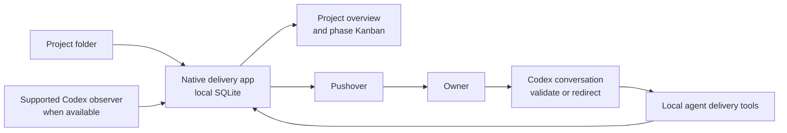

# Release Radar By Rekon Labs — agent-driven delivery dashboard design

## Decision

Replace the Rekon-specific static delivery Kanban with a separate, native macOS
application for the owner's personal use across any folder-backed project. The
application is an agent-driven operational view: agents own delivery structure
and delivery transitions; the owner uses the application to see current work,
progress, dependencies, requests for review, blocks, and notification history.

The application does not write delivery state into project repositories and does
not ask agents to maintain a parallel JSON dashboard. It keeps its own local
state and links back to project documents as evidence.

## Goals

- Show all onboarded projects and their current delivery health before drilling
  into a phase-level Kanban board.
- Make every ticket understandable in board view: its outcome, delivery state,
  goal state, dependencies, attention required, and evidence must be visible.
- Present live Codex thread and goal state only when a supported authenticated
  observation transport exists; otherwise show truthful unavailable or
  persisted-last-known stale context without agent-authored duplication.
- Let agents manage phases, tickets, dependencies, delivery status, outcome
  text, evidence, and review requests through structured local app actions.
- Send Pushover notifications from the app for blocks, task completion, and
  review requests, with a durable local delivery record and de-duplication.
- Require a local folder for every project. Discover Codex work in that folder
  and its worktrees automatically; remember excluded exceptions.

## Non-goals

- No repository-backed dashboard state, committed manifest, or recurring
  synchronization with a project folder.
- No manual phase/ticket editing surface for the owner.
- No attempt to infer canonical delivery state from arbitrary Markdown.
- No cloud delivery authority, multi-user sharing, web app, or browser-hosted
  localhost dashboard. The owner-approved future read-only companion publishes
  copies under ADR-001's 2026-09-06 boundary; implementation remains separate.
- No direct agent access to the app database or Pushover credentials.

## RekonDesignSystem integration scope

The owner confirmed on 2026-09-06 that Release Radar will use RekonDesignSystem's
existing components, tokens and appearance as provided. Adding or changing
light/dark support, app theme-selection controls or the design system's palette
is out of scope. No separate theme decision is required before adoption.
Map application statuses to existing design-system tones and preserve native
interaction and accessibility. Existing light/dark wordmark requirements concern
brand assets; those assets and mockup appearance examples do not require app theme
support.

RDS owns reusable card, control, checkbox, separator and native-titlebar visual
treatment. Release Radar consumes those public components and opt-in styles without
adding a parallel local border or theme layer. Selection and focus retain the
stronger accent treatment; warnings and errors retain their semantic RDS colors.
The app owns its window lifecycle and routing while the RDS titlebar treatment
blends native chrome into the product background and preserves standard
traffic-light controls, dragging, resizing and accessibility. Settings panels keep
consistent horizontal margins and expand or contract with the window. The General
tab remains a product summary; changing its content or adding preferences requires
a separate owner product decision.

## Architecture

The app is a menu-bar-capable SwiftUI macOS application with a local SQLite
database. It has two integrations:

1. A bounded read-only Codex observer may list and read linked threads, goals,
   runtime statuses, and streamed changes only after a supported authenticated
   transport is proven. The current configured observer reports unavailable;
   injected persisted observations are explicitly stale.
2. A local agent tool interface exposes narrow, structured commands to create
   and update delivery records. The app remains the sole database writer.

The Pushover client is app-owned. Its credentials live in Keychain. Agents do
not submit raw HTTP requests or handle credentials.

## State ownership

The SQLite database has four distinct record groups:

| Group | Authority | Contents |
| --- | --- | --- |
| Delivery structure | Agents via app tools | Projects, phases, tickets, outcome text, dependencies, evidence references, ticket-to-Codex links, exclusions. |
| Observed runtime state | Codex App Server | Thread status, goal text/status, waiting-for-input, last observed time, and connection freshness. |
| Operational audit | App | Every agent delivery update and observed meaningful runtime change, attributed to its originating Codex thread when available. |
| Notification history | App | Pushover event fingerprint, attempted/sent/failed state, provider receipt when returned, acknowledgement, and related ticket/goal. |

The app validates only data integrity: valid project and ticket references,
project-bound thread links, dependency acyclicity, and atomic audit creation.
It does not impose delivery gates or reserve Accepted for a manual app action.

Observed Codex state is display context, not an implicit delivery transition.
For example, a ticket may remain In progress while its linked goal is shown as
Blocked. A block can alert the owner immediately; an agent records any formal
ticket lane/phase change through the delivery tools.

## Agent tool contract

Agents receive local actions to:

- create or update a phase or ticket;
- set a ticket's plain-language outcome, phase, lane, dependencies, evidence,
  and linked Codex task;
- request review or record a completion;
- resolve or dismiss an import-review item.

Each action includes an explanatory reason, executes transactionally, and
produces an audit event. Invalid references, cross-project links, or dependency
cycles fail clearly and make no partial update. Agents may make any delivery
transition, including Accepted, after obtaining owner validation through the
normal Codex conversation.

## Onboarding

Add Project presents distinct, clearly labelled choices. **Attach Folder to
Existing Project** selects an eligible persisted rootless project first, then a
folder, and names both in confirmation. It preserves the project's complete
delivery history and uses the minimum explicit owner decision; it never runs
new-project preparation or import.

**Import Existing Project** is complete-project restoration from the approved
versioned portable Release Radar archive. It shows a validation preview before
writing, creates a new project atomically, rejects collisions instead of
overwriting or remapping, and creates fresh local folder authorization.
Release Radar's Markdown delivery records and the Rekon seed JSON are not that
archive. The import workflow remains unavailable until an authoritative
exporter and exporter-produced fixture exist.

New folder-backed projects use **Initialize Project Tracking**. Folder
selection and discovery are preview-only. Before the durable write, the app
names the project and folder and explains that initialization saves local
Release Radar state and folder authorization without modifying repository
files. After the write, closing preserves resumable pending setup.

If no usable delivery structure is found, the app presents a truthful
owner-mediated Codex handoff. It shows the exact prompt below with an
icon-only overlapping-squares copy control labelled **Copy Codex prompt**,
confirms the copy visibly and through accessibility, and does not launch,
contact, paste into, or submit to Codex. Only the prompt is copied; it contains
no folder path or project content.

> In this Codex task rooted at the selected repository, explicitly invoke and
> follow the installed `$release-radar:release-radar` skill. You are authorizing this task to
> create or update only the Release Radar managed guidance block in the
> selected repository's root AGENTS.md, and to create
> docs/delivery/progress.md only if it is absent, while preserving every other
> instruction and all existing delivery content. Follow the skill's repository
> handoff: write and read back the permitted repository guidance first, record
> that exact `AGENTS.md` with the existing ticketless Release Radar evidence
> mutation, preserve the complete request across uncertain outcomes, and report
> any pending audit or discrepancy instead of guessing.
> Do not invent an MCP repository-read operation, access Release Radar SQLite,
> infer canonical state from arbitrary Markdown, or guess; send uncertain items
> to Needs Review.

Portable Import remains hidden until its exporter/archive gate opens. Contextual
Help covers the shipped local lifecycle, documentation boundaries, and recovery;
it does not imply portable import or later planning capabilities.

For new folder-backed project onboarding:

1. The owner selects a local project folder. The app retains a local
   security-scoped bookmark and discovers the Git root and worktrees.
2. If a supported observer exists, it may discover Codex threads whose working
   directory is that folder or a subfolder, including matching worktrees. With
   no supported observer, discovery is unavailable rather than inferred from
   private state. Explicit exclusions remain durable when observations exist.
3. The app recognizes only explicitly supported seed artifacts and offers a
   seed preview. The current one-time Rekon seed importer reads its supported
   schema-version-1 dashboard JSON; Markdown roadmaps, task briefs, handoffs,
   and ledgers remain evidence rather than import authority. Seed import does
   not restore a complete portable project or establish ongoing synchronization.
4. Confidently mapped phases/tickets/dependencies are imported. Ambiguous
   items, possible duplicates, unmatched threads, and missing outcome text go
   to a Needs review inbox instead of blocking onboarding.
5. Initialization saves an opaque project ID, a separate registration ID and a
   request generation. The owner may explicitly finish with zero phases; the
   project becomes visible immediately while incomplete repository documentation
   remains actionable. The copied bootstrap prompt pins the exact registration
   and root, previews either a blank-repository or preservation-first existing-
   documents change, and stops after repository check/readback. Binding, catalog
   acceptance and audited guidance handoff are separate explicit app actions.
   The app never invents a default phase, claims an agent was contacted, writes
   repository files, or treats missing desktop observation as Codex unavailability.
6. The app creates no Pushover alert during onboarding. It may notify about
   outstanding review items only after the owner has opened that project's
   dashboard once.

## Dashboard model

### Project overview

The home screen lists projects with their active phase, verified persisted or
truthfully unavailable/stale goal context, current work count, and attention
count. A project is always represented by a folder-backed record; there are no
folderless planning projects.

A project with no phase is a valid ready-for-planning state. Its overview exposes
editable saved name/task exclusions, contextual Help, exact-root recovery,
documentation activation, and read-only project health. Settings retains a
combined store/access/documentation/plugin/observer health surface even when the
delivery store cannot open. Every result displays its check time and exact target
when a saved registration is available; superseded refreshes are discarded.

### Project archive and restore

Projects opens on an explicit **Active** scope and keeps archived projects in a
separate discoverable **Archived** scope. Archive is a reversible local lifecycle
change, not deletion or portable export. The active overview prepares a confirmation
that names the exact project and registration and counts the phases, tickets,
evidence references and history that remain retained. Cancel or Escape makes no
change. A confirmed archive preserves the complete project graph, roots, bookmarks,
documentation binding, exclusions, registration identity and event history while
advancing its request generation.

Archived project detail is read-only. It shows retained counts, the preserved
registration, a read-only health check and a previewed Restore action; it exposes
no project settings, root management or repository-document action. Stale operational
routes resolve to this detail. While archived, Release Radar excludes the project
from active dashboard counts and evidence readback, rejects new app/agent/observer
mutations, suppresses queued notifications and records in-flight attempts as unknown.
Already-sent, failed and unknown delivery history remains factual.

Restore advances the same registration's request generation and returns the project
to active views without re-creating or remapping its graph. It never replays suppressed
or ambiguous notification work, grants no folder capability, accepts no documentation
catalog and writes no repository file. Missing folder access and invalid or pending
documentation remain visible health problems for the owner to resolve separately.

### Application backup, reset and recovery

General Settings presents full application backup and restore separately from preference
reset. The confirmation preview names the complete supported local-store contents and
states that credentials, source repositories, portable project files and device permission
grants are excluded. Preference reset restores only the four alert-rule defaults and
temporary view selections. Projects Settings presents tracking-data reset separately; it
removes active and archived registrations through retained-history removal semantics while
preserving global preferences, plugin receipts and historical records.

Restore validates a versioned app-backup package before confirmation, names restored and
displaced registrations, and states whether newer local history can be reconciled. During
replacement the app stops new bridge and notification work, drains admitted operations,
closes its stores and resumes only with a fresh service graph. Restored queued notifications
are not sent; ambiguous attempts remain unknown, newer terminal delivery facts are retained
when readable, bookmarks require reauthorization and all live registration authority is
rotated. Startup recovery remains available through Application health when the current
store cannot open. Plugin recovery inspection is read-only and reports unknown management
when its retained receipt is unavailable.

### Phase board

The project board contains a selected phase, phase dependencies, Codex sync
freshness, active goals, and last notification. The later approved visual
design supersedes the earlier Ready-lane proposal. Its lanes are:

1. Backlog
2. In progress
3. Needs review
4. Blocked
5. Accepted

Dependency eligibility is derived information available in detail and agent
workflow context. It is not a separate lane and never causes an automatic
delivery transition.

A separate, visible Needs review inbox contains uncertain imports, possible
duplicates, unresolved dependencies, excluded/untracked task candidates, and
agent-requested owner review. It is a first-class attention surface, not an
empty-state message.

At full width, each card shows its ticket ID, concise agent-maintained outcome,
dependency count, and blocker count. At compact widths it shows only the ticket
ID and counts. Lane position communicates delivery state, so cards do not
repeat it.

Selecting a card opens a read-only detail view with full outcome, dependency
graph and direction, linked Codex task/goal and verified persisted or
truthfully unavailable/stale state, owner-attention reason, latest meaningful
update, evidence, audit history, and notification delivery history. Opening a
linked Codex task is available only after a separate supported handoff is
proven; the detail contains no manual delivery editing controls.

## Phase 4 navigation and inspector — owner-approved 2026-09-08

Across existing surfaces, one Back/Forward history restores project, explicitly
viewed phase/scope, filters, selected ticket and appropriate keyboard/accessibility
focus. Sidebar, in-app links and navigation controls share it. Branching after Back
clears Forward; changing a local filter updates the current entry. Browsing never
changes the owner-selected active working phase. Relaunch starts at Projects with
empty history. Missing targets explain their unavailable selection in a valid
parent scope; archive/removal use the existing read-only identity-preserving views.

Dependencies shows project-wide relationships focused on the selected ticket,
including cross-phase prerequisites/dependents labelled with their phases.
Opening it from a nonactive board and returning preserves that board's context.
The phase-only heading/scope in `mockups/dependencies.png` is superseded by this
explicit scope choice; its relationship direction, selected-path presentation and
inspector remain visual references. Dense paths must remain readable and reachable.

At compact widths, Ticket Details uses the available vertical space and makes
remaining overflow visibly and accessibly discoverable. Ordinary scrolling and
keyboard navigation must reach the first and last rows, including long task plans,
while preserving the wider side inspector, wrapping, counts and completion state.
No task count, acceptance, five-lane or dependency-mutation policy changes. Use the
supplied RDS controls/appearance and compare native compact/wide rendering with the
existing board and dependency references. New planning/Goals/History screens and
appearance/light-dark changes are outside Phase 4.

## Notification policy

The app sends Pushover only for meaningful events:

- a linked Codex goal becomes Blocked;
- an agent records task completion or requests review; or
- a ticket or import item enters Needs review.

Each notification event has a durable fingerprint. Reconnects, page refreshes,
or app restarts never resend an identical event. A later resolved-and-reentered
state creates a new event and may send a new alert. Failed/misconfigured
Pushover attempts are recorded and visible; they do not prevent dashboard use.

Paused goals are shown explicitly but do not alert by default.

## Failure behavior

- If Codex is offline or unavailable, the app displays the last observed state
  and timestamp instead of presenting stale state as live.
- If a linked project document is moved or removed, its evidence link is marked
  unavailable and historical imported state remains intact.
- Agent-tool validation failures return actionable errors and make no partial
  write.
- Pushover problems create an audit/notification failure record without
  exposing credentials.

## Visual reference status — 2026-08-26

The accepted wide mockup vocabulary remains:

- `docs/design/mockups/phase_board.png`
- `docs/design/mockups/dependencies.png`
- `docs/design/mockups/needs_review.png`
- `docs/design/mockups/alerts.png`
- `docs/design/mockups/settings.png`

`docs/design/mockups/activity.png` remains a historical supported-observer
concept. Its live/synced wording is not authority for current behavior; ADR-001
requires unavailable or persisted-last-known stale context until a supported
authenticated attachment exists.

`docs/design/mockups/onboarding_state.png` is superseded visual evidence. Its
“Ask agent to define first phase” action and Portable Import implication do not
match the accepted **Initialize Project Tracking** copied-not-sent handoff or
the exporter/archive gate above. Preserve the image for history, but do not use
its copy as a current product requirement.

Completed Projects/Overview, selected-ticket detail, and compact-board behavior
are covered by durable runtime evidence under `docs/delivery/evidence/`; they
are not missing-work mockup candidates. Goals, all-phase Work Board, History,
and their compact/state/flow images remain proposal evidence only. Their
current classification and decision gates are recorded exclusively in
`docs/delivery/progress.md`.

## Acceptance criteria

1. Onboarding any local folder preserves a resumable **Initialize Project
   Tracking** state with opaque project/registration identity, discovers matching
   Codex threads/worktrees only when a supported observer exists, remembers
   exclusions, and permits explicit completion with zero phases. Its copied
   prompt operates in the current task rooted at the selected folder and
   explicitly invokes `$release-radar:release-radar`; repository preparation,
   binding, catalog acceptance, and audited guidance are previewed and confirmed
   as separate steps without an invented MCP API.
2. Rekon's importer produces local phases/tickets/dependencies/evidence links
   from its existing delivery records, routing uncertain mappings to Needs
   review rather than silently guessing.
3. The responsive board follows the approved five-lane compact-card design:
   full-width cards show ticket ID, outcome, dependency count, and blocker
   count; narrow cards show ID and counts; the selected read-only detail view
   communicates goal state, dependency direction, attention, activity, and
   evidence.
4. When supported Codex observation exists, runtime updates refresh the live
   goal display and show a last-sync timestamp without silently changing formal
   delivery lanes. Otherwise the UI truthfully presents unavailable or
   persisted-last-known stale context.
5. Agent delivery actions are atomic, audited, attributed, and reject invalid
   references/cycles without partial state.
6. Block, completion/review, and Needs review events create one deduplicated
   Pushover attempt with visible delivery history; paused goals do not notify
   by default.
7. The dashboard remains useful when Codex, Pushover, or linked evidence is
   unavailable, with clear stale/error state rather than hidden failure.

## Phase 5A selected planning surfaces — 2026-09-09

The owner selected Overview as landing, a sibling Project Plan for all recorded
phases/phase-owned Delivery Goals/unassigned tickets, and one shared phase/all-phase
board with each ticket's phase labelled. Preserve supplied RDS, the five lanes,
existing Details/Dependencies and Phase 4 session navigation/focus. Unassigned
tickets appear in Plan with read-only details, tasks, evidence and dependencies;
they are not cards in a fake phase or sixth lane. Distinguish No phase from No
Delivery Goal, the latter being the current board assignment filter.

Use the approved Phase Board screenshot for lane/layout language. Proposed
work_board.png and the historical planning/redesign studies provide partial visual
reference only; their Goals/History routes and other unselected behaviors do not
become requirements. New Project Plan composition uses existing components and
accessible compact/wide behavior, verified in the isolated native app. Browsing
remains read-only; typed agent operations perform formal planning changes.

The delivered Phase 5A composition uses a single scrolling list of phase cards
with explicit readiness revision, coverage, ticket count and phase-owned Delivery
Goals, followed by a visually separate **Not placed** section and the existing
ticket inspector. The all-phase board reuses the established five-lane visual
grammar, adds an explicit board-scope selector, and shows a phase label on every
card. At compact widths both surfaces stack the inspector below the primary
content and retain vertical scrolling; the board preserves all five lanes through
horizontal scrolling rather than shrinking their content below a readable width.

Native comparison retained the approved Phase Board lane colors, bordered columns,
compact/full-density behavior and inspector hierarchy. It intentionally differs
from the proposed Work Board by keeping the approved **Phase Board** route name,
omitting the unselected Goals and History routes, and using the existing detailed
inspector. It differs from the historical planning proposal by showing readiness
rather than inventing phase lifecycle groups and by retaining board-local scope
switching, as required by the later owner selection for one shared phase/all-phase
board. These differences do not introduce lifecycle or ordering semantics.

## Phase 5B references and recorded impacts — 2026-09-09

Placed and unassigned ticket inspectors expose requirement/decision links with
linked revision, current resolution facts and retained link history. Source details
lead to **Recorded impacts**: project-scoped tickets explicitly linked to that
source, labelled by phase or Not placed, kind, source-local identity/revision and
current versus historical relationship. These results do not assert complete
semantic impact or delivery coverage. Ticket dependencies remain separately named.

Use existing inspector/navigation and supplied RDS patterns. Back/Forward restores
the source/link context, ticket, scope/filter and actual keyboard/accessibility
focus. Unavailable historical content remains visibly unavailable, never replaced
by current prose; missing targets never select another ticket. Native browsing is
read-only, with link creation/revision/retirement performed through typed agent
commands. Wide/compact and recovery journeys must be verified against the Phase
Board/Dependencies visual language. The [Phase 5B brief](../delivery/task-briefs/2026-09-09-phase5b-reference-impacts/phase5b-reference-impacts-brief.md)
sets the complete bounded acceptance criteria; it does not adopt later proposal
or lifecycle surfaces.

## Phase 5C proposal workflow — 2026-09-10

Project Plan exposes saved proposal versions with rationale, derived before/after
diff, recorded source impacts and disposition. Owner-app Approve and Apply are
separate explicit actions under the approved proposal contract; they do not grant
execution or publication authority. Stale state offers refresh and renewed review,
never silent approval transfer. Preserve exact proposal/version focus and existing
source/impact navigation, and withdraw actionable content when identity or access
changes. Use the current Plan/RDS layout and compact stacking; no new broad History
or Goals surface is included.

The proposal list precedes recorded phases in the existing scrolling Plan column.
Selecting a proposal opens its exact version in the existing inspector: the version
picker, rationale, baseline identity, grouped additions and recorded source impacts
remain together. Awaiting versions offer Reject and Approve; an approved current
version offers a separate Apply control; unapplied current versions offer Refresh.
Applied, rejected and historical versions remain inspectable but cannot silently
become actionable. At compact widths the inspector stacks below the same list so
the complete detail and recovery state remain scrollable rather than being clipped.
Back/Forward restores the exact proposal/version and, when present, its source-impact
ticket with real keyboard and accessibility focus.

Source-impact rows identify the exact recorded ticket/link/version and observed
source facts. Opening one reuses the existing revision-specific source route. A
missing or changed current source remains an explicit unavailable/changed state;
the UI never substitutes current prose for the recorded version. The
[Phase 5C brief](../delivery/task-briefs/2026-09-10-phase5c-proposals/phase5c-proposals-brief.md)
contains the bounded delivery contract and verification.

## Phase 5D retained work and coverage — 2026-09-10

Extend Project Plan proposal details with complete retirement/last-lane, successor,
obligation and dependency before/after readback. Retained originals remain reachable
with their task/evidence history. Uncovered, carried, explicitly dropped and delivered
are distinct states; no sixth board lane or automatic acceptance. Existing native
Plan/board/detail counts and exact Back/Forward focus must agree with canonical
coverage, including compact layouts and recoverable stale/unknown states.

## Phase 5E explicit phase lifecycle — 2026-09-10

Project Plan phase controls display persisted Unassessed / Upcoming / In delivery /
Completed separately from readiness and active/view context. Show exact phase,
current state, intended transition, reason and completion blockers. Complete and
Reopen are deliberate owner actions with visible pending, stale, failure and
committed-refresh states. Multiple In-delivery phases remain visible; selecting or
browsing a phase changes no lifecycle. Completed history remains accessible and
new work explains the explicit reopen/new-phase requirement. Replace count-derived
"delivery complete" wording with neutral readiness wording.

Reuse existing Plan cards, RDS controls and five-lane board design, with compact
stacking and real keyboard/accessibility focus restoration. Do not add another
lifecycle lane, broad History surface or phase-ordering policy. The [Phase 5E brief](../delivery/task-briefs/2026-09-10-phase5e-lifecycle/phase5e-lifecycle-brief.md)
sets migration, guard and native acceptance boundaries under the approved policy.

The implemented native controls retain the existing dark Plan card hierarchy and
RDS picker/button vocabulary. At compact width, state and intent stack without
horizontal clipping while Completed guidance and explicit reopen remain visible.
The selected [native capture](../delivery/evidence/phase5e-lifecycle-native.png)
shows that compact state. The first external-control journey exposed a false
navigation-recovery banner after a valid same-project placed-ticket selection;
that discrepancy was corrected rather than accepted as a design deviation. The
fresh journey retained exact reason accessibility focus after every save/reload
at wide and compact widths. No design deviation is recorded for the delivered
Phase 5E surface.

## Phase 6A truthful event-time History — 2026-09-10

History is one project-scoped, read-only timeline with filters for All, Audit,
Observations, Notifications, Reviews and Completions. Each row identifies its
source and event time; selecting a row opens event detail without replacing the
recorded facts with the ticket's current state. Where recording and observation
times differ, detail names them separately. Legacy audit rows whose event-time
facts were never recorded remain explicitly unknown.

At wide widths the timeline and selected-event inspector remain side by side. At
compact widths the inspector stacks below the full-width timeline and remains
keyboard reachable. Opening an exact retained ticket or phase uses the shared
typed navigation history; Back returns to the same History filter and event.
Unavailable or legacy targets present an accessible recovery explanation instead
of redirecting to a replacement registration or current entity. Empty History,
no matches for a filter, failed reads and incomplete observation sources use
distinct states.

Contextual Help explains provenance, event/recording/observation time, unknown
legacy facts, current context, attention versus acceptance, and that copied
actions are not dispatched actions. It describes only implemented behavior.

The delivered surface follows the approved History references' dark Rekon
palette, source chips, timeline rhythm and wide/compact composition. It uses the
established detailed inspector rather than the mockup's flatter grouped cards so
exact provenance, recorded facts, recovery and navigation remain together. The
compact sidebar remains an explicit app control rather than automatically
collapsing at a width threshold. Observation availability is reported from the
implemented source and never replaced by the mockup's aspirational freshness
copy. These are recorded implementation differences, not new authority or
future-source behavior.

## Phase 6B workspace Delivery and Execution Goals — 2026-09-10

Goals is a workspace-level, read-only destination with an explicit domain control:
**Delivery** presents formal phase-owned outcomes, while **Execution** presents
persisted Codex observations. Delivery detail keeps criteria, membership, the
formal Delivery Goal state, phase lifecycle, carried-obligation coverage,
structural readiness and explicit owner acceptance distinct; terminal outcomes,
phase-placed work without a Delivery Goal and project-level work that is not yet
placed remain discoverable. Execution
detail identifies its exact thread/goal source, link state, observation time,
freshness and availability. Completed and unlinked persisted observations remain
useful without implying live visibility, formal acceptance or new attention.

Project and domain-specific state filters narrow the workspace list without
hiding source availability. Associated work opens the existing all-phase Phase
Board with an explicit typed Delivery Goal or Execution Goal filter, where **All
goals** clears that filter; project-level unplaced work opens Project Plan instead.
An Execution filter remains valid only while its exact persisted observation and
ticket link remain current. Goals does not reproduce the mockup's embedded work
lanes: the established board remains the only five-lane presentation and labels
each ticket's stored phase. Back/Forward restores the Goals domain, project and
state filters, selected exact goal, actual scroll position and keyboard/
accessibility focus. A missing or replaced registration produces an accessible
recovery explanation rather than selecting another project or goal.

The project picker, Delivery rows, Execution rows and work-without-goal rows use
stable identity cues only when their normally visible labels collide. Initial and
filtered detail is rendered only for the exact selection recorded in the model and
navigation history; it never substitutes a visually convenient first row for a
missing selection. Documentation evidence refresh preserves current exact
Execution observation/link identities and cannot invalidate an otherwise current
board filter.

The delivered surface retains the mockup's workspace route, cross-project list,
source treatment and wide list/detail rhythm while adding the required formal
Delivery domain. At compact widths, detail stacks beneath the list in one
vertically scrollable surface rather than using a separate drill-in; this keeps
the selected row, exact detail and associated-work action in the same recoverable
context. At wide widths, detail remains aligned with the selected content while
the list scrolls. The native captures for the [wide](../delivery/evidence/2026-09-10-phase6b-goals-wide.png),
[compact](../delivery/evidence/2026-09-10-phase6b-goals-compact.png) and
[registration recovery](../delivery/evidence/2026-09-10-phase6b-goals-registration-recovery.png)
states record these responsive and recovery decisions.
