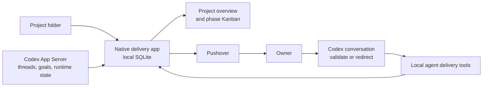

# Release Radar By Rekon Labs — agent-driven delivery dashboard design

## Decision

Replace the Rekon-specific static delivery Kanban with a separate, native macOS
application for the owner's personal use across any folder-backed project. The
application is an agent-driven operational view: agents own delivery structure
and delivery transitions; the owner uses the application to see current work,
progress, dependencies, requests for review, blocks, and notification history.

The application does not write delivery state into project repositories and does
not ask agents to maintain a parallel JSON dashboard. It keeps its own local
state and links back to project documents as evidence.

## Goals

- Show all onboarded projects and their current delivery health before drilling
  into a phase-level Kanban board.
- Make every ticket understandable in board view: its outcome, delivery state,
  goal state, dependencies, attention required, and evidence must be visible.
- Observe live Codex thread and goal state without agent-authored duplication.
- Let agents manage phases, tickets, dependencies, delivery status, outcome
  text, evidence, and review requests through structured local app actions.
- Send Pushover notifications from the app for blocks, task completion, and
  review requests, with a durable local delivery record and de-duplication.
- Require a local folder for every project. Discover Codex work in that folder
  and its worktrees automatically; remember excluded exceptions.

## Non-goals

- No repository-backed dashboard state, committed manifest, or recurring
  synchronization with a project folder.
- No manual phase/ticket editing surface for the owner.
- No attempt to infer canonical delivery state from arbitrary Markdown.
- No cloud backend, multi-user sharing, web app, or browser-hosted localhost
  dashboard.
- No direct agent access to the app database or Pushover credentials.

## Architecture

The app is a menu-bar-capable SwiftUI macOS application with a local SQLite
database. It has two integrations:

1. A Codex App Server reader lists and reads linked threads, goals, runtime
   statuses, and streamed changes.
2. A local agent tool interface exposes narrow, structured commands to create
   and update delivery records. The app remains the sole database writer.

The Pushover client is app-owned. Its credentials live in Keychain. Agents do
not submit raw HTTP requests or handle credentials.

## State ownership

The SQLite database has four distinct record groups:

| Group | Authority | Contents |
| --- | --- | --- |
| Delivery structure | Agents via app tools | Projects, phases, tickets, outcome text, dependencies, evidence references, ticket-to-Codex links, exclusions. |
| Observed runtime state | Codex App Server | Thread status, goal text/status, waiting-for-input, last observed time, and connection freshness. |
| Operational audit | App | Every agent delivery update and observed meaningful runtime change, attributed to its originating Codex thread when available. |
| Notification history | App | Pushover event fingerprint, attempted/sent/failed state, provider receipt when returned, acknowledgement, and related ticket/goal. |

The app validates only data integrity: valid project and ticket references,
project-bound thread links, dependency acyclicity, and atomic audit creation.
It does not impose delivery gates or reserve Accepted for a manual app action.

Observed Codex state is display context, not an implicit delivery transition.
For example, a ticket may remain In progress while its linked goal is shown as
Blocked. A block can alert the owner immediately; an agent records any formal
ticket lane/phase change through the delivery tools.

## Agent tool contract

Agents receive local actions to:

- create or update a phase or ticket;
- set a ticket's plain-language outcome, phase, lane, dependencies, evidence,
  and linked Codex task;
- request review or record a completion;
- resolve or dismiss an import-review item.

Each action includes an explanatory reason, executes transactionally, and
produces an audit event. Invalid references, cross-project links, or dependency
cycles fail clearly and make no partial update. Agents may make any delivery
transition, including Accepted, after obtaining owner validation through the
normal Codex conversation.

## Onboarding

1. The owner selects a local project folder. The app retains a local
   security-scoped bookmark and discovers the Git root and worktrees.
2. It discovers Codex threads whose working directory is that folder or a
   subfolder, including matching worktrees. New matching threads are included
   automatically; explicit exclusions are durable.
3. The app recognizes known delivery artifacts and offers an import preview.
   Rekon gets a one-time importer for its existing dashboard JSON, roadmap,
   task briefs, handoffs, and ledger. These imports seed local records and
   preserve evidence links; they do not establish an ongoing synchronization.
4. Confidently mapped phases/tickets/dependencies are imported. Ambiguous
   items, possible duplicates, unmatched threads, and missing outcome text go
   to a Needs review inbox instead of blocking onboarding.
5. If no usable delivery structure is found, onboarding cannot finish until an
   agent has defined the first phase. The app never invents a default phase.
6. The app creates no Pushover alert during onboarding. It may notify about
   outstanding review items only after the owner has opened that project's
   dashboard once.

## Dashboard model

### Project overview

The home screen lists projects with their active phase, live goal state,
current work count, and attention count. A project is always represented by a
folder-backed record; there are no folderless planning projects.

### Phase board

The project board contains a selected phase, phase dependencies, Codex sync
freshness, active goals, and last notification. The later approved visual
design supersedes the earlier Ready-lane proposal. Its lanes are:

1. Backlog
2. In progress
3. Needs review
4. Blocked
5. Accepted

Dependency eligibility is derived information available in detail and agent
workflow context. It is not a separate lane and never causes an automatic
delivery transition.

A separate, visible Needs review inbox contains uncertain imports, possible
duplicates, unresolved dependencies, excluded/untracked task candidates, and
agent-requested owner review. It is a first-class attention surface, not an
empty-state message.

At full width, each card shows its ticket ID, concise agent-maintained outcome,
dependency count, and blocker count. At compact widths it shows only the ticket
ID and counts. Lane position communicates delivery state, so cards do not
repeat it.

Selecting a card opens a read-only detail view with full outcome, dependency
graph and direction, linked Codex task/goal and live state, owner-attention
reason, latest meaningful update, evidence, audit history, and notification
delivery history. It can open the linked Codex task but contains no manual
delivery editing controls.

## Notification policy

The app sends Pushover only for meaningful events:

- a linked Codex goal becomes Blocked;
- an agent records task completion or requests review; or
- a ticket or import item enters Needs review.

Each notification event has a durable fingerprint. Reconnects, page refreshes,
or app restarts never resend an identical event. A later resolved-and-reentered
state creates a new event and may send a new alert. Failed/misconfigured
Pushover attempts are recorded and visible; they do not prevent dashboard use.

Paused goals are shown explicitly but do not alert by default.

## Failure behavior

- If Codex is offline or unavailable, the app displays the last observed state
  and timestamp instead of presenting stale state as live.
- If a linked project document is moved or removed, its evidence link is marked
  unavailable and historical imported state remains intact.
- Agent-tool validation failures return actionable errors and make no partial
  write.
- Pushover problems create an audit/notification failure record without
  exposing credentials.

## Acceptance criteria

1. Onboarding any local folder discovers matching Codex threads and worktrees,
   remembers exclusions, and requires an agent-defined first phase when no
   usable structure exists.
2. Rekon's importer produces local phases/tickets/dependencies/evidence links
   from its existing delivery records, routing uncertain mappings to Needs
   review rather than silently guessing.
3. The responsive board follows the approved five-lane compact-card design:
   full-width cards show ticket ID, outcome, dependency count, and blocker
   count; narrow cards show ID and counts; the selected read-only detail view
   communicates goal state, dependency direction, attention, activity, and
   evidence.
4. Codex runtime updates refresh the live goal display and show a last-sync
   timestamp without silently changing formal delivery lanes.
5. Agent delivery actions are atomic, audited, attributed, and reject invalid
   references/cycles without partial state.
6. Block, completion/review, and Needs review events create one deduplicated
   Pushover attempt with visible delivery history; paused goals do not notify
   by default.
7. The dashboard remains useful when Codex, Pushover, or linked evidence is
   unavailable, with clear stale/error state rather than hidden failure.
